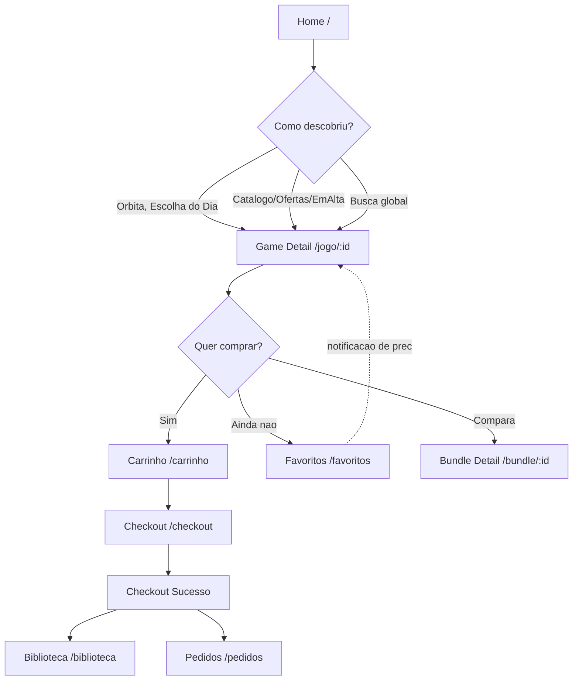
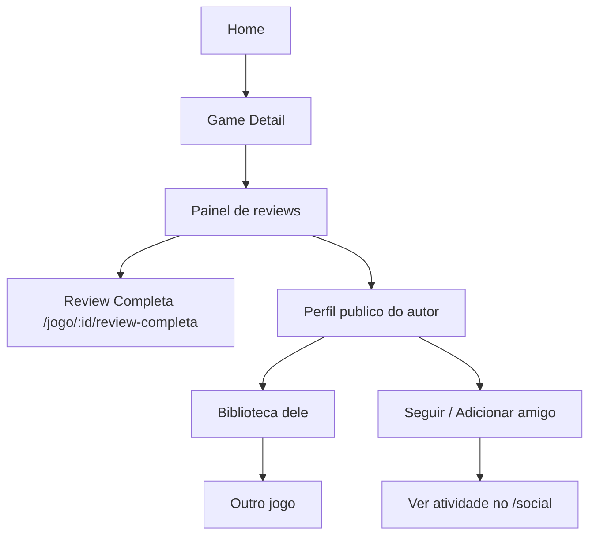
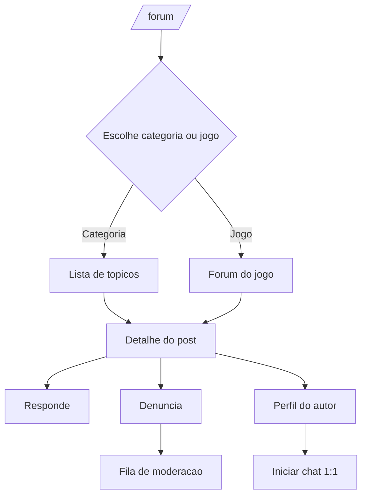
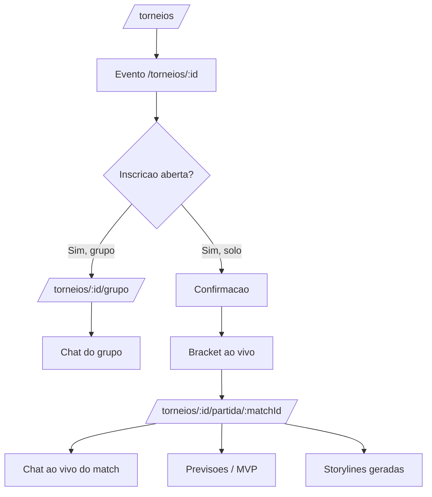
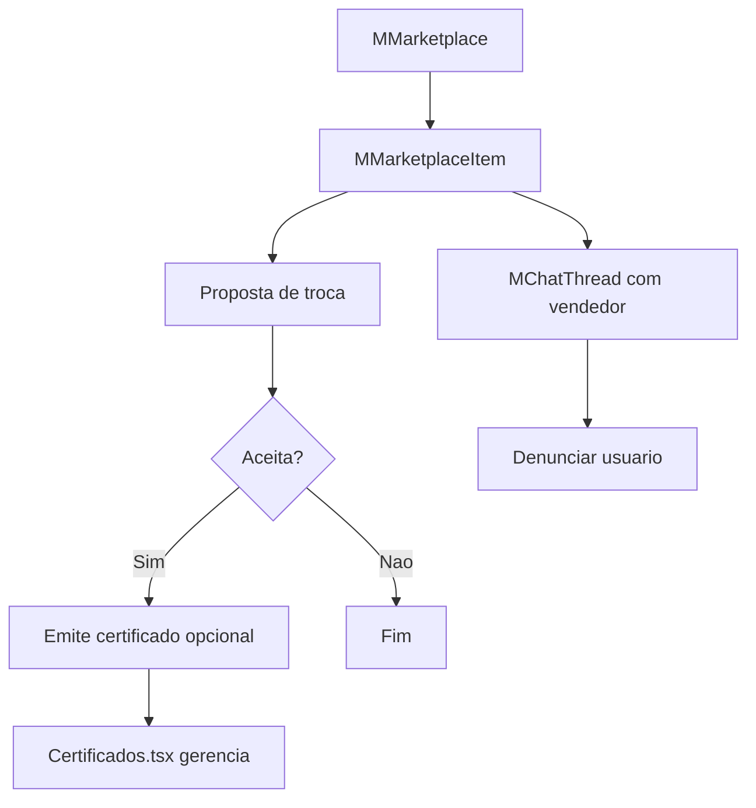
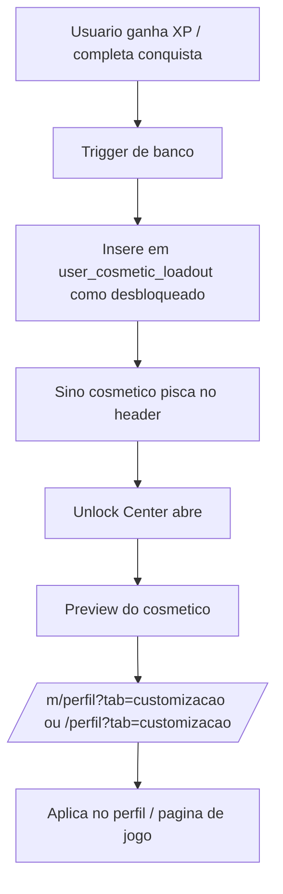

# Fluxos globais do MIDIAS

Os **7 fluxos-mãe** que atravessam várias páginas. Cada arquivo de página referencia estes fluxos em vez de redesenhá-los.

Diagramas em **mermaid** — sem emojis dentro dos blocos (quebra o lexer).

---

## Fluxo 1 — Descoberta → Compra (B2C)

O caminho comercial padrão. É o fluxo que a banca vai testar primeiro.



**Pontos de fricção conhecidos:**
- Sessão expirada entre Carrinho e Checkout (P1)
- Estoque zera entre adicionar e finalizar (P1)
- Cupom aplicado no Carrinho não persiste se voltar para catálogo (P2)

---

## Fluxo 2 — Descoberta social

O caminho que valida a hipótese de "MIDIAS é rede social de gamers, não só loja".



---

## Fluxo 3 — Comunidade (fórum)



**Observação:** o fórum web (`ForumGeral.tsx`) e o mobile (`MForum.tsx`) compartilham o mesmo banco mas têm UIs distintas. Auditar paridade na Fase B.

---

## Fluxo 4 — Competitivo (torneios)



---

## Fluxo 5 — C2C (marketplace mobile)

**Só existe no mobile (Capacitor).** Web tem apenas leitura de perfil de vendedor via `/vendedor/:handle`.



---

## Fluxo 6 — Notificação → Ação

O sino é o teletransporte do ecossistema. Toda notificação **precisa** cair em um contexto específico, nunca só na Home.

```mermaid
flowchart TD
  Sino[Bell no header] --> Lista[Lista de notificacoes]
  Lista --> Tipo{Tipo}
  Tipo -->|Pedido| Pedidos[/pedidos/]
  Tipo -->|Mensagem| Chat[/chat/thread/id]
  Tipo -->|Menção fórum| Post[/forum/post/id]
  Tipo -->|Torneio| Evento[/torneios/id]
  Tipo -->|Amigo comprou| GameDetail[/jogo/id]
  Tipo -->|Preço caiu| GameDetail
  Tipo -->|Denuncia resolvida| Perfil[/perfil]
```

**Regra de design:** notificação sem destino específico é bug, não feature. Rejeitar no code review.

---

## Fluxo 7 — Cosmético desbloqueado → Customização

Fluxo isolado com sino próprio (`CosmeticUnlocksCenter`) para não competir com o sino de notificações normal.



---

## Matriz de conexão entre páginas

Onde cada página **naturalmente** leva. `X` = ponte forte (usada por >20% dos usuários que passam pela origem, estimativa). `.` = ponte fraca ou inexistente.

|              | Home | Cat | Ofertas | EmAlta | PraVc | GameDet | Bundle | Torneios | Perfil | Fórum | Chat | Biblioteca |
| ------------ | :--: | :-: | :-----: | :----: | :---: | :-----: | :----: | :------: | :----: | :---: | :--: | :--------: |
| **Home**     |  —   |  X  |    X    |   X    |   X   |    X    |   X    |    X     |   X    |   X   |  .   |     X      |
| **Catálogo** |  .   |  —  |    X    |   .    |   .   |    X    |   .    |    .     |   .    |   .   |  .   |     .      |
| **Ofertas**  |  .   |  X  |    —    |   .    |   .   |    X    |   X    |    .     |   .    |   .   |  .   |     .      |
| **GameDet**  |  .   |  .  |    .    |   .    |   .   |    —    |   .    |    .     |   X    |   X   |  X   |     X      |
| **Perfil**   |  X   |  .  |    .    |   .    |   .   |    X    |   .    |    X     |   —    |   X   |  X   |     X      |
| **Fórum**    |  X   |  .  |    .    |   .    |   .   |    X    |   .    |    .     |   X    |   —   |  X   |     .      |

**Leitura:** Home é hub verdadeiro (linha cheia de X). GameDetail é o ponto de convergência — todo mundo chega lá. Fórum é subutilizado como origem para descoberta comercial (linha quase vazia para GameDetail via jogo mencionado — oportunidade P1).

---

## Princípios cross-fluxo

1. **Todo estado é deep-linkável.** Se você não consegue mandar a URL para um amigo e ele ver a mesma coisa, está errado.
2. **Notificação sempre cai em contexto.** Nunca em Home.
3. **Voltar (browser back) preserva scroll e filtros.** URL guarda `?platform=&sort=&q=` — checar em `Catalogo.tsx`.
4. **Sessão perdida no meio do fluxo redireciona para login e volta ao ponto exato.** Usar `redirect_to` em query.
5. **Feedback ótico é imediato.** Optimistic update no favoritar, curtir, adicionar ao carrinho — rollback silencioso se falhar.
