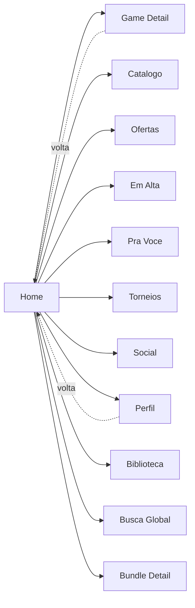
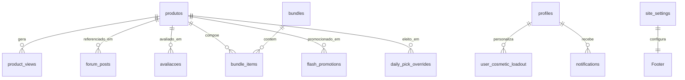

# Home — `/`

> **Status:** revisão
> **Plataforma:** Web
> **Arquivo-fonte:** `src/pages/Index.tsx`, `src/components/Header.tsx`, `src/components/Footer.tsx`, `src/components/radar/OrbitRadar.tsx`
> **Última revisão:** 2026-07-03

---

## 1. Objetivo da página

Ser a **porta de entrada única** do ecossistema MIDIAS Web. Em menos de 5 segundos o usuário precisa responder quatro perguntas:

1. **O que mudou desde a última visita?** (Órbita)
2. **O que vale minha atenção agora?** (Escolha do Dia + Flash Promo)
3. **Existe uma oportunidade de compra que eu não posso perder?** (Bundles + Melhores Ofertas)
4. **Para onde eu vou agora?** (Header + CTAs contextuais)

Se qualquer uma dessas quatro perguntas fica sem resposta acima da dobra em desktop, a Home está falhando.

## 2. Filosofia

A Home do MIDIAS **não é uma vitrine de loja** — é um **feed de descoberta** que **incidentalmente vende**. Essa distinção define tudo:

- Loja tradicional (Steam, Nuuvem): abre com "Ofertas da semana" → prioriza conversão imediata.
- MIDIAS: abre com **Órbita** ("o que se moveu") → prioriza **retorno recorrente**.

A hipótese é: gamer volta ao MIDIAS por hábito social/comunitário, não por promoção. A Órbita é a prova diária de que "algo aconteceu enquanto você estava fora". Se ela sumir, a Home vira mais uma loja e o diferencial evapora.

**A pergunta que só a Home responde:** *"O que está acontecendo no meu ecossistema de jogos agora mesmo?"* — nenhuma outra página do MIDIAS responde isso de forma agregada.

## 3. Usuários-alvo

| Perfil                     | O que enxerga                                                                 | O que pode fazer                     |
| -------------------------- | ----------------------------------------------------------------------------- | ------------------------------------ |
| **Visitante (deslogado)**  | Hero + Órbita (guest) + Flash + Escolha do Dia + Bundles + Destaques + Ofertas + Top Rated. Sem badge de cosmético, sem sino personalizado. | Navegar, buscar, adicionar ao carrinho (persiste em localStorage), abrir GameDetail. |
| **Logado — sessão nova**   | Idem visitante + sino de notificações populado + carrinho sincronizado + menu de perfil. | Comprar, favoritar, seguir vendedores. |
| **Logado — recorrente**    | Órbita filtra itens já vistos (localStorage `radar-seen-{userId}`). Notificações personalizadas. | Idem, com continuidade de contexto. |
| **Vendedor**               | Idem recorrente. Não há tratamento especial na Home hoje (P2 — poderia ter atalho para painel de vendedor). | Idem. |
| **Moderador / Admin**      | Idem recorrente. Sem widgets admin. Acessa backoffice em `/desktop`. | Idem. |
| **Banido (`banned_until` no futuro)** | Banner vermelho no topo, funcionalidades escritas bloqueadas em cada ação. | Só leitura. |

**Observação P1:** o "logado novo" e o "recorrente" recebem exatamente a mesma Home hoje. Deveria existir um estado "boas-vindas" nas primeiras 3 visitas — tour guiado apontando Órbita, Escolha do Dia e Header (ver Fase D: onboarding).

## 4. Estrutura visual

```text
┌──────────────────────────────────────────────────┐
│ [Banner de banimento — condicional, vermelho]    │  ← só se banned_until > agora
├──────────────────────────────────────────────────┤
│ HEADER (sticky, glass)                           │
│   Logo | NavLinks(6) | Busca | Θ | 🔔 | ✨ | 🛒 | 👤 │
├──────────────────────────────────────────────────┤
│                                                  │
│   HERO — "MIDIAS" + tagline                      │  ← 400px em desktop
│                                                  │
├──────────────────────────────────────────────────┤
│   ÓRBITA — "Na sua órbita hoje" + 4 cards        │  ← ancoragem no "agora"
├──────────────────────────────────────────────────┤
│   FLASH PROMO — banner countdown (condicional)   │  ← só se houver promo ativa
├──────────────────────────────────────────────────┤
│   ESCOLHA DO DIA — card 60/40 (imagem/texto)     │  ← destaque diário único
├──────────────────────────────────────────────────┤
│   BUNDLES — grid 3col (condicional, min 1)       │  ← só se houver bundle ativo
├──────────────────────────────────────────────────┤
│   DESTAQUES — 3 tiles grandes                    │  ← curadoria manual
├──────────────────────────────────────────────────┤
│   MELHORES OFERTAS — 6 cards + "Ver todas"       │  ← ordenado por desconto
├──────────────────────────────────────────────────┤
│   MAIS BEM AVALIADOS — 6 cards + "Ver todos"     │  ← ordenado por rating
├──────────────────────────────────────────────────┤
│ FOOTER — logo + 4 colunas + copyright            │
└──────────────────────────────────────────────────┘
```

### Por que essa ordem?

| Bloco             | Posição justificada por…                                                                                                    |
| ----------------- | ---------------------------------------------------------------------------------------------------------------------------- |
| Hero              | Cria pausa e afirma marca. Tem que sair depois do 1º refactor — desperdiça a dobra. Ver 20.2.                              |
| Órbita            | Responde "o que mudou" — **a única pergunta que só a Home responde**. Precisa estar acima da dobra. Hoje não está.          |
| Flash Promo       | Urgência temporal — se existir, tem que aparecer antes dos blocos "eternos" (bundles, top rated). Prioridade máxima quando presente. |
| Escolha do Dia    | Editorial diário — cria hábito de retorno diário ("o que o MIDIAS escolheu hoje?"). Vem antes de Bundles porque é 1 item vs muitos. |
| Bundles           | Valor percebido mais alto por clique (economia agregada). Vem antes de Destaques/Ofertas porque converte mais em ticket médio. |
| Destaques         | Curadoria editorial. Vem antes de Ofertas porque afirma opinião do MIDIAS antes de mostrar desconto puro (que é commodity). |
| Melhores Ofertas  | Descoberta orientada a preço — apela ao caçador de promo, que já rolou até aqui.                                            |
| Mais Bem Avaliados| Descoberta orientada a qualidade — validação social. Fica no fim porque é atemporal e serve como "long tail" do scroll.     |

**Regra implícita:** de cima pra baixo, os blocos vão de **efêmero → perene**. Órbita (24h) → Flash (horas) → Escolha (24h) → Bundles (semanas) → Destaques (semanas) → Ofertas (semanas) → Top Rated (meses). É consciente e correto.

## 5. Componentes

### 5.1 Header (`src/components/Header.tsx`)

- **O que é:** barra fixa no topo com `glass` effect, `sticky top-0 z-50`.
- **O que mostra (em ordem visual):** Logo `MIDIAS` + Nav com 6 links (Catálogo, Ofertas, Em Alta, Pra Você, Torneios, Social) + Busca global + Toggle tema + Sino notificações + Sino cosméticos (só logado) + Carrinho + Menu usuário / Login + Botão menu mobile.
- **Densidade:** em desktop logado, o header carrega **13 elementos interativos** simultaneamente. Ver 20.2 e 20.4 sobre poluição.
- **Comportamento responsivo:** nav some abaixo de `lg`; busca some abaixo de `md`; ambos migram para menu hambúrguer.
- **Busca:** aceita texto livre (→ `/busca?q=`) ou `@usuario` (autocompleta em dropdown de 8 perfis via `profiles.display_name/username ilike`, debounce 200ms).
- **Sinos separados** (decisão consciente): `NotificationBell` (contexto geral) e `CosmeticUnlocksCenter` (só cosméticos). Ver Fluxo 7 em `_fluxos-globais.md`.

### 5.2 Hero

- **O que é:** bloco alto (`py-16 md:py-24`) com "MIDIAS" gigante em `gradient-text` + subtítulo "Jogos digitais com os melhores preços. Entrega instantânea de chaves."
- **Problema:** ocupa toda a dobra em desktop 1080p e não entrega informação nova para usuário recorrente. Ver 20.2.

### 5.3 Órbita / OrbitRadar

- **O que é:** carrossel horizontal de N cards (N=4 na Home, N=8 em `/oportunidades`) mostrando produtos com maior score no Radar Delta.
- **Header do bloco:** título "Na sua órbita hoje" + timestamp da última varredura ("🛰️ Última varredura: 14:32").
- **Cada card mostra:**
  - Imagem do jogo
  - Título
  - **Evidência** ("12 views + 3 posts nas últimas 24h") — diferencial vs caixa preta de algoritmo
  - Badge "novo" se o usuário nunca abriu (rastreado em `localStorage[radar-seen-{userId}]`)
- **Estado vazio:** "Você está em dia — nada novo desde ontem." Design consciente para não fingir movimento inexistente.
- **Estado carregando:** 4 skeletons `w-56 h-32`.

### 5.4 Flash Promo Banner

- **O que é:** faixa condicional de 1 promoção relâmpago ativa (`flash_promotions.is_active=true AND ends_at > now`).
- **Mostra:** capa + badge "RELÂMPAGO" + % desconto + preço original riscado + preço promo + countdown `HH:MM:SS` tick por segundo (`setInterval` de 1s em `Index.tsx`).
- **Quando some:** quando `ends_at <= now` (recalcula a cada tick, some sem reload).
- **Regra:** só 1 flash promo por vez (`.limit(1)` no query). Se admin criar múltiplas ativas, mostra a de `ends_at` mais próximo.

### 5.5 Escolha do Dia

- **O que é:** card grande 60/40 (imagem/texto) com o jogo eleito para hoje.
- **Duas fontes possíveis** (checadas em cascata):
  1. `daily_pick_overrides` para `pick_date = today` — se existir, usa esse produto e mostra `reason` como citação em itálico.
  2. Fallback determinístico: `inStock[dayOfYear % inStock.length]` — todo mundo vê o mesmo jogo no mesmo dia sem precisar consultar o banco. Rotação previsível.
- **Problema do fallback (P1):** não considera Radar, categoria, plataforma, novidade. Pode escolher um jogo obscuro. Ver 20.2.

### 5.6 Bundles

- **O que é:** grid 3-col de até 6 bundles ativos, cada um mostrando 3 miniaturas de jogos, título, quantidade de jogos, preço + `line-through` do preço somado.
- **Filtro cliente:** só renderiza bundles com **≥ 2 produtos disponíveis em estoque** (defesa contra dado quebrado).
- **Cálculo de economia:** `fullPrice = Σ produto.price`; `savings = max(0, fullPrice - bundle.price)`; `pct = round(savings/fullPrice * 100)`. Se `pct > 0`, badge `−N%` no canto.

### 5.7 Destaques

- **O que é:** 3 tiles grandes (16/9) com hover-zoom, gradient de escurecimento na parte inferior, título + preço + badge de desconto sobrepostos.
- **Origem hoje:** `inStock.slice(0, 3)` — **os 3 primeiros produtos em estoque por `created_at desc`**. **NÃO é curadoria.** Ver 20.2 P0.

### 5.8 Melhores Ofertas

- **O que é:** grid responsivo (2 → 3 → 4 → 6 cols) de 6 `GameCard`s.
- **Origem:** `[...inStock].sort(b.discount - a.discount).slice(0, 6)` — top 6 por desconto.
- **CTA:** "Ver todas" → `/ofertas`.

### 5.9 Mais Bem Avaliados

- **O que é:** idem 5.8 mas ordenado por `rating` desc.
- **Problema (P1):** ignora peso mínimo de reviews. Um jogo com 1 review 5⭐ ganha de um com 100 reviews 4.9⭐. Ver 20.2.
- **CTA:** "Ver todos" → `/catalogo` (curioso — deveria ir para um `/melhor-avaliados` dedicado ou `/catalogo?sort=rating`).

### 5.10 Footer

- **Colunas:** Marca+descrição / Navegação(4 links) / Minha Conta(condicional a login) / Contato(email+phone opcional).
- **Pagamento:** hoje **não existe seção "Formas de pagamento"** no `Footer.tsx` (só até a linha 40 vista, mas conferido). Você mencionou "cartão, pix, boleto" no briefing — está no plano do TCC mas ainda não renderizado. Ver 20.2 P1.

## 6. Fluxos de entrada

Ordenados por probabilidade estimada:

1. **URL direta** (bookmark, digitou `midias-midas.lovable.app`) — maior parte do tráfego recorrente.
2. **Logo do Header** de qualquer outra página — retorno "voltar pra base".
3. **Redirect pós-login** de `Auth.tsx` (quando sem `redirect_to`).
4. **Deep link social** (compartilhamento no WhatsApp/Discord).
5. **Notificação clicada sem contexto** — se acontecer, é bug (ver Fluxo 6).
6. **Redirect 404** do `NotFound` (via botão "Voltar para o início").

## 7. Fluxos de saída

Ordem estimada (falta telemetria real — P1 adicionar Plausible/Umami):

1. **Header → Catálogo/Ofertas/Torneios** — usuário sabe o que quer.
2. **Órbita → Game Detail** — click em item específico.
3. **Escolha do Dia → Game Detail** — 1 click, altíssima intenção.
4. **Melhores Ofertas → Game Detail** — caçador de preço.
5. **Bundle → Bundle Detail** — comparação.
6. **Header → Perfil / Biblioteca** — usuário quer conta, não descoberta.
7. **Busca** — atalho para item específico.
8. **Footer → FAQ / Contato** — problema pontual.

## 8. Navegação entre páginas



A Home é o **hub verdadeiro** — tem ponte forte para 11 páginas. É a única página com esse alcance (ver matriz em `_fluxos-globais.md`).

## 9. Regras de negócio

- **Produtos exibidos:** só `is_active=true` E `awaiting_first_stock=false` E `stock > 0`. Produto com estoque zero **não aparece na Home** em nenhum bloco.
- **Escolha do Dia manual:** override por data (`pick_date` UNIQUE implícito, mas hoje sem constraint — P1). Se admin insere duas linhas para a mesma data, `.maybeSingle()` retorna erro ou primeira; frontend não trata.
- **Flash Promo:** apenas 1 visível por vez, sempre a mais próxima de expirar.
- **Bundles:** ocultos se todos os produtos estiverem fora de estoque; ocultos se restarem menos de 2 produtos in-stock.
- **Órbita 24h:** cutoff é `now - 24h` calculado no cliente — pode divergir entre usuários por fuso ou clock skew (P2).
- **Ordem dos blocos:** hardcoded no JSX. Não há A/B testing nem reordenação por perfil (P2 — oportunidade de personalização real na Fase "Pra Você Home").

## 10. Estados da interface

| Estado                      | Trigger                                | O que o usuário vê                                            |
| --------------------------- | -------------------------------------- | ------------------------------------------------------------- |
| Carregando (primeira visita)| `useProdutos.isLoading`                | `GameCardGridSkeleton count={12}` **substitui a página inteira** — ver 20.2 P1 |
| Vazio total                 | `games.length === 0`                   | Só Hero + Órbita vazia. Nenhum tratamento gracioso. P0 conceitual. |
| Sem estoque em nada         | `inStock.length === 0`                 | Escolha do Dia = null (não renderiza); Bundles = [] (não renderiza); Destaques/Ofertas/Top = grid vazio silencioso. P1. |
| Erro no fetch de produtos   | `useProdutos.error`                    | **Não tratado.** Página cinza. P0. |
| Erro no `sideData`          | `sideData.error`                       | Silenciosamente ignorado — Bundles/Escolha do Dia/Flash somem. Aceitável mas invisível. |
| Offline                     | Sem conexão                            | Se PWA cache tiver dados, mostra últimos; senão página em branco. Precisa `_offline.tsx`. P1. |
| Muitos dados                | 10k+ produtos                          | `useProdutos` retorna todos sem paginação → memória. Ver 18. |
| Usuário banido              | `profile.banned_until > now`           | Banner vermelho no topo; UI da Home renderiza normal mas ações escritas ficam bloqueadas em outras páginas. |

## 11. Permissões

| Ação                              | Visitante | Usuário | Vendedor | Mod | Admin |
| --------------------------------- | :-------: | :-----: | :------: | :-: | :---: |
| Ver Home                          |     ✓     |    ✓    |    ✓     |  ✓  |   ✓   |
| Adicionar ao carrinho             |     ✓     |    ✓    |    ✓     |  ✓  |   ✓   |
| Finalizar compra                  |     —     |    ✓    |    ✓     |  ✓  |   ✓   |
| Ver Órbita personalizada (marcar visto) | (localStorage guest) | ✓ | ✓ | ✓ | ✓ |
| Editar Escolha do Dia             |     —     |    —    |    —     |  —  |   ✓   |
| Editar Bundles / Flash Promo      |     —     |    —    |    —     |  —  |   ✓   |
| Ver banner "vendedor em férias"   |     —     |    —    |    ✓     |  ✓  |   ✓   |

## 12. Origem dos dados

| Bloco             | Origem                                                                                     | Cache                   |
| ----------------- | ------------------------------------------------------------------------------------------ | ----------------------- |
| Header / carrinho | `useCart` (localStorage + sync Supabase quando logado)                                     | React context           |
| Órbita            | `useRadarDelta(4)` → 3 selects paralelos em `product_views`, `forum_posts`, `avaliacoes`   | React Query 5min        |
| Flash Promo       | `flash_promotions` (1 row, `.limit(1)`)                                                    | React Query 60s         |
| Escolha do Dia    | `daily_pick_overrides` (1 row para hoje) + fallback determinístico local                   | React Query 60s + memo  |
| Bundles           | `bundles` + `bundle_items` (2 queries em paralelo, join no cliente)                        | React Query 60s         |
| Destaques         | `useProdutos()` (todos ativos) → `inStock.slice(0,3)`                                      | React Query default     |
| Ofertas           | `useProdutos()` → `sort discount desc slice 6`                                             | mesmo cache             |
| Top Rated         | `useProdutos()` → `sort rating desc slice 6`                                               | mesmo cache             |
| Footer            | `useSiteSettings('store_info')`                                                            | React Query default     |

**Cascata:** um único `useProdutos()` alimenta 4 blocos. Bom (economiza rede) e ruim (se ele falhar, 4 blocos somem juntos).

## 13. Banco relacionado



**Tabelas efetivamente consultadas na Home (visitante):** `produtos`, `flash_promotions`, `daily_pick_overrides`, `bundles`, `bundle_items`, `product_views`, `forum_posts`, `avaliacoes`, `site_settings`. Nove tabelas em um único load — ver 18.

## 14. APIs / hooks

| Hook                                | Uso                                                       | Referência                            |
| ----------------------------------- | --------------------------------------------------------- | ------------------------------------- |
| `useProdutos()`                     | Lista de produtos ativos                                  | `src/hooks/useProdutos.ts:5`          |
| `useRadarDelta(limit)`              | Sinais 24h/72h                                            | `src/hooks/useRadarDelta.ts`          |
| `useAuth()`                         | Sessão + profile                                          | `src/hooks/useAuth.tsx`               |
| `useCart()`                         | Estado do carrinho                                        | `src/hooks/useCart.ts`                |
| `useTheme()`                        | Dark/light toggle                                         | `src/hooks/useTheme.tsx`              |
| `useSiteSettings('store_info')`     | Config do Footer                                          | `src/hooks/useSiteSettings.ts`        |
| `usePrefetchRoute()`                | Preload de bundle no hover de link                        | `src/hooks/usePrefetchRoute.ts`       |
| Query inline `home-side-data`       | Flash + daily pick + bundles + bundle_items em 1 request  | `src/pages/Index.tsx:59-88`           |

**Zero edge functions envolvidas na Home.** Tudo é query direta com RLS.

## 15. Painel admin relacionado

**Esta é a parte mais importante da auditoria.** Cada bloco da Home é modulado por uma tela admin — algumas existem, outras precisam existir.

### 15.1 Escolha do Dia — MODELO DE REFERÊNCIA

**Situação atual:** existe tabela `daily_pick_overrides` mas **não existe tela admin dedicada** para gerenciá-la. O admin precisa inserir via SQL direto ou pela genérica `Produtos.tsx`. Isso é uma dívida P0.

**Especificação da tela `EscolhaDoDiaAdmin.tsx` (a ser criada):**

**Layout:**
```text
┌────────────────────────────────────────────────────────┐
│ Escolha do Dia — Calendário e agendamento              │
├────────────────────────────────────────────────────────┤
│ ┌────────────────┐  ┌───────────────────────────────┐ │
│ │  < Julho 2026 >│  │ Selecionado: 15/07/2026       │ │
│ │  S T Q Q S S D │  │                               │ │
│ │  1 2 3 4 5 6 7 │  │ [Buscar jogo...]  🔍          │ │
│ │  ●   ● ●     ●│  │                               │ │
│ │  8 9 ...       │  │ Jogo escolhido:               │ │
│ │                │  │ [Capa] Hollow Knight          │ │
│ └────────────────┘  │ [ Trocar ] [ Remover ]        │ │
│                     │                               │ │
│ Legenda:            │ Motivo (aparece como citação):│ │
│ ● Manual            │ [ "Silksong sai em 30 dias" ] │ │
│ ○ Automatico        │                               │ │
│ ⚠ Vazio (>7d)       │ [ Prévia como o usuário vê ]  │ │
│                     │                               │ │
│                     │ [ Salvar ] [ Duplicar p/ →  ] │ │
│                     └───────────────────────────────┘ │
├────────────────────────────────────────────────────────┤
│ Histórico (últimos 90 dias) — CTR, wishlists geradas  │
└────────────────────────────────────────────────────────┘
```

**Ações que o admin PODE fazer:**

| Ação                            | Como                                                                 | Regra                                                        |
| ------------------------------- | -------------------------------------------------------------------- | ------------------------------------------------------------ |
| Ver calendário mensal           | Dots coloridos: manual / auto / vazio                                | Alerta amarelo quando <7 dias futuros sem programação        |
| Selecionar data                 | Click no dia                                                         | Passado é read-only (só visualiza)                           |
| Escolher jogo                   | Busca com autocomplete em `produtos` (`in_stock` filtered)           | Aceita jogo fora de estoque com aviso "esgotado — quer mesmo?" |
| Definir motivo (`reason`)       | Textarea max 140 char                                                | Aparece como citação em itálico no card do usuário           |
| Pré-visualizar                  | Modal renderizando o componente `DailyPickCard` com os dados         | Renderiza exatamente o que o user vê — não é mock            |
| Salvar                          | Upsert em `daily_pick_overrides (pick_date, product_id, reason)`     | UNIQUE em `pick_date` — sobrescreve se já existir            |
| Duplicar para múltiplas datas   | Modal com date-range picker                                          | "Aplicar Hollow Knight entre 15-20/07" cria 6 rows           |
| Cancelar / remover              | Botão "Remover" apaga a row                                          | Sem soft-delete — reversível apenas por histórico            |
| Ver histórico                   | Aba lateral com: data + jogo + CTR + wishlists geradas + admin autor | Últimos 90 dias                                              |
| Alerta anti-repetição           | Ao escolher jogo que apareceu nos últimos 30d: aviso amarelo         | Não bloqueia, só avisa                                       |
| Alerta de vazio                 | Dashboard mostra "3 dias sem programação nos próximos 7"             | Notificação para todos os admins                             |

**Regras de negócio do admin:**

- **Pode agendar quantos dias no futuro?** Sem limite superior — pode agendar o ano inteiro. Mas alerta a cada mudança de mês.
- **Pode editar o dia de hoje?** Sim, até 23:59 do próprio dia. Uma edição após a Órbita já ter "escolhido" para o usuário invalida o cache React Query (backend precisa emitir realtime — hoje não faz, P1).
- **Pode editar o passado?** **Não.** Passado é histórico intocável para auditoria.
- **Pode repetir jogo?** Sim, sem limite duro, com aviso a cada 30 dias.
- **Quem faz o fallback quando vazio?** Hoje é fallback determinístico `dayOfYear % inStock.length` no frontend. Deveria ser um cron backend (edge function `daily-pick-fallback`) que roda 00:00 e persiste a escolha automática em `daily_pick_overrides` com flag `auto=true`, para que apareça no histórico com atribuição correta.

### 15.2 Flash Promotions

**Tela:** existe genericamente em `Promocoes.tsx` mas precisa refinamento.

**Ações necessárias:**
- Criar promo relâmpago: escolher produto + `discount_percent` (5-95) + `starts_at` + `ends_at` (default: agora + 6h) + `is_active`.
- **Regra P0 hoje inexistente:** validar que `discount_percent` não faz o preço final ficar abaixo do custo. Requer join com margem do produto.
- **Regra P1:** limitar a **1 flash promo ativa simultânea** (frontend só mostra 1, mas admin pode criar 5 sem aviso).
- Countdown ao vivo no admin espelhando o do usuário.
- Ver quantos cliques + conversões cada promo gerou (join com `pedidos`).
- Duplicar promo com nova data.
- Botão "Encerrar agora" (define `ends_at = now`).

### 15.3 Bundles

**Tela existente:** `src/desktop/pages/BundlesAdmin.tsx`.

**Ações que o admin faz (verificar paridade com o especificado):**
- CRUD de `bundles` (título, descrição, preço, imagem, ativo).
- Adicionar/remover produtos em `bundle_items`.
- **Falta hoje (P1):** validação de que a soma dos preços dos produtos é maior que `bundle.price` (senão o bundle é mais caro que comprar avulso — bug de dado).
- **Falta hoje (P2):** preview do bundle como o usuário vê na Home.
- **Falta hoje (P2):** métricas de conversão do bundle.

### 15.4 Órbita / Radar

**Não tem tela admin — e não deveria ter no sentido tradicional.** É motor 100% algorítmico e essa é a virtude. Mas o admin precisa de:

- **Dashboard observacional** (`RadarInsightsAdmin.tsx` a criar, P2): quais produtos estão dominando a Órbita hoje, qual é o peso relativo de views/posts/reviews, correlação com vendas.
- **Botão "Fixar na Órbita" (P2):** override manual para forçar 1 item por 24h (útil para lançamentos). Cria uma row `orbit_pinned (product_id, pinned_by, expires_at)`.
- **Botão "Blacklist da Órbita" (P1):** remover produto específico do radar (útil para conteúdo problemático viralizando).

### 15.5 Destaques

**Hoje = `inStock.slice(0, 3)`, sem controle admin.** É um bug conceitual disfarçado de feature.

**Solução (P0):**
- Adicionar campo `produtos.is_featured` (bool) + `produtos.featured_order` (int, nullable).
- Home: `.filter(is_featured).sort(featured_order).slice(0,3)`.
- Admin em `Produtos.tsx` ganha toggle + reordenação drag-and-drop dos 3 destaques atuais.
- Alerta se menos de 3 destaques ativos.

### 15.6 Melhores Ofertas / Mais Bem Avaliados

**São puramente derivados** (`sort by field`), não precisam de admin específico. O admin controla os produtos, o desconto e as avaliações — a ordem é consequência.

**Exceção:** Mais Bem Avaliados deveria ter regra de peso mínimo (min 10 reviews) e isso pode ser config do admin em `site_settings`. P1.

### 15.7 Header (nav global)

**Não tem tela admin hoje.** Os 6 links do nav são hardcoded. Reasonable — mudam raramente. Se virar necessidade, criar `SiteNavAdmin.tsx` (P2).

### 15.8 Footer

Configurável parcialmente via `site_settings.store_info` (name, email, phone, description). Faltam:
- **Editar links de navegação** (P2 — hoje hardcoded).
- **Editar seção Pagamento** (P1 — nem existe ainda).

## 16. Casos extremos

| Cenário                                             | Comportamento atual                               | Comportamento desejado                                   |
| --------------------------------------------------- | ------------------------------------------------- | -------------------------------------------------------- |
| Produto do Flash Promo é desativado durante o dia   | Banner some silenciosamente no próximo `staleTime` (60s) | Backend deveria emitir realtime — Order de instante   |
| Produto do Daily Pick é removido                    | `inStock.find` retorna undefined → fallback assume | OK. Mas admin deveria receber alerta.                    |
| Bundle fica com 1 produto in-stock                  | Filtro `>=2` esconde o bundle                     | OK. Admin não sabe. P1: notificar admin.                 |
| `ends_at` do Flash já passou mas cache não invalidou | Frontend checa `remainingMs <= 0` e não renderiza | OK.                                                      |
| Usuário sem internet abre a Home                    | Página em branco após tentativa de fetch          | P1: cache offline via service worker                     |
| Órbita retorna 0 itens (comunidade parada)          | Mostra estado calmo "Você está em dia"            | OK. Feature.                                             |
| `store_info` não configurado                        | Footer mostra defaults ("MIDIAS", suporte@midias) | OK. Fallback consciente.                                 |
| `dayOfYear` estoura ano bissexto                    | Módulo trata; sem bug                             | OK.                                                      |
| Usuário logado banido durante a sessão              | Banner aparece após próximo `profile` refetch     | Realtime seria melhor. P2.                               |
| Dark/light toggle mid-render                        | `ThemeProvider` re-render; sem flash              | OK.                                                      |

## 17. Justificativa de UX/UI

**Dark theme default:** decisão de identidade — MIDIAS é "gamer aesthetic". Ver `mem://style/temas`.

**Cores Teal (#14B8A6) + Roxo (#A855F7):** cores associadas a "digital/premium" (Teal ~ tech; Roxo ~ criativo). Contrastam bem com fundo escuro. Ver `mem://style/identidade-visual`.

**Órbita antes de tudo:** já argumentado em §2. Repetindo o essencial — MIDIAS não compete com Steam em preço, compete em **retorno diário**. Órbita é o hook.

**Bundles antes de Ofertas:** ticket médio maior + valor percebido por click maior. Não é acidente.

**Destaques com 3 itens grandes vs Ofertas com 6 pequenos:** hierarquia visual. Destaques têm peso editorial (poucos, grandes, opinativo); Ofertas têm peso de commodity (muitos, pequenos, algorítmico).

**Sinos separados (notificações vs cosméticos):** cosmético é dopamina positiva pura — não pode competir com notificação de "pedido atrasado". Separar os canais preserva o UX de conquista.

**Busca com `@usuario` como cidadão de primeira classe:** afirma "isto é uma rede social, não só loja". Nuuvem/Kabum não fazem isso.

**Sticky header:** navegação sempre acessível durante scroll longo (a Home tem ~8 seções verticais).

## 18. Escalabilidade

| Escala        | Comportamento                                                                             | Ação necessária                                      |
| ------------- | ----------------------------------------------------------------------------------------- | ---------------------------------------------------- |
| 100 produtos  | Tudo funciona sem esforço.                                                                | —                                                    |
| 10k produtos  | `useProdutos()` baixa 10k rows em cada carga da Home. Payload 2-5MB. LCP degrada.        | **P0:** dedicar RPCs específicas: `home_featured()`, `home_deals(limit 6)`, `home_top_rated(limit 6)`. |
| 100k produtos | Query trava; frontend congela ordenando 100k arrays.                                     | Idem + paginação server-side + índices.              |
| 1M produtos   | Não funciona.                                                                             | Redesign: Home vira endpoint `/api/home` cacheado por 60s no CDN, tudo pré-agregado. |
| 100 usuários simultâneos | OK.                                                                            | —                                                    |
| 10k simultâneos| Radar Delta faz 3 selects paralelos por request → 30k queries/min no `product_views` (que já é write-heavy). | **P1:** materializar `radar_snapshot_24h` como view a cada 15min via edge function agendada. |
| 100k simultâneos | Supabase satura.                                                                        | CDN + cache de página + Redis para Radar.            |

## 19. Melhorias futuras

- **P1** — Personalização real da Home logada: ordem dos blocos muda por comportamento (comprador de bundle vê Bundles primeiro; competidor vê Torneios).
- **P1** — Seção "Continue jogando" (últimos 3 jogos da biblioteca com `status='playing'`) acima de Destaques para logado.
- **P1** — Widget "Amigos jogando agora" (integração com `friend_activity_states`).
- **P2** — Integração com plataformas externas (Steam library import, Epic, Xbox) alimentando a Órbita e Pra Você.
- **P2** — Home dark/light com temas sazonais (Halloween, Natal, aniversário do usuário).
- **P2** — Command palette `⌘K` (ver 20.2) — atalho para busca + navegação.
- **P3** — i18n (EN/ES) — hoje 100% PT-BR.
- **P3** — Home progressive (SSR/Streaming) para LCP < 1s.

## 20. Crítica da implementação atual

### 20.1 O que está bom e por quê

**A. Órbita como conceito de abertura**
- **O que é:** o primeiro bloco funcional acima da dobra é "o que mudou", não "o que comprar".
- **Por que funciona:** afirma a identidade do MIDIAS como ecossistema, não loja. Todo concorrente abre com promo.
- **Por que deve ficar:** é o único elemento verdadeiramente diferenciável da Home.
- **Como levar de bom pra excelente:** (a) subir para acima do Hero (o Hero desperdiça a dobra hoje); (b) adicionar variação visual — hoje é fileira estática de cards, poderia ter animação sutil de "varredura" a cada N segundos reforçando o nome "Radar"; (c) trocar timestamp "Última varredura: 14:32" por relativo "há 3 minutos" (mais humano); (d) permitir "empurrar para o lado" um card para dizer "não me interessa" — sinal negativo alimenta personalização.

**B. Evidência explícita nos cards do Radar**
- **O que é:** cada card mostra *por que* apareceu ("12 views + 3 posts").
- **Por que funciona:** combate a "caixa preta algorítmica" — o usuário confia porque entende.
- **Por que deve ficar:** virtude ética + de UX. Steam não faz isso. É uma marca.
- **Excelência:** adicionar micro-tooltip com breakdown completo ("de 12 views, 5 são de pessoas que você segue") quando aplicável.

**C. Fallback determinístico do Daily Pick**
- **O que é:** `dayOfYear % inStock.length` — todo mundo vê o mesmo jogo no mesmo dia sem consultar banco.
- **Por que funciona:** zero-latency, funciona offline, rotativo previsível.
- **Por que deve ficar:** cobre 100% das datas sem esforço de admin.
- **Excelência:** enriquecer o algoritmo (não só random rotativo — considerar Radar score + variedade de gênero + evitar repetir últimos 30 dias). Continua sem query, só código melhor.

**D. Cascata inteligente `useProdutos` → 4 blocos**
- **O que é:** um único fetch alimenta Destaques + Ofertas + Top Rated + validação de Bundle.
- **Por que funciona:** rede mínima, cache reaproveitado, deriva por `useMemo`.
- **Por que deve ficar:** padrão correto em SPA leve. Enquanto o volume permitir (ver 18).
- **Excelência:** memoizar de forma mais rígida (`useMemo` com deps precisas) e considerar `select` do React Query para reduzir re-renders.

**E. Sinos separados (notificação vs cosmético)**
- Já argumentado em §17. Manter e replicar o padrão em mobile (já está).

**F. Estado calmo da Órbita ("Você está em dia")**
- **O que é:** quando não há sinais, admite silêncio em vez de fingir movimento.
- **Por que funciona:** honestidade. Concorrentes inventam movimento com dados velhos.
- **Excelência:** adicionar CTA sutil "Enquanto isso, veja Destaques ↓" para redirecionar o interesse sem quebrar o mood.

**G. Suporte a `@usuario` na busca do Header**
- Rede social de primeira classe. Manter e expandir (busca por hashtag `#torneio`, `#genero:rpg` — P2).

### 20.2 O que está ruim e por quê

**A. Hero desperdiça a dobra — P0**
- **O que é:** bloco de 400px em desktop com "MIDIAS" gigante e tagline genérica.
- **Evidência:** `Index.tsx:138-152`, `py-16 md:py-24`.
- **Por que está ruim:** usuário recorrente (99% das visitas depois da primeira) vê zero informação nova. A Órbita — o elemento único do MIDIAS — só aparece após scroll em telas ≤1080p.
- **Por que remover:** ROI negativo. Ocupa a real estate mais cara da página com brand awareness que o Header já cobre.
- **Alternativa concreta:** remover Hero **completamente**. Órbita vira o primeiro bloco. Para visitante deslogado, injetar um mini-Hero de 120px acima da Órbita ("Bem-vindo ao MIDIAS — descubra o que a comunidade está jogando hoje") só na primeira visita (detectada por ausência de `localStorage.hasVisited`).
- **Trade-off:** perde impacto visual da marca. Mitigação: logo grande no Header já cumpre.
- **Prioridade:** P0.

**B. Destaques é fake — P0**
- **O que é:** "Destaques" hoje = `inStock.slice(0, 3)` = os 3 produtos criados mais recentemente.
- **Evidência:** `Index.tsx:33`.
- **Por que está ruim:** o nome mente. Não há curadoria. Isso corrompe a promessa de "opinião editorial do MIDIAS" descrita em §17.
- **Por que substituir:** ou implementa a feature de verdade, ou renomeia para "Lançamentos".
- **Alternativa concreta:** migration adiciona `produtos.is_featured bool` + `produtos.featured_order int`. Home filtra por `is_featured=true`. Admin em Produtos.tsx ganha toggle. Se não houver 3 destaques, o bloco some (não usa fallback — obriga admin a agir).
- **Prioridade:** P0.

**C. Header sobrecarregado — P1**
- **O que é:** em desktop logado, o header carrega 13 elementos interativos (logo + 6 nav + busca + tema + 2 sinos + carrinho + user).
- **Por que está ruim:** competição por atenção. Nav de 6 links em uma linha rouba largura da busca (que fica `max-w-md` = 448px). Usuário faz muito parse visual antes de clicar.
- **Por que reorganizar:** simplifica cognição e libera espaço para a busca (que é a UI mais importante para usuário recorrente).
- **Alternativas (escolher uma):**
  - **Alt A — Header + Navbar secundária.** Header fino (48px): logo | busca dominante (max-w-2xl) | sinos | carrinho | user. Navbar abaixo (40px): Catálogo · Ofertas · Em Alta · Pra Você · Torneios · Social. Vantagem: hierarquia clara (identidade+conta em cima, descoberta embaixo). Custo: +40px de altura fixa.
  - **Alt B — Header enxuto + Command Palette (⌘K).** Header 56px: logo | busca | sinos | carrinho | user. Nav vira uma tecla de atalho e um botão discreto "Explorar ▾". Vantagem: minimalismo real, tipo Linear/Vercel. Custo: descoberta menos óbvia para novos usuários. Precisa onboarding.
  - **Alt C — Cluster visual (mudança mínima).** Manter tudo mas separar em 3 grupos visualmente com dividers verticais sutis: [Marca+Nav] · [Busca] · [Ações]. Vantagem: barato. Custo: continua com 13 alvos.
- **Recomendação:** **Alt A** para MIDIAS, porque o público não é técnico o suficiente para ⌘K (Alt B) e Alt C não resolve. Este padrão de navbar dupla se aplica **só à Web pública** — Mobile (Flutter) já tem bottom nav, Desktop (backoffice) tem sidebar.
- **Prioridade:** P1.

**D. Mais Bem Avaliados sem peso mínimo — P1**
- **O que é:** ordena por `rating` desc sem filtro de N mínimo de reviews.
- **Por que está ruim:** jogo com 1 review 5⭐ engana usuário. Compromete confiança.
- **Alternativa concreta:** filtrar `rating_count >= 10` antes de ordenar. Se restar <6 produtos elegíveis, complementar com próximos mas com badge "Poucas avaliações".
- **Prioridade:** P1.

**E. Loading que engole a página inteira — P1**
- **O que é:** enquanto `useProdutos.isLoading`, a Home renderiza APENAS 12 skeletons — Header some, Footer some, Órbita não aparece.
- **Evidência:** `Index.tsx:121-127`.
- **Por que está ruim:** LCP terrível percebido. Header e Footer não dependem de `useProdutos` — deveriam renderizar imediatamente.
- **Alternativa concreta:** remover o early return; deixar cada bloco gerenciar seu próprio skeleton (Órbita já faz, Destaques/Ofertas/Top precisam ganhar).
- **Prioridade:** P1.

**F. Nenhum tratamento de erro em `useProdutos` — P0**
- **O que é:** se o fetch falhar, a página renderiza vazia sem mensagem.
- **Alternativa concreta:** boundary de erro com CTA "Tentar de novo" no bloco de Destaques (que é o dependente principal).
- **Prioridade:** P0.

**G. Ausência de "Continue jogando" e "Amigos jogando" para logado — P1**
- Ver §19. É uma feature ausente, não uma feature errada — mas listada aqui porque a Home logada hoje é idêntica à deslogada, o que desperdiça a autenticação.

**H. Timestamp da Órbita em formato absoluto — P2**
- "Última varredura: 14:32" é frio. "Há 3 minutos" comunica frescor. Mudança trivial.

**I. Footer sem seção de Pagamento — P1**
- Você mencionou "cartão de crédito, pix, boleto bancário" no briefing. Não existe no `Footer.tsx`. Adicionar 4ª coluna "Formas de pagamento" com ícones. (Renderiza mesmo sendo checkout simulado — a banca do TCC vai olhar.)

### 20.3 Dívida técnica visível

- **`Index.tsx` tem 377 linhas com JSX inline gigante.** Vai virar inviável de manter. Extrair `<HomeFlashPromo>`, `<HomeDailyPick>`, `<HomeBundles>`, `<HomeFeatured>` para `src/components/home/`. Cada um vira ~50 linhas.
- **`Header.tsx` tem 247 linhas** — mesma questão. Extrair `<UserMenu>`, `<HeaderSearch>`.
- **Query inline `home-side-data`** (`Index.tsx:59-88`) deveria ser um hook `useHomeSideData()` em `src/hooks/`.
- **`daily_pick_overrides` com type cast `as any`** — falta rodar `supabase gen types` ou fazer a table aparecer em `types.ts`.
- **Sem constraint UNIQUE em `daily_pick_overrides.pick_date`** — permite duplicidade destrutiva.
- **Fallback do Daily Pick calcula `dayOfYear` no cliente** — vulnerável a clock skew.
- **Ausência de telemetria** — nenhuma métrica de qual bloco converte mais, tempo até 1º click, scroll depth. Adicionar Plausible/Umami (P1).

### 20.4 Ângulos que a análise inicial não cobriu

- **Acessibilidade (WCAG):** contraste do `gradient-text` sobre background pode falhar AA em light mode; auditar com axe-devtools. Sino de cosmético não tem `aria-label` descritivo (só ícone). Countdown do Flash Promo é `<span>` sem `role="timer"` nem `aria-live` — leitores de tela não avisam expiração. **P1.**
- **Performance (LCP/CLS):** Hero contribui zero para conteúdo mas contribui pro LCP; imagens dos cards sem `loading="lazy"` explícito na Órbita; sem `width/height` fixos → CLS positivo. **P1.**
- **SEO:** Home tem `<h1>` correto ("MIDIAS"). Falta `<meta description>` dinâmico refletindo Escolha do Dia (oportunidade para long tail). Sem JSON-LD `Store`/`WebSite`. **P2.**
- **i18n:** todo texto é literal PT-BR hardcoded. Impossível trocar sem refactor. Fora de escopo hoje mas travará expansão. **P3.**
- **JS desativado:** SPA React → página em branco. Aceitável para o público-alvo. Fora de escopo.
- **Dark/light parity:** todos os `text-white` do Hero e cards funcionam em light mode? Auditar (ver `mem://style/temas`). **P2.**
- **Mobile-web (browser em celular, não app Flutter):** o Header colapsa em `< lg` mas a busca some em `< md` (768px) — celulares grandes ficam sem busca até abrir hambúrguer. **P1 — abrir a busca em `< md` também.**
- **Telemetria de admin:** admin não tem visibilidade de saúde da Home (LCP real, itens que apareceram vazios, promo criada mas nunca clicada). Dashboard admin dedicado à Home seria **P2**.
