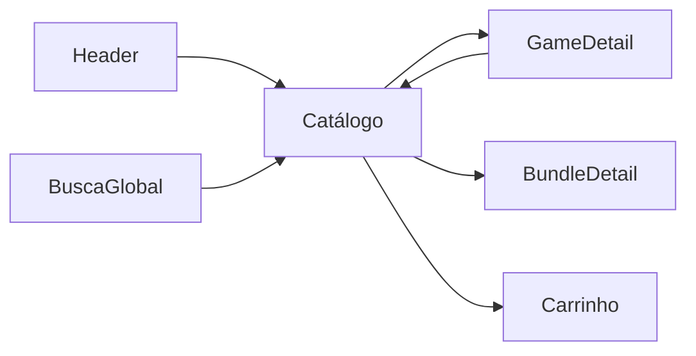

# Catálogo — `/catalogo`

> **Status:** final rascunho
> **Plataforma:** Web
> **Arquivo-fonte:** `src/pages/Catalogo.tsx`
> **Última revisão:** 2026-07-04

---

## 1. Objetivo da página

Permitir que o usuário **encontre um jogo específico** ou **explore o acervo completo** com filtros previsíveis (busca textual, categoria, plataforma, ordenação). É a página do "eu sei mais ou menos o que quero" — o oposto da Home, que é "me surpreenda".

## 2. Filosofia

Se a Home é o feed de descoberta emocional (Órbita, Escolha do Dia), o Catálogo é a **loja funcional**: grade densa, sem storytelling, respeitando a intenção declarada do usuário. É a página que precisa funcionar mesmo quando o usuário chega de um link colado no WhatsApp com `?q=elden`.

O Catálogo é também o **ponto de verdade** do acervo: se um jogo não aparece aqui com filtros zerados, ele não existe comercialmente. Isso o torna a página de referência para QA, suporte e vendedores.

## 3. Usuários-alvo

| Perfil                 | O que enxerga                                          | O que pode fazer                       |
| ---------------------- | ------------------------------------------------------ | -------------------------------------- |
| Visitante (deslogado)  | Grade completa, filtros, bundles                       | Filtrar, buscar, ver detalhes, add carrinho (LoginGate no checkout) |
| Logado — sessão nova   | Idem + estado do carrinho persistido                   | Idem + favoritar                       |
| Logado — recorrente    | Idem, com prefetch mais agressivo (cache quente)       | Idem                                   |
| Vendedor               | Igual ao usuário (o catálogo é da loja, não C2C)       | Idem                                   |
| Moderador / Admin      | Igual + (futuro) badge de "em revisão"                 | Idem                                   |

## 4. Estrutura visual

```text
Header
   ↓
H1 "Catálogo de Jogos"
   ↓
Barra de filtros [busca | categoria | plataforma | ordenação]
   ↓
[Bundles] (só quando filtros zerados)
   ↓
"N jogos encontrados"
   ↓
Grade GameCard (2/3/4/5/6 colunas responsivo)
   ↓
Empty state (quando filtered.length === 0)
   ↓
Footer
```

**Por que essa ordem?** Filtros no topo respeitam o padrão de e-commerce (Steam, Epic, GOG). Bundles antes da grade porque são a "oferta compostinha" que o usuário nunca busca ativamente mas converte quando exposta — funciona como cross-sell natural. Contador de resultados dá feedback imediato de que o filtro pegou.

## 5. Componentes

### 5.1 Barra de filtros

- **O que é:** 4 controles horizontais (input de busca + 3 selects nativos).
- **O que mostra:** valores atuais, sincronizados com a URL (`?q=&cat=&platform=&sort=`).
- **Quando aparece:** sempre.
- **Comportamento responsivo:** empilha em coluna abaixo de `md` (busca ocupa 100%, selects em wrap).
- **Dependências:** `useSearchParams`, `useDebounce(200ms)` na busca, `useQuery(['categorias'])`.

### 5.2 Bundles condicional

- **O que é:** carrossel horizontal de 4 bundles.
- **Quando aparece:** apenas quando `!debouncedQuery && category === 'Todos' && platform === 'Todos'` — ou seja, na entrada limpa.
- **Por quê:** bundle não é filtrável por categoria/plataforma no modelo atual, então esconder ao filtrar evita confusão ("filtrei RPG e apareceu bundle de FIFA").

### 5.3 Grade de GameCards

- **O que é:** grid responsivo 2 → 6 colunas.
- **O que mostra:** produtos filtrados/ordenados.
- **Dependências:** `useProdutos()` (traz TODOS os produtos ativos com estoque de primeira leva).

### 5.4 Empty state

- **O que é:** mensagem "Nenhum jogo encontrado" + sugestão.
- **Ausente hoje:** CTA para limpar filtros. **P1.**

## 6. Fluxos de entrada

- Link direto do header ("Catálogo")
- Busca do header → redireciona com `?q=`
- Deep link externo (colado no WhatsApp/Discord)
- Redirect vindo de banner promocional futuro
- Clique em categoria/plataforma de outra página (futuro — hoje não existe)

## 7. Fluxos de saída

Por probabilidade:

1. **GameCard → GameDetail** (`/jogo/:id`)
2. **BundleCard → BundleDetail**
3. **Volta pra Home** (usuário não achou nada relevante)
4. **Ofertas** (se veio buscando desconto)
5. **Sair do site** (bounce quando empty state sem CTA)

## 8. Navegação entre páginas



Catálogo é um **hub secundário**: quase toda a árvore de navegação passa por ele em algum momento.

## 9. Regras de negócio

- Só produtos com `is_active = true` e `awaiting_first_stock = false` aparecem.
- Ordenação padrão é `created_at DESC` (novos primeiro) — a opção "Relevância" hoje é sinônimo dessa ordem.
- Filtro de plataforma casa por `.includes()` no array — jogo multi-plataforma aparece em várias.
- Filtros persistem em URL para deep-link e voltar/avançar do browser.

## 10. Estados da interface

| Estado          | Trigger                                | O que o usuário vê                              |
| --------------- | -------------------------------------- | ----------------------------------------------- |
| Carregando      | primeira fetch                         | `GameCardGridSkeleton count={12}` — bom         |
| Vazio (acervo)  | catálogo sem produtos                  | "Nenhum jogo encontrado" — **mesma msg do filtro vazio, ruim** |
| Vazio (filtro)  | filtro sem match                       | Idem — **precisa distinguir** |
| Erro            | fetch falhou                           | **Hoje: nada. React Query silencia. P0.**       |
| Offline         | sem conexão                            | Idem                                            |
| Muitos dados    | 10k+ produtos                          | **Renderiza tudo, sem virtualização. P0.**      |

## 11. Permissões

| Ação            | Visitante | Usuário | Vendedor | Mod | Admin |
| --------------- | :-------: | :-----: | :------: | :-: | :---: |
| Visualizar      |     ✓     |    ✓    |     ✓    |  ✓  |   ✓   |
| Filtrar/buscar  |     ✓     |    ✓    |     ✓    |  ✓  |   ✓   |
| Add carrinho    |     ✓*    |    ✓    |     ✓    |  ✓  |   ✓   |
| Favoritar       |     —     |    ✓    |     ✓    |  ✓  |   ✓   |

*Visitante pode adicionar; LoginGate no checkout.

## 12. Origem dos dados

- `produtos` (via `useProdutos()`): array completo, filtrado client-side.
- `categorias` (via `useQuery(['categorias'])`): para popular o select.
- `plataformas`: **hardcoded em `src/lib/gameData.ts`**. **P1** — deveria vir do banco (existe `plataformas` no schema mobile).
- Bundles: `useBundles()` interno do `BundleStoreGrid`.

## 13. Banco relacionado

`produtos`, `categorias`, `bundles`, `bundle_items`. Sem tabela de "produto ↔ categoria" (categoria é campo string único no produto — limitação: um jogo = uma categoria).

## 14. APIs / hooks

- `useProdutos()` — `select('*') from produtos where is_active and not awaiting_first_stock order by created_at desc`
- `useQuery(['categorias'])` — inline no arquivo
- `usePrefetchRoute()` + `queryClient.prefetchQuery(['produto', id])` no hover do card

## 15. Painel admin relacionado

Hoje: `JogosAdmin.tsx`, `Produtos.tsx`, `Categorias.tsx`, `Estoque.tsx`.

**O que falta / deve existir:**

- **Ordem editorial**: hoje só existe `created_at DESC`. O admin não pode "pinar" um jogo no topo do catálogo. Adicionar campo `catalog_weight int default 0` e ordenar `weight desc, created_at desc`.
- **Coleções/Curadoria**: página `ColecoesAdmin.tsx` — coleções manuais tipo "Melhores de 2025", "Metroidvanias", exibidas como faixas horizontais dentro do catálogo antes da grade.
- **A/B de ordenação default**: alternar entre `relevance = weighted score` vs `created_at desc` para medir CTR.
- **Alertas de saúde**: painel que mostra jogos que aparecem no catálogo mas com estoque zero há > 7 dias, imagem quebrada (404 no `image_url`), preço zero, etc.
- **Preview do catálogo**: botão "ver como visitante" que abre `/catalogo` em nova aba com token de bypass.

## 16. Casos extremos

- **Produto sai do ar entre a listagem e o clique**: GameDetail deve tratar 404 com CTA "voltar ao catálogo".
- **Categoria renomeada no admin**: produtos com categoria antiga somem do filtro (filtro é por string). Precisa migração automática ao renomear.
- **Plataforma nova adicionada**: não aparece no filtro (hardcoded). Vide P1 em §12.
- **10k produtos**: `useProdutos` puxa tudo, React renderiza tudo, browser trava.
- **Busca com regex/SQL injection na URL**: filtro é client-side, sem risco de injection, mas `q=` extremamente longo (>1MB) pode travar debounce.
- **Sessão expira**: catálogo continua funcionando, LoginGate protege o checkout.

## 17. Justificativa de UX/UI

- **Selects nativos, não Radix**: intencional para mobile (usa picker do SO). Trade-off: estética inconsistente. **P2** — migrar para shadcn Select com fallback nativo em `<md`.
- **Grid denso (6 colunas em `xl`)**: alinhado com Steam. Densidade permite escanear 30+ produtos sem scroll em telas grandes.
- **Debounce 200ms**: sweet spot entre "responsivo" e "não fritar CPU a cada tecla".
- **URL como source of truth**: permite compartilhar, colar, voltar. Padrão de e-commerce sério.

## 18. Escalabilidade

| Escala   | Comportamento atual                        | Ação necessária                              |
| -------- | ------------------------------------------ | -------------------------------------------- |
| 100      | ok                                         | —                                            |
| 1k       | ok (0.5s parse)                            | —                                            |
| 10k      | trava 3-5s no filter+render                | Paginação server-side ou virtualização       |
| 100k     | inviável                                   | RPC `catalog_search(q, cat, platform, sort, page)` com índice full-text no Postgres |
| 1M       | precisa Meilisearch/Algolia ou pg_trgm + índice GIN | Search externo                    |

## 19. Melhorias futuras

- **P0**: paginação/virtualização server-side (`react-virtuoso` ou `@tanstack/react-virtual`).
- **P0**: RPC de busca com full-text (`to_tsvector`) e ranking.
- **P1**: filtros compostos (checkbox multi-select para plataforma, faixa de preço via slider, tags).
- **P1**: URL params para `page`.
- **P1**: SEO — SSR/prerender das primeiras N páginas.
- **P2**: comparador de jogos (selecionar 2-4 cards → tabela lado a lado).
- **P2**: histórico de buscas recentes (localStorage).
- **P2**: integração Steam/Epic para importar wishlist e destacar no catálogo.

## 20. Crítica da implementação atual

### 20.1 O que está bom e por quê

**URL como state (`useSearchParams` + `useEffect` de sincronização)**
- **O que é:** filtros vivem em `?q=&cat=&platform=&sort=`.
- **Por que funciona:** deep-link, back/forward do browser, compartilhamento nativo. Sem ele, o usuário perde o filtro ao apertar F5.
- **Por que deve ficar:** é o padrão correto e raramente feito bem. Nunca remover.
- **Como levar a excelente:** adicionar `?page=` quando entrar paginação; usar `history.replaceState` mais fino para não poluir histórico do browser em cada tecla digitada (hoje faz replace, o que é o correto — apenas confirmar).

**Debounce de 200ms na busca**
- **O que é:** `useDebounce(query, 200)`.
- **Por que funciona:** filtro é client-side custoso (percorre array + `toLowerCase` + `includes`), sem debounce a cada tecla o filtro roda 8-10× por segundo.
- **Por que deve ficar:** performance imediata percebida.
- **Como levar a excelente:** aumentar para 300ms quando `games.length > 1000` (adaptativo).

**Skeleton de grade no loading**
- Consistente, sem CLS. **Manter.**

**Ocultar bundles quando há filtro ativo**
- Decisão sutil e correta. Evita ruído semântico. **Manter.**

### 20.2 O que está ruim e por quê

**1. Não há paginação — puxa todos os produtos ativos**
- **O que é:** `useProdutos()` faz `select('*')` sem `limit`.
- **Por que está ruim:** com 500 produtos já são ~200KB de JSON + 500 imagens em `lazy`. Com 5k é insustentável. Filter/sort roda no client em cima do array inteiro.
- **Por que remover:** viola escalabilidade e mata a métrica de LCP.
- **Alternativa concreta:** RPC `catalog_page(filters, page, per_page)` que devolve `{items, total, facets}`. React Query com `keepPreviousData`. Facets vindas do servidor (contagem por categoria/plataforma), não calculadas no client.
- **Prioridade:** **P0**.

**2. Sem tratamento de erro visível**
- **O que é:** `isError` do React Query não é exibido.
- **Por que está ruim:** usuário vê grade vazia e assume "não tem jogo" quando na verdade a API caiu. Falha silenciosa.
- **Alternativa:** bloco de erro com botão "Tentar de novo" + `toast` com detalhe técnico para o dev.
- **Prioridade:** **P0**.

**3. Empty state igual para "sem filtro" e "filtro sem match"**
- **O que é:** mensagem única.
- **Por que está ruim:** o usuário que filtrou "RPG + Xbox + Menor Preço" não sabe se o problema é filtro ou acervo. Sem CTA para limpar filtros.
- **Alternativa:** duas mensagens; se `debouncedQuery || category !== 'Todos' || platform !== 'Todos'` → mostrar "Nenhum jogo com esses filtros" + botão "Limpar filtros". Se acervo genuinamente vazio → "Novos jogos chegam em breve" + link para newsletter.
- **Prioridade:** **P1**.

**4. Plataformas hardcoded**
- **O que é:** `platforms = ["Todos","PC","PS5","Xbox","Switch"]` em `gameData.ts`.
- **Por que está ruim:** admin cria plataforma nova (PS6, SteamDeck) e ela não aparece no filtro. Descolamento entre dado e UI.
- **Alternativa:** buscar de `plataformas` (mobile já tem a tabela) com cache de 10min.
- **Prioridade:** **P1**.

**5. Ordenação "Relevância" é uma mentira educada**
- **O que é:** option "Relevância" retorna a ordem default (`created_at desc`).
- **Por que está ruim:** o rótulo promete algoritmo e entrega cronologia. Quebra confiança sutil.
- **Alternativa:** ou renomear para "Mais recentes", ou implementar score de verdade (`0.4*rating + 0.3*sales_30d + 0.2*view_delta_7d + 0.1*recency`).
- **Prioridade:** **P1**.

**6. Selects nativos misturados a inputs shadcn**
- Inconsistência visual. Cosmética. **P2**.

**7. `useQuery(['categorias'])` inline no componente**
- **O que é:** hook definido dentro do arquivo da página em vez de `src/hooks/useCategorias.ts`.
- **Por que está ruim:** duplicação futura, dificulta invalidation compartilhada.
- **Alternativa:** extrair para hook próprio.
- **Prioridade:** **P2**.

### 20.3 Dívida técnica visível

- Sem virtualização: bomba-relógio pro Fase B (quando o acervo crescer).
- Sem RPC de busca full-text: qualquer busca por termo próximo ("elden" vs "eldenring") falha.
- Filtros mutuamente exclusivos (uma categoria, uma plataforma) — refactor para multi-select é doloroso depois que houver telemetria consumindo o formato atual.
- `useProdutos` compartilhado com Home, Ofertas, EmAlta, ParaVocê → qualquer refactor para paginação impacta 4 páginas ao mesmo tempo. Considerar hooks especializados (`useCatalogPage`, `useHomeFeatured`).

### 20.4 Ângulos que a análise inicial não cobriu

- **Acessibilidade**: selects nativos ok para teclado/leitor. Contudo `<input>` de busca sem `<label>` explícito (só `placeholder`) — WCAG 3.3.2 falho. Adicionar `<label className="sr-only">`.
- **Performance**: LCP dominado pela primeira fileira de `GameCard` (imagens `lazy` mas 6 imagens acima da dobra). Primeiras 6 imagens deveriam ter `loading="eager"` + `fetchpriority="high"`.
- **CLS**: grade tem `aspect-[3/4]`, então CLS = 0. Bom.
- **SEO**: página é CSR pura. Google renderiza JS mas custa crawl budget. Prerender das top-100 combinações filtro seria valioso.
- **i18n**: strings em PT-BR hardcoded (`"Buscar por nome ou tag..."`, `"Todos"`, `"Menor Preço"`). Migrar para `i18next` antes de expansão futura.
- **JS desativado**: página em branco. Adicionar `<noscript>` mínimo linkando para `/catalogo.html` estático.
- **Dark/light**: usa tokens semânticos (`bg-card`, `text-foreground`) → paridade ok.
- **Telemetria**: nenhum evento disparado para "filtro aplicado", "busca sem resultado", "sort mudado". Sem isso, impossível saber se o feature de ordenação é usado.
