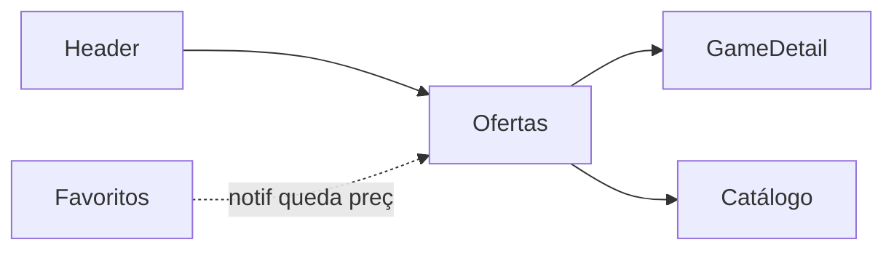

# Ofertas — `/ofertas`

> **Status:** rascunho
> **Plataforma:** Web
> **Arquivo-fonte:** `src/pages/Ofertas.tsx`
> **Última revisão:** 2026-07-04

---

## 1. Objetivo

Concentrar em uma única página **todos os produtos com desconto ativo**, ordenados pelo maior desconto, para o usuário que chega em modo "caçador de promoção".

## 2. Filosofia

Ofertas é a página de **intenção comercial declarada**. O usuário aqui não quer descobrir, quer economizar. Diferente do Catálogo (funcional) e da Home (emocional), Ofertas precisa **fazer o preço gritar**: badge de %, preço original riscado, sensação de urgência. É a página que converte carrinho abandonado que voltou depois de e-mail "voltamos a esse preço".

Se sumisse, o usuário caçador teria que aplicar `?sort=discount` no catálogo — factível, mas perde a legibilidade e a assinatura "ofertas curadas".

## 3. Usuários-alvo

| Perfil                | O que enxerga                              | Ações                          |
| --------------------- | ------------------------------------------ | ------------------------------ |
| Visitante             | Todos os jogos com `discount > 0`          | Ver, add carrinho (LoginGate)  |
| Logado                | Idem + favoritar                           | Idem                           |
| Vendedor              | Idem                                       | Idem                           |
| Admin                 | Idem + (futuro) badge "promoção agendada"  | Idem                           |

## 4. Estrutura visual

```text
Header
   ↓
Título "Ofertas Especiais" + ícone Zap
   ↓
Subtítulo curto
   ↓
[Grade GameCard] OU [Empty state com CTA]
   ↓
Footer
```

**Ausências gritantes na estrutura:**
- Sem filtro por plataforma/categoria dentro de ofertas.
- Sem faixa "Top 10 descontos".
- Sem contador regressivo para promoções que expiram.
- Sem separação "Ofertas relâmpago" (< 24h) vs "Ofertas do mês".

## 5. Componentes

### 5.1 Cabeçalho

Título + `Zap` icon + parágrafo estático. Cosmético.

### 5.2 Grade de ofertas

- `useProdutos()` → filter `discount > 0` → sort `discount desc`.
- Mesma grade responsiva do Catálogo (2/3/4/5/6 col).
- Reaproveita `GameCard` (já mostra badge `-X%` e preço riscado). Consistência boa.

### 5.3 Empty state

- Mensagem + link para `/catalogo`. **Único empty state com CTA real na Fase A** — mérito.

## 6. Fluxos de entrada

- Header ("Ofertas")
- Banner promocional (futuro)
- E-mail de "voltamos ao seu preço" (futuro)
- Notificação de queda de preço (favorito monitorado) — **P1**

## 7. Fluxos de saída

1. GameDetail
2. Carrinho
3. Catálogo (via empty state)
4. Home (bounce)

## 8. Navegação



## 9. Regras de negócio

- Aparece se `discount > 0` no produto. Ponto.
- Não existe hoje `promo_starts_at` / `promo_ends_at` — desconto é **estado permanente do produto** até o admin zerar.
- Ordenação fixa por `discount desc` (sem toggle).

## 10. Estados

| Estado       | O que vê                                     |
| ------------ | -------------------------------------------- |
| Loading      | Skeleton grid — bom                          |
| Sem ofertas  | Empty + link catálogo — bom                  |
| Erro fetch   | **Nada — grade vazia igual "sem ofertas"** — P0 |
| Muitas ofertas | Renderiza tudo, sem paginação — P1         |

## 11. Permissões

Iguais ao Catálogo.

## 12. Origem dos dados

`useProdutos()` compartilhado. **Ofertas herda todos os problemas de escala do Catálogo** (§18 do Catálogo).

## 13. Banco

`produtos.discount`, `produtos.original_price`, `produtos.price`.

**Faltando no schema:**
- `promo_starts_at timestamptz`
- `promo_ends_at timestamptz`
- `promo_type enum('daily','weekend','flash','permanent')`
- `promo_reason text` (motivo interno para auditoria: "queima estoque", "lançamento", "sazonal")

## 14. APIs / hooks

Apenas `useProdutos()` + `useMemo` client-side.

**Recomendação futura:** hook próprio `useOfertas()` que consulte RPC `get_active_offers()` com JOIN em `promocoes` (tabela que precisa existir) e retorne já ordenado + com metadata (`ends_in_hours`).

## 15. Painel admin relacionado

Hoje: `Promocoes.tsx` existe no desktop.

**O que precisa amadurecer:**

- **Editor de campanha**: seleciona múltiplos produtos → aplica desconto % ou valor fixo → agenda início/fim.
- **Calendário de promoções**: visão de mês mostrando promoções ativas, agendadas, expiradas. Alerta de sobreposição ("PS5 já tem 20% off ativo até 15/07").
- **Regras de proteção**: bloquear preço final abaixo de `custo * 1.10` (margem mínima); alerta se `discount > 70%` (pode ser erro de digitação).
- **Copy pack**: campo `promo_banner_text` por promoção para exibir em faixa no topo da Ofertas ("Semana Indie: -40% em 47 títulos").
- **Segmentação**: promoção só para usuários com N pedidos, ou aniversariantes do mês.
- **Auditoria**: quem criou, quando, valor antes/depois, quantos usaram, receita gerada.
- **Preview**: renderizar em modal como o GameCard vai aparecer com o desconto aplicado.
- **Rollback com 1 clique**: reverter promoção mantendo histórico.

## 16. Casos extremos

- Promoção expira enquanto item está no carrinho → **hoje: preço é recalculado no checkout? Precisa verificar.** Ponto de sangue potencial.
- Produto com `discount > 0` mas estoque zero → aparece em Ofertas com badge "Esgotado" (herdado do GameCard) — comportamento correto, mas polui a lista. Filtrar `stock > 0`? Trade-off: perde a memória de "estava em promoção".
- `original_price < price` (dado corrompido) → GameCard mostra preço original menor riscado, ficando ridículo. Sem validação no banco.
- 100% de desconto (item grátis) — provavelmente quebra checkout. Sem clamp.

## 17. Justificativa UX/UI

- Ícone `Zap` (raio) reforça urgência.
- Cor `text-price` (accent do brand) no valor promocional — consistente com o resto da app.
- Reuso do `GameCard` mantém memória muscular do usuário.

## 18. Escalabilidade

Herda 100% dos problemas do Catálogo (§18 do Catálogo). Adicionar: quando entrar `promo_ends_at`, timer regressivo por card gera N intervalos rodando simultaneamente — usar um único `requestAnimationFrame` global ou update por minuto (não por segundo).

## 19. Melhorias futuras

- **P0**: modelo de `promocoes` com janela temporal.
- **P0**: tratamento de erro visível.
- **P1**: faixa "Ofertas Relâmpago" no topo com timer.
- **P1**: notificação push para queda de preço em favoritos.
- **P1**: filtros dentro de Ofertas (categoria, plataforma, faixa de desconto).
- **P2**: "Preço mais baixo dos últimos 90 dias" (usar `price_history` que já existe pelo `PriceHistoryChart`).
- **P2**: badge "Menor preço histórico" quando aplicável.
- **P2**: página `/ofertas/expiradas` — histórico de promoções passadas, ótimo para SEO ("ver quando FIFA voltar a estar em promoção").

## 20. Crítica da implementação atual

### 20.1 O que está bom e por quê

**Empty state com CTA de saída**
- **O que é:** "Sem ofertas ativas" + botão para `/catalogo`.
- **Por que funciona:** único empty state da Fase A que evita bounce. Redireciona intenção comercial em vez de encerrá-la.
- **Manter e replicar** em Catálogo, Em Alta, Pra Você.

**Ordenação por maior desconto**
- **Por que funciona:** cumpre a promessa do rótulo "Ofertas Especiais" — o primeiro card É o maior desconto. Simples, honesto.
- **Como melhorar:** adicionar toggle secundário "por menor preço final" e "por termino em breve".

**Reuso de GameCard**
- **Por que funciona:** consistência visual, badge de desconto já pronto, sem código duplicado.

### 20.2 O que está ruim e por quê

**1. Modelo de desconto plano no produto**
- **O que é:** `produtos.discount` é um int estático no registro.
- **Por que está ruim:** impossível agendar, impossível saber "está em promoção há quanto tempo", impossível auditar quem baixou o preço, impossível fazer campanha temporária sem editar manualmente antes/depois.
- **Alternativa:** tabela `promocoes(id, produto_id, percent, starts_at, ends_at, criador_id, motivo)` + trigger que aplica ao `produtos.discount` durante a janela ativa. RPC `get_active_offers()` faz join.
- **Prioridade:** **P0**.

**2. Página é essencialmente `/catalogo?sort=discount&filter=discount>0`**
- **O que é:** zero valor adicional vs catálogo filtrado.
- **Por que está ruim:** perde identidade. Não tem faixa hero, não tem timer, não tem storytelling ("Semana Indie", "Black Friday"), não tem seções tematizadas.
- **Alternativa:** adicionar acima da grade um bloco `<PromoCampaigns />` que renderiza campanhas ativas (cada campanha = imagem hero + copy + CTA "ver 12 jogos desta oferta"). Grade completa vira secundária.
- **Prioridade:** **P1**.

**3. Sem filtros internos**
- **O que é:** você não pode filtrar as ofertas por PS5 ou por RPG.
- **Por que está ruim:** com 100 ofertas ativas, o caçador de promoção de Xbox rola até desistir.
- **Alternativa:** reaproveitar a barra de filtros do Catálogo (extrair componente `FiltersBar` compartilhado).
- **Prioridade:** **P1**.

**4. Herda "puxa tudo" do useProdutos**
- Vide Catálogo §20.2 item 1. Mesmo problema, mesma solução.
- **Prioridade:** **P0** (junto com Catálogo).

**5. Sem indicador de urgência**
- **O que é:** sem timer, sem "restam 3 unidades", sem "acaba hoje".
- **Por que está ruim:** perde conversão. Urgência real (não fake pattern) é o principal driver da página de ofertas.
- **Alternativa:** quando `promo_ends_at - now < 48h`, mostrar chip "Termina em 12h" no card. Quando `stock < 5`, mostrar "Últimas unidades".
- **Prioridade:** **P1** (depende de #1).

**6. Sem tratamento de erro visível**
- Mesma crítica do Catálogo §20.2 item 2.
- **Prioridade:** **P0**.

### 20.3 Dívida técnica

- Dependência de `useProdutos` compartilhado com Home/Catálogo/EmAlta/ParaVocê — qualquer paginação server-side precisa ser feita em conjunto.
- Ausência da tabela `promocoes` bloqueia dashboards de "ROI de promoção" no admin.
- `price_history` existe mas não é consultada aqui — subutilização.

### 20.4 Ângulos que a análise inicial não cobriu

- **Acessibilidade**: título tem `text-2xl font-bold` mas não é `<h1>` semanticamente destacado como "início do conteúdo"; screen reader trata igual a qualquer heading. Adicionar `<main aria-labelledby="ofertas-h1">`.
- **Performance**: filtro + sort são O(n log n) client-side; irrelevante até 1k produtos, dorido em 10k.
- **SEO**: página excelente para SEO ("jogos em promoção", "ofertas ps5"), mas CSR sem prerender + sem meta description específica = desperdício de intent search puro. **Adicionar `<Helmet>` (react-helmet-async) com `<title>Ofertas de Jogos - MIDIAS</title>` e description que muda com contagem ("48 jogos em promoção hoje").**
- **i18n**: PT-BR hardcoded.
- **JS desativado**: em branco.
- **Dark/light**: tokens semânticos, ok.
- **Telemetria**: nenhum evento `offer_viewed`, `offer_clicked`, `offer_added_to_cart` — sem isso, o admin não sabe quais promoções converteram. Adicionar assim que houver campanhas reais.
- **Notificação push queda de preço**: pré-requisito é tabela `precos_monitorados(user_id, produto_id, target_price)` — nem existe, mas é a killer feature natural da página.
