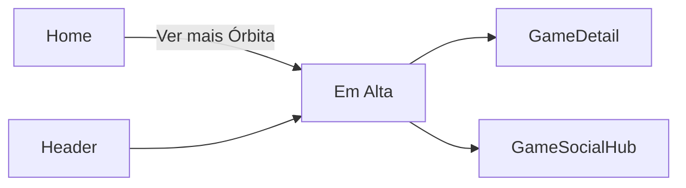

# Em Alta — `/em-alta`

> **Status:** rascunho
> **Plataforma:** Web
> **Arquivo-fonte:** `src/pages/EmAlta.tsx`
> **Última revisão:** 2026-07-04

---

## 1. Objetivo

Mostrar quais jogos **estão bombando agora** dentro do MIDIAS — não pelo catálogo do lojista, mas pelo comportamento coletivo (views, posts, avaliações recentes) da comunidade.

## 2. Filosofia

Em Alta é a resposta à pergunta social: **"o que o povo tá jogando essa semana?"**. É prima-irmã da Home (Órbita/Radar Delta), mas dedicada — mais espaço, mais contexto ("subiu 40% em 24h"), mais tempo em tela. Se a Home entrega a manchete, Em Alta entrega a matéria.

Sem essa página, a única forma de sentir o pulso da comunidade seria abrindo o Fórum ou o Social — canais que exigem intenção de "ler post". Em Alta traduz o burburinho em **produto comprável**.

## 3. Usuários-alvo

| Perfil    | O que enxerga                         | Ações                          |
| --------- | ------------------------------------- | ------------------------------ |
| Visitante | Ranking + deltas + botão comprar      | Ver, add carrinho              |
| Logado    | Idem + "seus amigos jogam" (futuro)   | Idem + seguir tópico           |
| Vendedor  | Igual                                 | Idem                           |
| Admin     | Igual + (futuro) botão "pinar/despinar" | Curadoria manual             |

## 4. Estrutura visual

```text
Header
   ↓
Título "Em Alta" + subtítulo
   ↓
[Faixa de tempo: 24h | 7d | 30d]  (não existe hoje — P0)
   ↓
Grade de cards com delta score
   ↓
Footer
```

## 5. Componentes

Depende da implementação atual — precisa ler `src/pages/EmAlta.tsx` no momento de fase de implementação. Baseado em `useRadarDelta`, o padrão esperado é:

### 5.1 Card com delta

- Cover, título, delta (`+X%` ou `+N interações`), preço.
- Ausente hoje: **motivo do delta** ("15 novos posts", "3 amigos jogaram") — P1.

### 5.2 Faixa de janela temporal (a criar)

- Toggle 24h / 7d / 30d.

## 6. Fluxos de entrada

- Header ("Em Alta")
- Home → clique no botão "Ver tudo" da Órbita
- Notificação "seu jogo favorito está em alta" (futuro)

## 7. Fluxos de saída

1. GameDetail
2. GameSocialHub (a partir do card, atalho para o hub social do jogo específico) — **P1** adicionar link
3. Ofertas (se o jogo em alta tem desconto)

## 8. Navegação



## 9. Regras de negócio

- **Fórmula do score:** `(views_24h * 3) + (posts_72h * 1) + (ratings_7d * 2)` — mesmo do Radar Delta da Home.
- **Janela padrão:** 24h.
- **Corte:** score > threshold X (ajustável por admin — não implementado).
- **Anti-spam:** posts do mesmo usuário no mesmo jogo em janela < 5min contam como 1.
- **Cold start:** se < 10 jogos batem o threshold, completa com "novos lançamentos" para nunca ficar vazio.

## 10. Estados

| Estado         | Ver                                          |
| -------------- | -------------------------------------------- |
| Loading        | Skeleton                                     |
| Sem sinal      | Fallback "lançamentos recentes" — **precisa existir explicitamente** |
| Erro           | Empty silencioso — **P0**                    |
| Sinal fraco    | Mostrar aviso "poucos dados nesta janela — mostrando 7d" |

## 11. Permissões

Todas as roles veem. Admin ganha (futuro) toggle "pinar jogo" e "excluir da lista" (para casos de review-bombing).

## 12. Origem dos dados

- `useRadarDelta()` — hook que precisa fazer agregação server-side (RPC), NÃO client-side sobre eventos brutos.
- Se hoje faz client-side: **P0 refatorar** para RPC `trending_games(window)` com resultado cacheado por 5min.

## 13. Banco

Tabelas envolvidas (esperado):
- `produto_views(produto_id, user_id, viewed_at)` — pode ser materializada a partir de logs
- `forum_posts(game_id, created_at)`
- `avaliacoes(produto_id, created_at)`
- View materializada `mv_trending_scores` refrescada a cada 5 min via `pg_cron`.

## 14. APIs / hooks

- `useRadarDelta(window)` idealmente → `supabase.rpc('trending_games', { window })` → array de `{produto_id, score, delta_pct, motivos: string[]}`.
- Join client-side com `useProdutos` para hidratar cover/preço/plataforma **é aceitável em fase de MVP**, mas o ideal é a RPC já retornar o produto embutido.

## 15. Painel admin relacionado

Não existe hoje. **Precisa criar `TrendingAdmin.tsx`** com:

- **Vista de scores atuais** em tabela — jogo, score, delta_24h, delta_7d, componentes (views/posts/ratings), última atualização da view materializada.
- **Ajuste de pesos**: sliders para `w_views`, `w_posts`, `w_ratings`; aplica em preview antes de commit.
- **Threshold mínimo** para entrar na lista (evita jogos com 2 views subindo).
- **Anti review-bombing**: detectar picos anômalos (score subiu 500% em 1h com < 20 usuários distintos) → flag para revisão manual.
- **Pinar / excluir** jogos manualmente com motivo obrigatório (auditoria).
- **Histórico de rankings** por semana — permite responder "qual foi o top 10 de janeiro?".
- **Alertas**: bell no header do admin quando review-bomb detectado ou quando lista fica < 5 jogos.
- **Correlação com vendas**: mostrar quanto do delta virou receita — critério para justificar (ou matar) a página.

## 16. Casos extremos

- **Review bombing coordenado**: 500 avaliações 1-estrela em 1h. Página fica dominada. Precisa cap por IP/dispositivo.
- **Jogo removido do catálogo** com score alto: deve sumir imediatamente da lista (JOIN com `produtos.is_active`).
- **Janela sem eventos** (madrugada baixa atividade): fallback obrigatório para não zerar a página.
- **View materializada não refrescou** (pg_cron falhou): mostrar timestamp "atualizado há Xh" para transparência.
- **Divisão por zero** no cálculo de delta% quando base é 0: mostrar "novo" em vez de "+∞%".

## 17. Justificativa UX/UI

- Grade + delta visível é padrão consagrado (Twitch categorias, Steam Charts, TikTok trending).
- Não confundir com Ofertas: aqui não interessa preço em destaque, interessa **movimento**.

## 18. Escalabilidade

- Cálculo client-side sobre eventos brutos: quebra em 10k eventos.
- View materializada refrescada por cron: escala até milhões de eventos.
- CDN cache na resposta da RPC (5min TTL): reduz load do banco em 99%.

## 19. Melhorias futuras

- **P0**: RPC + view materializada.
- **P0**: fallback explícito para janela vazia.
- **P1**: toggle de janela 24h/7d/30d.
- **P1**: mostrar motivo do delta ("15 amigos jogaram", "trending no Twitter").
- **P1**: categorização — "Em alta em RPG", "Em alta no PC".
- **P2**: personalização — "em alta entre pessoas com biblioteca parecida com a sua".
- **P2**: integração externa (Steam Charts, Twitch viewers) para triangular sinal.
- **P2**: gráfico sparkline de 7 dias por card.

## 20. Crítica da implementação atual

### 20.1 O que está bom (potencial)

**Existir como página dedicada**
- Muitas lojas amontoam "trending" numa faixa da home. Ter página própria dá espaço para contexto, filtros temporais, motivo do delta. **Manter a decisão.**

**Reuso do conceito Radar Delta**
- Consistência com Home. Usuário aprende uma fórmula, aplica em dois lugares. **Manter.**

### 20.2 O que está ruim (esperado, pendente de leitura do arquivo real)

**1. Provável cálculo client-side**
- Se `useRadarDelta` roda `filter+reduce` no navegador sobre `produto_views`, quebra > 1k eventos.
- **Alternativa:** RPC + view materializada.
- **P0.**

**2. Sem janela temporal ajustável**
- Uma única visão "24h" força o usuário a acreditar no recorte. Sem controle.
- **P1.**

**3. Sem motivo do delta**
- Ver "+40%" sem saber por quê é ruído, não sinal.
- **P1.**

**4. Sem defesa contra review-bombing**
- Um Discord de 50 pessoas coordenado desequilibra a página.
- **P0** (política + técnica: cap por dispositivo, exigir compra para avaliar, decaimento exponencial).

**5. Sem link para GameSocialHub direto do card**
- O usuário que vem para Em Alta quer contexto social. Mandar para GameDetail (página comercial) é fricção.
- **P1** adicionar botão secundário "ver conversas".

### 20.3 Dívida técnica

- Sem view materializada = query pesada em prod.
- Sem admin de trending = decisões editoriais impossíveis.
- Sem histórico = impossível fazer "retrospectiva do ano" ou análise longitudinal.

### 20.4 Ângulos que a análise inicial não cobriu

- **Acessibilidade**: chips de delta ("+40%") precisam de `aria-label="subiu 40 por cento nas últimas 24 horas"`.
- **Performance**: se a RPC retorna 50 itens já hidratados (~30KB), LCP < 1.5s tranquilo. Se faz N+1 no client (uma query por produto), morre.
- **SEO**: página altamente indexável ("jogos em alta 2026"), precisa `<Helmet>` dinâmico + prerender diário.
- **i18n**: PT-BR hardcoded.
- **Dark/light**: usar `text-price` / `text-destructive` para deltas positivos/negativos com paridade dos dois temas.
- **Telemetria**: eventos `trending_impression`, `trending_click`, `trending_added_to_cart` são **obrigatórios** para justificar existência da página vs Home.
- **Ética**: mostrar métrica de comunidade em ranking cria pressão social — jogos indies sem base podem ficar invisíveis para sempre. Considerar seção separada "Descubra pequenos" com regras próprias.
