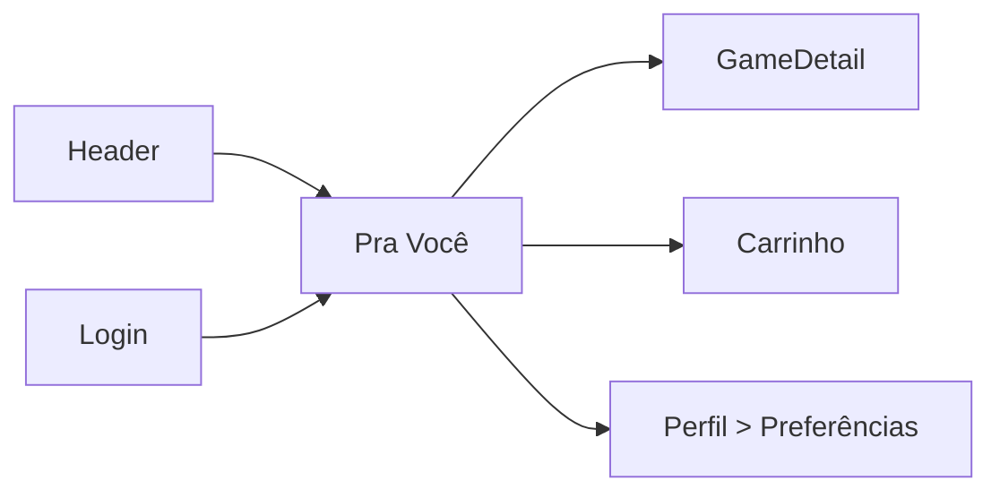

# Pra Você — `/pra-voce`

> **Status:** rascunho
> **Plataforma:** Web
> **Arquivo-fonte:** `src/pages/ParaVoce.tsx`
> **Última revisão:** 2026-07-04

---

## 1. Objetivo

Entregar uma lista **personalizada** de jogos com base no histórico do usuário (biblioteca, favoritos, pedidos, gêneros consumidos, amigos), assumindo login.

## 2. Filosofia

Pra Você é a **prova de que o MIDIAS te conhece**. Sem essa página, a plataforma é uma loja como outra qualquer. Com ela — e feita direito — vira relação. Cada visita deveria surpreender ("como sabiam?") sem parecer stalker.

Filosoficamente é o oposto de Em Alta: aquela é "o que o coletivo curte", esta é "o que **eu** curto e ainda não sei".

## 3. Usuários-alvo

| Perfil    | O que enxerga                                | Ações                    |
| --------- | -------------------------------------------- | ------------------------ |
| Visitante | **Empty state com CTA "faça login"** ou fallback baseado em bestsellers | Login / ver populares |
| Logado — cold start (0 dados) | Fallback: populares + curadoria editorial | Idem                     |
| Logado — quente | Grade personalizada + explicação "porque você jogou X" | Ver, comprar, ocultar sugestão |
| Vendedor  | Igual                                        | Idem                     |
| Admin     | Igual + toggle "ver como usuário X" (debug) | Idem                     |

## 4. Estrutura visual

```text
Header
   ↓
"Pra Você" + subtítulo com nome (opcional)
   ↓
[Seção A: "Porque você jogou Elden Ring"]
   ↓
[Seção B: "Seus amigos estão jogando"]
   ↓
[Seção C: "Novos em gêneros que você curte"]
   ↓
[Seção D: "Você deixou X no carrinho"] (retargeting)
   ↓
Footer
```

**Hoje provavelmente é uma grade única sem seções nomeadas** — deve ser confirmado em fase de refactor. A estrutura acima é o alvo.

## 5. Componentes

### 5.1 Seção "porque..."

- Cada seção = título com **âncora explicativa** (o "porque") + carrossel horizontal de 6-10 cards.
- Por que âncora: transparência gera confiança. "Porque você jogou Hollow Knight" é 10x mais convincente que uma grade sem contexto.

### 5.2 Card com botão "ocultar sugestão"

- **Não existe hoje**. Crucial para calibrar o algoritmo com feedback negativo explícito. Envia `dislike` para reponderar futuras recomendações.

### 5.3 Empty state

- Se deslogado: hero "Entre para ver recomendações personalizadas" + prévia turva por trás.
- Se logado sem histórico: "Ainda estamos te conhecendo — enquanto isso, os mais amados por todo mundo:" + fallback de populares.

## 6. Fluxos de entrada

- Header ("Pra Você")
- Notificação "novidade que combina com você" (futuro)
- Pós-checkout ("veja o que combina com sua compra")
- Pós-onboarding (usuário novo escolheu gêneros favoritos)

## 7. Fluxos de saída

1. GameDetail
2. Carrinho
3. Perfil > Preferências (ajustar gêneros)
4. Biblioteca (comparar com o que já tem)

## 8. Navegação



## 9. Regras de negócio

- **Requer login** para versão personalizada. Deslogado → fallback público (populares).
- **Exclui** jogos já na biblioteca do usuário.
- **Exclui** jogos ocultados pelo usuário (dislike explícito).
- **Prioriza** gêneros com > 3 títulos jogados/comprados.
- **Cold start**: se `perfil.jogos < 3`, mostra "descubra populares" + pergunta 3 gêneros favoritos inline.
- **Frescor**: mesmo jogo não aparece duas vezes em seções diferentes na mesma visita.
- **Diversidade**: no máximo 40% da lista total pode ser do mesmo gênero (evita bolha).

## 10. Estados

| Estado         | Ver                                                          |
| -------------- | ------------------------------------------------------------ |
| Deslogado      | Hero + CTA login + fallback populares                        |
| Loading        | Skeletons por seção                                          |
| Cold start     | "Ainda estamos te conhecendo" + onboarding rápido            |
| Sem dados novos | "Já te mostramos tudo que combina esta semana — volte amanhã" |
| Erro           | Empty silencioso hoje — **P0**                               |

## 11. Permissões

Todas as roles logadas veem versão personalizada. Admin adicional: "ver como usuário X" para debug.

## 12. Origem dos dados

- `useAuth()` para pegar `user.id`
- RPC `recommendations(user_id)` que devolve `{sections: [{title, reason, produtos: [...]}]}`
- Fallback: `useProdutos` ordenado por popularidade quando deslogado

## 13. Banco

- `biblioteca(user_id, produto_id, status, hours_played)`
- `favoritos(user_id, produto_id)`
- `pedidos_itens(user_id, produto_id, comprado_em)`
- `produto_genre_affinity` — view materializada com similaridade jogo-jogo por co-ocorrência em bibliotecas.
- `user_dislikes(user_id, produto_id, motivo, criado_em)` — **não existe, precisa criar**.
- `user_preferences(user_id, gender_weights jsonb)` — pesos aprendidos.

## 14. APIs / hooks

- `useRecommendations()` → RPC única, cache 15min por usuário.
- RPC internamente:
  1. lê histórico (limite 100 títulos mais recentes)
  2. calcula perfil de gêneros
  3. busca top-N por seção usando `pgvector` (embeddings dos jogos) ou tabela de similaridade materializada
  4. filtra biblioteca + dislikes
  5. retorna estruturado

## 15. Painel admin relacionado

Não existe hoje. **Criar `RecomendacoesAdmin.tsx`** com:

- **Editor de regras**: pesos por sinal (`hours_played`, `favorito`, `avaliação_5_estrelas`, `amigo_comprou`) via slider.
- **Ajuste de diversidade**: quanto forçar variedade de gênero.
- **Boost editorial**: campanhas do tipo "empurrar indies BR nesta semana" com peso adicional em lista curada.
- **Blacklist**: excluir globalmente do sistema de recomendação (jogo problemático, direitos revogados).
- **Debug por usuário**: input `user_id` → mostra tabela "recomendação atual + score + componentes" para explicar decisões (transparência interna).
- **Métricas**: CTR por seção, conversão, taxa de dislike, tempo médio até compra recomendada.
- **A/B por variante de algoritmo**: comparar "similaridade por gênero" vs "similaridade por embedding" com pool 50/50.
- **Auditoria de vieses**: alerta se recomendação exclui sistematicamente indies, jogos < R$30, etc.

## 16. Casos extremos

- **Usuário sem dado nenhum**: precisa fallback digno, não grade vazia.
- **Usuário só joga um gênero**: bolha extrema. Regra de diversidade obrigatória (máx 40% mesmo gênero).
- **Jogo removido entre cálculo e render**: filtro `is_active` no JOIN final.
- **Recomendação sazonal irrelevante**: adicionar decay temporal (`hours_played` de 2 anos atrás pesa menos).
- **Usuário abre a página 10x em 1 minuto**: cache de 15min evita recalcular; mostra o mesmo resultado (bom para consistência, ruim para "surpreender" — trade-off).
- **Amigo bloqueado**: seção "amigos jogam" precisa respeitar `blocked_users`.

## 17. Justificativa UX/UI

- Seções nomeadas com "porque" seguem padrão Netflix/Spotify — provado eficaz.
- Botão "ocultar" respeita autonomia do usuário; sinaliza que a personalização é editável, não imposta.
- Deslogado tem prévia turva com CTA de login → gatilho psicológico de "quero ver o meu".

## 18. Escalabilidade

- Sem cache: RPC roda por usuário em cada request → mata banco em 10k DAU.
- Com cache 15min por usuário: 10k DAU = ~700 req/min → tranquilo.
- Embeddings via pgvector: até 100k produtos, IVFFLAT com lists=100 responde < 50ms.
- Além disso: mover recomendação para job noturno (`user_recommendations_daily`) e servir do banco em O(1).

## 19. Melhorias futuras

- **P0**: RPC + estrutura de seções.
- **P0**: fallback deslogado + cold start.
- **P0**: `user_dislikes` + botão ocultar.
- **P1**: seção "amigos jogam" (requer `friends` + `biblioteca` públicos).
- **P1**: retargeting de carrinho abandonado.
- **P2**: embeddings via pgvector.
- **P2**: onboarding com 3-5 perguntas para acelerar cold start.
- **P2**: explicabilidade profunda ("recomendamos porque 87% dos jogadores de X também jogaram este").

## 20. Crítica da implementação atual

### 20.1 O que está bom (potencial)

**Existir como página**
- Muitas lojas escondem "para você" em faixa da home. Ter rota própria força investimento no algoritmo. **Manter.**

**Nome em PT-BR, coloquial**
- "Pra Você" é mais quente que "Recomendados" ou "Personalizado". Boa escolha de copy.

### 20.2 O que está ruim (esperado)

**1. Provável grade única sem seções**
- Sem "porque X" o algoritmo vira caixa-preta. Usuário não confia, não clica.
- **Alternativa:** múltiplas seções com âncora textual do motivo.
- **P0.**

**2. Provavelmente não trata deslogado bem**
- Se a rota renderiza vazio para visitante, perde chance de conversão de login.
- **Alternativa:** hero + prévia turva + CTA + fallback público.
- **P0.**

**3. Sem sinal negativo (dislike)**
- Algoritmo só aprende do que você clica; nunca do que você rejeita.
- **P0.**

**4. Sem regra de diversidade**
- Usuário que jogou 3 FIFA só vê FIFA para sempre. Bolha.
- **P0.**

**5. Sem cache**
- Recomendação é caro. Sem cache = latência ruim + custo alto.
- **P0.**

**6. Sem admin para calibrar**
- Ninguém pode ajustar pesos ou entender por que o algoritmo está recomendando algo. Bloqueia iteração.
- **P0.**

### 20.3 Dívida técnica

- Sem pgvector = escalabilidade curta.
- Sem `user_dislikes` = feedback loop unilateral.
- Sem tracking de exposição/click por seção = impossível A/B ou justificar mudanças.
- Página vira "vitrine ilustrada de bestsellers" se não houver investimento algorítmico real.

### 20.4 Ângulos que a análise inicial não cobriu

- **Acessibilidade**: seções precisam `<h2>` semântico, cada carrossel com `aria-label="Recomendações porque você jogou X"`.
- **Performance**: N seções × M cards = risco de LCP. Renderizar primeira seção completa + skeleton nas demais e hidratar após.
- **Privacidade**: recomendar baseado em amigos requer opt-in explícito no Perfil > Privacidade. Sem isso, viola expectativa.
- **SEO**: página logada, não precisa indexação. Marcar `<meta name="robots" content="noindex">`.
- **i18n**: PT-BR hardcoded.
- **Dark/light**: paridade ok se seguir tokens.
- **Ética**: recomendação pode empurrar compras impulsivas. Adicionar copy sutil "você já tem 47 jogos não jogados na biblioteca — que tal começar por eles?" — feature "Pra Você Já" (do que já comprou).
- **Telemetria obrigatória**: `recommendation_shown`, `recommendation_clicked`, `recommendation_dismissed`, `recommendation_added_to_cart`, `recommendation_purchased`. Sem isso, o algoritmo é chute.
- **Cold start honesto**: em vez de mentir com "recomendações", deixar claro "estas são as populares até te conhecermos melhor". Confiança > vaidade do produto.
