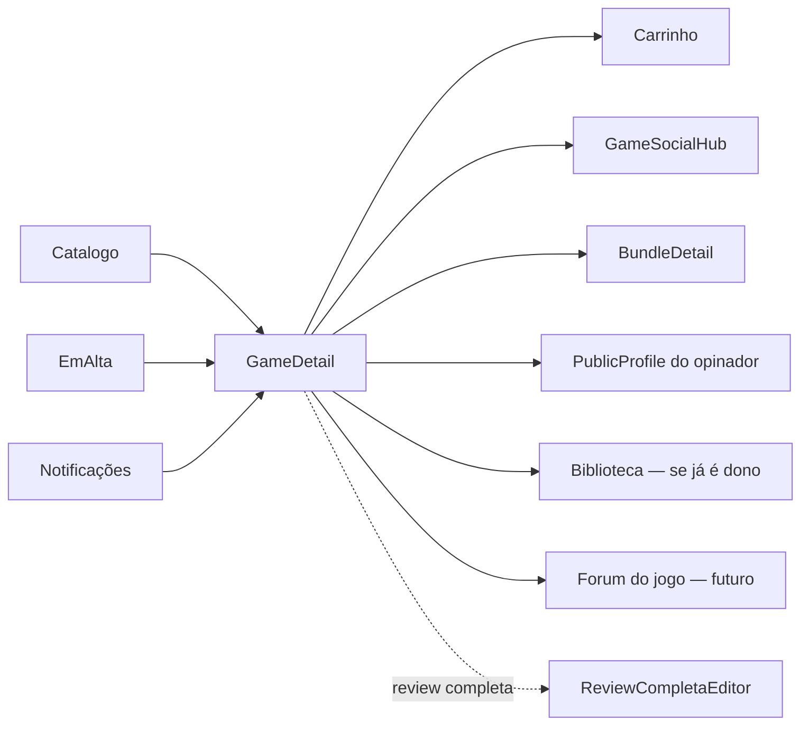

# GameDetail — `/jogo/:id`

> **Status:** rascunho
> **Plataforma:** Web
> **Arquivo-fonte:** `src/pages/GameDetail.tsx`
> **Última revisão:** 2026-07-05

---

## 1. Objetivo da página

Converter interesse em compra **e** interesse em pertencimento. É a única página do ecossistema onde convivem, no mesmo scroll, o **produto** (preço, estoque, CTA), a **prova social** (avaliações, opiniões, screenshots), o **contexto histórico** (gráfico de preço, bundles) e a **identidade** (customização cosmética por quem já é dono). Se a Home é o *feed*, o GameDetail é a *ficha viva* do jogo.

## 2. Filosofia

Nenhuma outra página do MIDIAS mistura *comércio* com *comunidade* no mesmo eixo vertical. O GameDetail é a **prova ontológica** de que o MIDIAS não é uma loja com fórum anexo — é um organismo onde comprar, avaliar, discutir e customizar são a mesma ação distribuída no tempo. A tese central: **a decisão de compra num jogo é 30% racional (preço, requisitos) e 70% social (o que meus amigos acham, o que a comunidade diz, o que eu vou ganhar de status ao ter isso na minha estante)**. Se essa página falha em entregar os 70%, o MIDIAS vira Kabum.

Se ela sumisse amanhã: o usuário perderia o único lugar do site onde ele decide *com contexto*. Catálogo dá visão panorâmica; GameDetail dá profundidade.

## 3. Usuários-alvo

| Perfil                 | O que enxerga                                                                | O que pode fazer                                                       |
| ---------------------- | ---------------------------------------------------------------------------- | ---------------------------------------------------------------------- |
| Visitante (deslogado)  | Galeria, preço, descrição, avaliação média, opiniões (parcial), relacionados | Adicionar ao carrinho (localStorage), ver — **não pode** avaliar/opinar |
| Logado — novo          | Tudo acima + CTA de avaliação, opiniões completas, botão de favoritar        | Comprar, favoritar, avaliar (estrelas), abrir hub social               |
| Logado — dono          | Overlay cosmético ativo + botão "Personalizar esta página" + timeline social | Trocar cosmético da página, escrever review completa, postar screenshot |
| Vendedor               | Mesma visão + (fase futura) link "editar ficha" se for produto seu           | Editar mídia/tags via painel admin                                     |
| Moderador / Admin      | Tudo + botão de moderação inline sobre opiniões/screenshots                  | Remover conteúdo, ver logs, ajustar cosméticos globais                 |

## 4. Estrutura visual

```text
Header
   ↓
Breadcrumb "← Voltar ao catálogo"
   ↓
[Se dono] Botão "Personalizar esta página"
   ↓
┌────────────────────────────┬──────────────────┐
│  Galeria (2/3)             │  Painel compra   │
│  ProductGallery + Favorito │  Plataforma tags │
│                            │  Título          │
│                            │  Avaliação média │
│                            │  Preço + parcela │
│                            │  CTA Carrinho    │
│                            │  Hub Social      │
│                            │  Trust badges    │
└────────────────────────────┴──────────────────┘
   ↓
Sobre o Jogo (2/3) + Detalhes técnicos (1/3)
   ↓
Bloco de Avaliação (média + interativo)
   ↓
PriceHistoryChart
   ↓
ProductBundles (se houver)
   ↓
[Logado] OpinionsPanel
   ↓
[Logado] ScreenshotsPanel
   ↓
Jogos relacionados (mesma categoria, 4)
   ↓
Footer
```

**Por que essa ordem?** Segue o funil clássico: *atenção* (galeria) → *desejo* (preço/CTA) → *justificativa* (descrição/detalhes) → *validação social* (avaliação, opiniões) → *contexto* (histórico de preço) → *cross-sell* (bundles/relacionados). Trocar bundles com opiniões, por exemplo, quebraria a lógica: o usuário precisa **acreditar** antes de considerar comprar mais.

## 5. Componentes

### 5.1 ProductGallery
- **O que é:** carrossel de mídia (imagens + trailers) puxado de `product_media`.
- **Quando some:** nunca — se não houver mídia, mostra `image_url` do produto.
- **Mobile:** vira swipe horizontal com dots.
- **Dependências:** query direta ao Supabase por `product_id`.

### 5.2 Painel de Compra
- **O que mostra:** plataformas (chips), categoria, título, publisher, rating consolidado, badge de desconto, preço, parcelamento, estoque, CTA principal e badges de confiança.
- **Comportamento:** se `stock <= 0` → CTA desabilitado + alerta vermelho. Se `discount > 0` → preço riscado + badge.
- **Regra de parcelas:** `min(12, max(2, ceil(price/10)))` — heurística puramente cosmética, sem juros reais (contexto TCC).

### 5.3 HalfStarRating (display + interactive)
- **Display:** média agregada de `avaliacoes` (`numeric(2,1)`, 0.5 a 5.0).
- **Interativo:** só aparece se `user` logado. Envia via `submitRating` (upsert por user+product).
- **Bug latente:** não bloqueia usuários que ainda não compraram o jogo (fase B deve exigir posse).

### 5.4 GamePageCosmeticOverlay + Customizer
- **O que é:** camada visual (bordas neon, partículas, temas) aplicada por quem **já comprou** o jogo (via `userOwnsGame`).
- **Quando aparece:** sempre que a página é aberta, se o usuário logado for dono.
- **Filosofia:** transforma a ficha do produto em **espaço identitário**, similar a "perfis com decoração" do Discord Nitro.

### 5.5 PriceHistoryChart
- **O que mostra:** série temporal de `product_price_history` (line chart com Recharts).
- **Valor:** frear FOMO — o usuário vê que "aquele desconto de 30% na verdade sobe o preço antes".

### 5.6 ProductBundles
- **O que mostra:** todos os bundles ativos que contêm o produto atual.
- **Regra:** ordena por maior desconto relativo à soma dos itens.

### 5.7 OpinionsPanel / ScreenshotsPanel
- **O que é:** feed social filtrado por produto, com SpoilerGuard (blur em texto/imagem marcados como spoiler).
- **Restrição:** só renderiza para usuários logados (regra de negócio).

### 5.8 Jogos Relacionados
- **Critério atual:** mesma `category`, `slice(0,4)`. **É simplista** — não considera tags, publisher, colaboração com histórico do usuário.

## 6. Fluxos de entrada

1. Card no Catálogo/Ofertas/EmAlta/ParaVocê (~80% do tráfego esperado)
2. Busca global
3. Notificação de queda de preço / disponibilidade
4. Deep link de opinião ("Fulano opinou sobre X")
5. Compartilhamento externo (WhatsApp, Discord)
6. Bundle → ficha individual do item
7. Perfil de amigo → biblioteca → item

## 7. Fluxos de saída

Ordenado por probabilidade:
1. **Adicionar ao carrinho** → Carrinho
2. **Voltar** → Catálogo
3. **Hub Social do jogo** → GameSocialHub (se logado)
4. **Jogo relacionado** → outro GameDetail
5. **Bundle** → BundleDetail
6. **Perfil do autor de opinião** → PublicProfile
7. **Login** (se tentou avaliar/opinar sem estar logado) → Auth

## 8. Navegação entre páginas



## 9. Regras de negócio

- Avaliar exige login. **Não** exige posse (dívida técnica).
- Opinar/screenshot exige login **e** — idealmente — posse (a validação hoje é apenas no compositor).
- Cosmético de página só aplica se `userOwnsGame` retorna true.
- Fora de estoque bloqueia CTA de compra mas **não** oculta preço nem opiniões.
- Descontos são armazenados como campo direto em `produtos.discount` (0–100). Não há tabela `promocoes` (ver 03-ofertas).
- Toda abertura registra `product_views` (analytics + Radar Delta).

## 10. Estados da interface

| Estado         | Trigger                          | O que o usuário vê                                 |
| -------------- | -------------------------------- | -------------------------------------------------- |
| Carregando     | `isLoading` do useProduto        | Spinner central (deveria ser skeleton estruturado) |
| Não encontrado | `game === null` após fetch       | Mensagem + link para catálogo                      |
| Fora de estoque| `game.stock <= 0`                | Alerta + CTA desabilitado                          |
| Sem login      | `!user`                          | Sem seção interativa de avaliação, sem opiniões    |
| Sem opiniões   | Painel vazio                     | Empty state dentro do OpinionsPanel                |
| Erro de fetch  | React Query error                | **⚠ hoje: silencioso** — vira "Jogo não encontrado" |

## 11. Permissões

| Ação                       | Visitante | Usuário | Dono | Vendedor | Mod | Admin |
| -------------------------- | :-------: | :-----: | :--: | :------: | :-: | :---: |
| Visualizar                 | ✅         | ✅       | ✅    | ✅        | ✅   | ✅     |
| Adicionar carrinho         | ✅         | ✅       | ✅    | ✅        | ✅   | ✅     |
| Favoritar                  | ❌         | ✅       | ✅    | ✅        | ✅   | ✅     |
| Avaliar (estrelas)         | ❌         | ✅       | ✅    | ✅        | ✅   | ✅     |
| Opinar/Screenshot          | ❌         | ✅       | ✅    | ✅        | ✅   | ✅     |
| Cosmético de página        | ❌         | ❌       | ✅    | ❌*       | ❌   | ✅     |
| Moderar opiniões           | ❌         | ❌       | ❌    | ❌        | ✅   | ✅     |
| Editar ficha do produto    | ❌         | ❌       | ❌    | ✅ (own)  | ❌   | ✅     |

## 12. Origem dos dados

| Bloco             | Fonte                                                              |
| ----------------- | ------------------------------------------------------------------ |
| Ficha principal   | `produtos` (via `useProduto`)                                       |
| Galeria           | `product_media` (query direta)                                     |
| Média/estrelas    | `avaliacoes` agregadas em `useAvaliacoes`                          |
| Favorito          | `favoritos` (`useFavoritos`)                                       |
| Bundles           | `bundles` ⋈ `bundle_items` (ProductBundles)                        |
| Histórico preço   | `product_price_history`                                            |
| Opiniões          | `opinioes` (RLS por visibilidade)                                  |
| Screenshots       | `screenshots` + `product_media` do usuário                         |
| Cosmético         | `user_cosmetics` + `game_page_cosmetics`                           |
| View tracking     | INSERT em `product_views` (efeito colateral no useEffect)          |

## 13. Banco relacionado

Tabelas centrais: `produtos`, `avaliacoes`, `favoritos`, `product_views`, `product_media`, `product_price_history`, `bundles`, `bundle_items`, `opinioes`, `screenshots`, `game_page_cosmetics`, `user_cosmetics`.

Relações críticas:
- `avaliacoes.product_id` → `produtos.id` (constraint UNIQUE user_id+product_id)
- `product_price_history` deveria ter trigger em `UPDATE OF price ON produtos`
- `opinioes.spoiler = boolean` alimenta o SpoilerGuard

## 14. APIs / hooks

- `useProduto(id)` — SELECT single
- `useProdutos()` — SELECT all (usado apenas para "relacionados"; **desperdício P0**)
- `useAvaliacoes(id)` — média + upsert
- `useCart()` — contexto localStorage
- `useFavoritos()` — CRUD com invalidação
- `userOwnsGame(userId, productId)` — consulta `biblioteca`

## 15. Painel admin relacionado

Hoje existe **`JogosAdmin.tsx`** (CRUD) e **`Produtos.tsx`**. O que falta para essa ficha alcançar excelência:

1. **Editor de ficha rico** — hoje o admin edita título/preço/descrição em um formulário chato. Deveria ter:
   - Preview lado-a-lado do que o usuário vai ver
   - Upload drag-and-drop com reordenação de mídia
   - Slot dedicado a trailer (YouTube ID ou upload)
   - Timer para agendar descontos (com data de início/fim)
2. **Moderação inline de opiniões/screenshots** — hoje precisa ir para `Denuncias`.
3. **Auditoria de cosméticos aplicados** — quem colocou o quê e quando (para detectar abuso visual).
4. **Regra anti-abuse:** limite de N screenshots/opiniões por usuário por 24h por produto.
5. **Blocklist de tags:** tags que soam ofensivas nunca devem aparecer.

## 16. Casos extremos

- **Produto removido** enquanto a página está aberta: cache do React Query mantém, mas add-to-cart falha silenciosamente.
- **Estoque zera** entre abertura e clique no CTA: hoje só valida no checkout.
- **Preço muda** entre carrinho e checkout: carrinho não revalida.
- **Cosmético do dono deletado** por admin: overlay quebra visualmente sem fallback.
- **Opinião com spoiler** desmarcada indevidamente: SpoilerGuard não re-esconde retroativamente.
- **URL manipulada** (ID inválido): mostra "não encontrado" — OK.
- **JS desativado:** página em branco (SPA cliente-side).

## 17. Justificativa de UX/UI

- **Layout 2/3 + 1/3** (galeria + painel de compra) é padrão Steam/Epic — usuários já reconhecem.
- **Preço em cor `text-price` semântica** — permite tematização (verde no dark, laranja no light se quisermos).
- **Chips de plataforma no topo** — decisão instantânea ("é PC? é PS5?").
- **Badges de confiança (Zap/Shield/Clock)** — reduzir ansiedade de compra digital.
- **Overlay cosmético só para donos** — mecânica de "status invisível" (só quem tem entende que aquilo é privilégio).

Referências: Steam (layout de detalhe), Epic (badges de garantia), Discord Nitro (identidade visual como posse).

## 18. Escalabilidade

| Escala      | Comportamento atual                                    | Ponto de quebra                              |
| ----------- | ------------------------------------------------------ | -------------------------------------------- |
| 100 opiniões| OK                                                     | —                                            |
| 10k opiniões| Painel carrega tudo (?) ou pagina — **verificar**       | Se sem paginação → travamento no scroll      |
| 10k views/dia| `product_views` INSERT síncrono no useEffect          | Latência perceptível; migrar para RPC batch  |
| 1M produtos | `useProdutos()` fetchando tudo pra montar "relacionados" | **P0 — quebra imediato**; substituir por RPC `related_products(id)` |
| 100k donos  | `userOwnsGame` roda em toda abertura                    | Cachear no client + realtime invalidation    |

## 19. Melhorias futuras

- **P0**: Substituir `useProdutos()` por `useRelatedProducts(id)` com RPC dedicada.
- **P0**: Skeleton estruturado no loading (não um spinner que engole a página inteira).
- **P0**: Exigir posse para avaliar (`WHERE EXISTS biblioteca`).
- **P1**: Trailer nativo com autoplay muted no topo da galeria.
- **P1**: "Comprar como presente" (envia código pra email de outro user).
- **P1**: Comparar preços com Steam/Epic (integração externa opcional).
- **P1**: Sistema de "achievements" desbloqueáveis por posse.
- **P2**: DLCs e edições (Standard/Deluxe) como variantes.
- **P2**: Requisitos de sistema para jogos PC (parser automático via IGDB).
- **P2**: i18n — hoje 100% PT-BR hardcoded.

## 20. Crítica da implementação atual

### 20.1 O que está bom e por quê

**Overlay cosmético de página (`GamePageCosmeticOverlay`)**
- **O que é:** dono do jogo pode aplicar temas visuais na própria ficha do jogo.
- **Por que funciona:** transforma a ficha em espaço identitário — é o tipo de detalhe que ninguém pediu mas todo mundo lembra. Diferencial competitivo real.
- **Por que deve ficar:** cria valor emocional pós-compra e amarra o usuário ao ecossistema.
- **Como levar de bom para excelente:** permitir compartilhar o preset ("essa customização feita por @fulano"), leaderboard de mais aplicadas, cosméticos exclusivos como recompensa de review.

**PriceHistoryChart**
- **O que é:** gráfico honesto do histórico de preço.
- **Por que funciona:** é a antítese de dark patterns. Um e-commerce que mostra que "aquele desconto não é tão bom" ganha confiança absurda.
- **Por que deve ficar:** transparência é vantagem estratégica sobre concorrentes.
- **Como melhorar:** marcar eventos ("Black Friday 2025"), overlay com preço médio dos últimos 90 dias, alerta "menor preço da história".

**Separação SpoilerGuard**
- **Por que funciona:** MIDIAS pensa em jogo como *narrativa*. Concorrentes tratam como *SKU*.
- **Como melhorar:** modo "escondi X spoilers desta página" no topo, granularidade por ato/capítulo do jogo.

**Badge de estoque + fora-de-estoque tratado de forma explícita**
- **Por que funciona:** evita frustração pós-clique.

### 20.2 O que está ruim e por quê

**❌ `useProdutos()` puxa TODOS os produtos só para montar 4 relacionados**
- **Evidência:** linha `const { data: allGames = [] } = useProdutos();` + `.filter().slice(0,4)` no cliente.
- **Por que remover:** em 10k produtos, isso é 10k rows por abertura de ficha. Multiplicado por views orgânicas = custo Supabase absurdo + latência.
- **Alternativa:** RPC `get_related_products(product_id uuid, limit int)` no Postgres, ordenando por match de `tags`+`category`+`publisher`.
- **Prioridade:** **P0**

**❌ Loading engole a página**
- **Evidência:** `if (isLoading) return <div><Loader2/></div>`.
- **Por que ruim:** CLS altíssimo; usuário perde o header/footer; percepção de "site travou".
- **Alternativa:** skeleton estruturado (galeria + painel de compra + descrição), com Header/Footer visíveis.
- **Prioridade:** **P0**

**❌ Avaliar não exige posse**
- **Por que ruim:** review-bombing é trivial. Usuário faz conta, avalia 1 estrela em 100 jogos concorrentes, some.
- **Alternativa:** `WHERE EXISTS (SELECT 1 FROM biblioteca WHERE user_id=... AND product_id=...)` no RLS de INSERT em `avaliacoes`.
- **Prioridade:** **P0** (integridade do rating agregado do site inteiro depende disso).

**❌ Related por `category` apenas**
- **Por que ruim:** se você abre um Souls-like indie, aparecem 4 RPGs AAA sem relação. Categoria é grosseira demais.
- **Alternativa:** score `tag_match * 3 + publisher_match * 2 + category_match * 1`. Ou embedding via IA.
- **Prioridade:** **P1**

**❌ Parcelamento fake**
- **Evidência:** heurística `ceil(price/10)`.
- **Por que ruim:** promete `12x sem juros` sem lastro. Contexto TCC tolera, mas em produção real vira problema jurídico.
- **Alternativa:** desabilitar UI de parcelas ou marcar explicitamente "simulação acadêmica".
- **Prioridade:** **P1**

**❌ Efeito colateral de tracking sem debounce**
- **Evidência:** `useEffect(() => { supabase.from('product_views').insert(...) }, [id])`.
- **Por que ruim:** reload em 5s = 5 views registradas. Contamina Radar Delta.
- **Alternativa:** dedupe por `sessionStorage` de 30min por produto.
- **Prioridade:** **P1**

**❌ OpinionsPanel/ScreenshotsPanel escondidos de visitantes**
- **Por que ruim:** perda enorme de prova social pré-conversão. Um visitante deslogado que vê 40 opiniões positivas converte melhor que um que vê nada.
- **Alternativa:** mostrar as 3 mais bem-avaliadas com overlay "Faça login para ver mais".
- **Prioridade:** **P1**

**❌ Erro de fetch silenciado**
- **Por que ruim:** se `useProduto` retorna erro (não `null`), a página cai no `!game` e mostra "não encontrado" — mentindo para o usuário.
- **Alternativa:** ramo explícito para `isError` com botão de retry.
- **Prioridade:** **P1**

### 20.3 Dívida técnica visível

- Uso misto de `.from('bundles' as any)` — indica types desatualizados.
- Cosmético e overlay usam efeitos colaterais imperativos (querySelector via `data-game-cosmetic`) que fogem do modelo React.
- Nenhuma memoização em `related`; recalcula a cada render.
- `installments` computado a cada render, não memoizado.
- Não há testes E2E cobrindo o fluxo add-to-cart desta página.

### 20.4 Ângulos não cobertos

- **Acessibilidade (WCAG):** botão de favorito não tem `aria-label`; estrelas interativas devem ser `role="radiogroup"`. Contraste do `text-price` sobre `bg-card` no light theme não foi auditado.
- **Performance:** LCP provavelmente é a primeira imagem da galeria — falta `fetchpriority="high"` + `preload`.
- **SEO:** falta `<title>` dinâmico, `og:image`, `og:price:amount`, JSON-LD `Product` com `Offer`. Isto é **crítico** para tráfego orgânico.
- **i18n:** todo texto hardcoded em PT-BR. Migração futura será dolorosa sem chaves.
- **JS desativado:** SPA — página em branco. Considerar SSR/prerender para SEO.
- **Dark/light parity:** `bg-card` e `border-border` são tokens — OK. Mas o overlay cosmético usa cores fixas em alguns presets.
- **Telemetria:** só `product_views` é registrado. Não sabemos quantos scrolam até opiniões, quantos clicam em relacionados, quantos abrem galeria full-screen.
