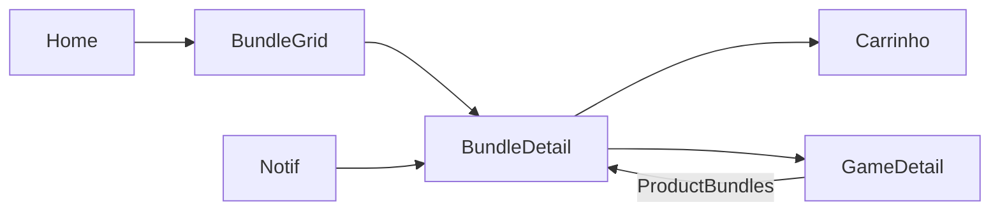

# Bundles — `/bundles` e `/bundle/:id`

> **Status:** rascunho
> **Plataforma:** Web
> **Arquivo-fonte:** `src/pages/BundleDetail.tsx`, `src/components/BundleStoreGrid.tsx`, `src/components/ProductBundles.tsx`
> **Última revisão:** 2026-07-05

---

## 1. Objetivo da página

Vender **combinações** — não produtos isolados. Um bundle é uma **oferta narrativa**: "jogue a trilogia Souls completa por 20% menos", "kit de RPGs indie pra fim de semana", "coleção do estúdio X". É simultaneamente uma **ferramenta de curadoria editorial** (o admin conta uma história com produtos) e uma **alavanca de ticket médio**.

## 2. Filosofia

Bundle no MIDIAS **não é desconto empacotado** — é **curadoria com desconto como consequência**. A diferença é sutil mas define o tom: um bundle bem construído responde a uma pergunta que o usuário nem sabia que tinha ("o que jogar depois de Hollow Knight?"), e o preço reduzido é o convite pra aceitar a resposta sem pensar.

Se sumisse amanhã: o MIDIAS perderia o único mecanismo de **cross-sell contextual** — Ofertas vende preço, Para Você vende afinidade, Bundle vende **conjunto**. É o único formato que consegue expressar "esses jogos conversam entre si".

## 3. Usuários-alvo

| Perfil                | O que enxerga                                | O que pode fazer                                   |
| --------------------- | -------------------------------------------- | -------------------------------------------------- |
| Visitante             | Grid de bundles, detalhes, preço combinado   | Adicionar bundle inteiro ao carrinho               |
| Logado — novo         | Idem + destaque para bundles indicados       | Comprar, favoritar bundle (fase futura)            |
| Logado — recorrente   | Filtro "esconder bundles com jogos que já tenho" | Ver bundles "incompletos" (você tem 2 de 3)     |
| Vendedor              | Não interage diretamente                     | Sugerir bundle via admin                           |
| Admin                 | Preview + editor + timeline de vendas        | Criar, editar, arquivar, agendar bundle            |

## 4. Estrutura visual

**Grid (`BundleStoreGrid`):**
```text
Header
   ↓
[filtros: categoria, faixa de desconto]
   ↓
Grid responsivo de cards (imagem + título + preço)
   ↓
Paginação
```

**Detail (`BundleDetail`):**
```text
Header
   ↓
"← Voltar"
   ↓
┌────────────────────────┬────────────────────┐
│ Galeria (imagens[])    │ Título             │
│ Thumbs                 │ Descrição          │
│                        │ Preço combinado    │
│                        │ vs. soma itens     │
│                        │ CTA "Comprar tudo" │
└────────────────────────┴────────────────────┘
   ↓
Lista de itens que compõem o bundle
   ↓
(futuro) Reviews do bundle, recomendações
   ↓
Footer
```

## 5. Componentes

### 5.1 BundleStoreGrid
- **O que é:** grid com todos os bundles ativos.
- **Ordem:** padrão parece ser `created_at DESC` — sem inteligência.

### 5.2 BundleDetail
- **Fetch em cascata:** bundle → bundle_items → produtos. Três round-trips.
- **Galeria com `images[]`:** array simples, sem lazy load.
- **Cálculo de economia:** compara `bundle.price` com `SUM(itens.price)` — mostra `-X%`.

### 5.3 ProductBundles (embutido em GameDetail)
- **O que é:** "esse jogo aparece em N bundles" — mostra sugestões inline.
- **Valor:** cross-sell em ponto quente.

## 6. Fluxos de entrada

1. Card de bundle na Home / EmAlta
2. Bloco `ProductBundles` no GameDetail
3. Notificação "novo bundle contém jogo dos seus favoritos"
4. Deep link compartilhado
5. Menu de navegação (se houver aba dedicada)

## 7. Fluxos de saída

1. Comprar bundle inteiro → Carrinho
2. Clique em item individual → GameDetail
3. "Voltar" → grid de bundles ou origem
4. Outro bundle sugerido (fase futura)

## 8. Navegação entre páginas



## 9. Regras de negócio

- Bundle é atômico no checkout: **não** dá pra remover 1 item.
- Se qualquer item ficar sem estoque → bundle inteiro fica indisponível.
- Preço do bundle **deve** ser menor que a soma dos itens (validação de admin).
- Não permite bundles duplicados (mesma composição) — hoje **não é validado**.

## 10. Estados da interface

| Estado                | Trigger                             | O que o usuário vê                             |
| --------------------- | ----------------------------------- | ---------------------------------------------- |
| Carregando            | fetch inicial                       | Spinner                                        |
| Bundle não existe     | `bundle === null`                   | "Bundle não encontrado" + voltar               |
| Item fora de estoque  | Um dos produtos com stock=0         | **⚠ hoje: não indicado visualmente**           |
| Preço inconsistente   | `bundle.price > SUM(itens.price)`   | **⚠ hoje: exibido normal**, sem alerta         |
| Bundle expirado       | fase futura (`ends_at < now`)       | Marca como encerrado                           |

## 11. Permissões

| Ação             | Visitante | Usuário | Vendedor | Admin |
| ---------------- | :-------: | :-----: | :------: | :---: |
| Ver              | ✅         | ✅       | ✅        | ✅     |
| Comprar          | ✅         | ✅       | ✅        | ✅     |
| Sugerir          | ❌         | ❌       | ✅ (fase futura) | ✅ |
| Criar/editar     | ❌         | ❌       | ❌        | ✅     |

## 12. Origem dos dados

- `bundles` (id, título, descrição, price, image_url, images[])
- `bundle_items` (bundle_id, product_id, quantity)
- `produtos` (para hidratação dos itens)

Três fetchs sequenciais no `BundleDetail` — pode ser 1 RPC.

## 13. Banco relacionado

```
bundles (id, title, description, price, image_url, images[], is_active, starts_at?, ends_at?)
    ↓
bundle_items (bundle_id → bundles, product_id → produtos, quantity)
```

Faltando:
- `UNIQUE (bundle_id, product_id)` — hoje **não há** garantia de que o mesmo item não apareça duas vezes.
- Trigger que valida `price < SUM(produto.price * quantity)`.
- Coluna `savings_percent` gerada.

## 14. APIs / hooks

- Query direta ao Supabase (não há hook dedicado como `useBundle`) — inconsistente com o resto do projeto.
- `useSubmitGuard` para debouncing do CTA.
- `useCart` para inserção — porém, o carrinho **hoje** insere itens individuais, não o bundle como unidade lógica. **Isso é um bug conceitual** (ver 20.2).

## 15. Painel admin relacionado

`BundlesAdmin.tsx` existe. Nível de detalhe necessário:

1. **Criar bundle:**
   - Selecionar produtos (autocomplete com preview)
   - Preço final (calcula economia automaticamente e mostra selo "-X%")
   - Bloqueio se `price >= SUM(itens)`
   - Agendar `starts_at` / `ends_at`
   - Upload de mídia dedicada (não reciclar imagem dos itens)
2. **Preview antes de publicar** — como o card e a página aparecem ao usuário.
3. **Duplicar bundle** — 90% dos bundles novos são variação de outro.
4. **Timeline de vendas** por bundle: quantas cópias, receita, taxa de conversão.
5. **Alerta de composição repetida** — "esse bundle tem os mesmos itens do bundle X".
6. **Arquivar sem apagar** — histórico é fundamental para auditoria.

## 16. Casos extremos

- Produto removido enquanto está em bundle ativo → hoje bundle quebra silenciosamente.
- Preço de item aumenta e desfaz a economia → bundle continua sendo vendido "sem desconto".
- Estoque de 1 item zera → bundle deveria ser marcado indisponível automaticamente.
- Usuário compra bundle e um item aparece de graça (estoque negativo por race condition).
- Admin edita bundle com o carrinho aberto de outro usuário → carrinho tem preço antigo, checkout tem preço novo.

## 17. Justificativa de UX/UI

- **Galeria própria** (não recicla dos itens): dá identidade visual ao bundle.
- **Preço "combinado vs. soma"**: mostra a economia sem esconder o preço cheio — transparência.
- **CTA único "Comprar tudo"**: comunica atomicidade.
- Referências: Steam Bundles, Humble Bundle (o modelo mental de "pacote curado").

## 18. Escalabilidade

- Até 100 bundles: performance OK.
- 10k bundles: `BundleStoreGrid` sem virtualização vai travar. Precisa server pagination.
- 1M bundle_items: JOIN pesado no detalhe — RPC dedicada obrigatória.
- Realtime: se estoque de um item zera, todos os bundles que o contêm precisam invalidar em tempo real. Hoje não há canal.

## 19. Melhorias futuras

- **P0**: RPC `get_bundle_full(id)` que traz bundle + itens + estoque em uma call.
- **P0**: Trigger que marca bundle inativo quando algum item zera.
- **P0**: Constraint `bundle.price < SUM(itens)` no DB.
- **P1**: Bundle "personalizado" — usuário escolhe 3 de 10 jogos, preço decresce.
- **P1**: Bundle "presente" (compra pra amigo).
- **P1**: Contagem regressiva quando `ends_at` está próximo.
- **P2**: Reviews específicas de bundle (não do jogo individual).
- **P2**: Cross-sell entre bundles ("quem comprou este, comprou também...").
- **P2**: Sugestão automática de bundles via IA baseada em co-ocorrência de compras.

## 20. Crítica da implementação atual

### 20.1 O que está bom e por quê

**Existência do conceito com galeria dedicada**
- **Por que funciona:** trata bundle como produto de primeira classe, não como agrupamento decorativo.
- **Como melhorar:** editor visual de "capa do bundle" com templates prontos para o admin.

**ProductBundles inline no GameDetail**
- **Por que funciona:** cross-sell contextual no momento certo — usuário considerando um jogo vê "esse jogo também vem em bundle X, 20% off".
- **Como melhorar:** destacar itens do bundle que o usuário **já não tem** ("você já tem 1 de 3 desses").

**Uso de `useSubmitGuard`**
- **Por que funciona:** previne double-click no CTA, algo que 90% dos e-commerces esquecem.

### 20.2 O que está ruim e por quê

**❌ Carrinho trata bundle como itens soltos**
- **Evidência:** ao adicionar, o CartContext adiciona cada `product_id` do bundle individualmente.
- **Por que ruim:** usuário abre o carrinho e vê 5 jogos avulsos, não "1 Bundle X". Pode remover 1 item e desfazer o desconto sem entender o que aconteceu.
- **Alternativa:** `CartItem` tipado como `{ type: 'product' | 'bundle', id, snapshot }`. Bundle é atômico no UI.
- **Prioridade:** **P0** — impacta receita direta e clareza pós-compra.

**❌ Ausência de validação de preço no DB**
- **Por que ruim:** admin pode salvar bundle com preço maior que a soma dos itens (bug de digitação ou preço de produto que subiu). O sistema vende "bundle com desconto" que não é desconto.
- **Alternativa:** trigger + column `savings_percent` gerada.
- **Prioridade:** **P0**

**❌ Fetch em cascata (bundle → items → produtos)**
- **Por que ruim:** 3 round-trips, latência somada. Em conexão móvel ruim, meio segundo perdido.
- **Alternativa:** RPC `get_bundle_full(bundle_id uuid)` retornando JSON aninhado.
- **Prioridade:** **P0**

**❌ Sem hook dedicado `useBundle`**
- **Por que ruim:** inconsistência com o resto do projeto; código duplicado se outro lugar precisar carregar bundle.
- **Alternativa:** `src/hooks/useBundle.ts` com React Query.
- **Prioridade:** **P1**

**❌ Estoque não invalida bundle**
- **Por que ruim:** vende-se bundle com item esgotado; checkout falha, frustra o usuário.
- **Alternativa:** view materializada `bundles_availability` ou trigger em `produtos.stock`.
- **Prioridade:** **P0**

**❌ Filtros pobres na store grid**
- **Por que ruim:** não há como filtrar por "bundles com jogos que ainda não tenho", "bundles do meu gênero preferido", "bundles ativos até fim de semana".
- **Alternativa:** filtros server-side com facetas.
- **Prioridade:** **P1**

**❌ Sem urgência / temporalidade visível**
- **Por que ruim:** Steam vende milhões em bundles limitados porque tem timer. Nós não temos nada.
- **Alternativa:** UI de "termina em Xh" quando `ends_at` estiver a menos de 72h.
- **Prioridade:** **P1**

### 20.3 Dívida técnica visível

- Uso extensivo de `as any` nos queries de bundle — types desatualizados.
- Sem realtime channel para invalidação.
- Sem testes cobrindo o cálculo de economia.
- `BundleStoreGrid` e `BundleDetail` duplicam lógica de fetch — extrair para hook.

### 20.4 Ângulos não cobertos

- **Acessibilidade:** thumbs da galeria não têm foco de teclado; economia mostrada só como cor, não como texto para leitor de tela.
- **SEO:** bundles são páginas de conversão puríssimas — precisam JSON-LD `Product` com `AggregateOffer` e `priceValidUntil`. Hoje: nada.
- **i18n:** bundles editoriais vão precisar de tradução manual — não há schema para isso.
- **Compartilhamento:** falta OG image dinâmica com imagem do bundle + preço destacado.
- **Telemetria:** não sabemos qual bundle é mais visto vs. mais comprado — sem conversion funnel.
- **Ético/dark patterns:** cuidado com "preço original" inflado pra fingir desconto maior. Precisamos regra: `original_price = max(preço histórico dos últimos 30 dias)`.
