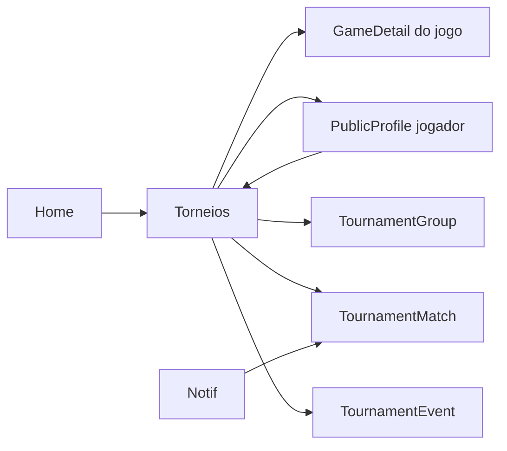

# Torneios — `/torneios`

> **Status:** rascunho
> **Plataforma:** Web
> **Arquivo-fonte:** `src/pages/Torneios.tsx`, `src/pages/torneios/*`, `src/components/tournaments/*`, `src/components/TournamentBracket.tsx`
> **Última revisão:** 2026-07-05

---

## 1. Objetivo da página

Transformar o MIDIAS de **loja onde você compra jogos** em **plataforma onde você joga com pessoas**. Torneios são o vetor mais forte de recorrência semanal — o usuário volta não pra comprar, mas pra competir, torcer e ganhar XP/cosméticos.

## 2. Filosofia

Nenhuma loja de jogos brasileira compete com MIDIAS **nesta camada**. Steam tem grupos, Epic tem quests, mas nenhum tem **torneios de primeira classe** com bracket cinematográfico, hype meter, chat ao vivo e storylines. Isto é o principal *moat* competitivo do projeto.

Filosofia central: **o torneio não é evento, é narrativa**. Cada torneio tem começo, meio e fim; jogadores viram personagens; partidas viram capítulos. A UI precisa refletir isso — não pode parecer uma tabela de Excel.

Se sumisse amanhã: o MIDIAS voltaria a ser uma loja bonita. Mais nada.

## 3. Usuários-alvo

| Perfil                | O que enxerga                                            | O que pode fazer                                        |
| --------------------- | -------------------------------------------------------- | ------------------------------------------------------- |
| Visitante             | Lista pública, bracket, transmissão, torcida             | Ver — **não** se inscrever                              |
| Logado — novo         | Idem + botão "inscrever"                                 | Inscrever-se, torcer, chat público                      |
| Logado — jogador ativo| Meus torneios, próximas partidas, notificações           | Reportar resultado, subir print, contestar              |
| Organizador (fase B)  | Painel do torneio, chaves editáveis, gerenciar duplas    | Criar, editar, arbitrar                                 |
| Moderador/Admin       | Tudo + botões de arbitragem, banir, forçar walkover     | Anular partida, ajustar chave, punir                    |

## 4. Estrutura visual

```text
Header
   ↓
Título "Torneios"
   ↓
Tabs: [Ativos] [Próximos] [Encerrados] [Meus torneios]
   ↓
Filtro por jogo (dropdown)
   ↓
Grid de cards de torneio (verified?, tipo, prize, participantes, starts_at)
   ↓
[Ao selecionar torneio] Detalhe:
   ┌──────────────────────┬─────────────────────┐
   │ HypeMeter            │ Info + inscrição    │
   │ CinematicBracket     │ Prize / XP / regras │
   │ Storylines           │ Stream embed        │
   │ Chat ao vivo         │ Stats               │
   └──────────────────────┴─────────────────────┘
   ↓
[Fase de mata-mata] TournamentMatch por partida
   ↓
Footer
```

## 5. Componentes

### 5.1 CreateTournamentDialog
- **Quem usa:** admin/moderador (hoje aberto demais — precisa restrição).
- **Campos:** título, jogo (produto_id), formato (SE, DE, round-robin), max_participants, prize, datas.

### 5.2 TournamentBracket / CinematicBracket
- **O que é:** visualização em árvore de eliminatórias, com animações de avanço.
- **Diferencial:** cinematográfico (Framer Motion, glow, transições).

### 5.3 HypeMeter
- **O que é:** medidor animado que sobe com engajamento (chat, torcedores, apostas simbólicas).
- **Filosofia:** transforma um número em emoção.

### 5.4 StorylinesPanel
- **O que é:** narrativas geradas ("Jogador X venceu Y, agora enfrenta seu ex-rival Z" — rivalidade histórica entre usuários).
- **Diferencial competitivo real** — ninguém faz isso.

### 5.5 LiveTournamentChat
- **O que é:** chat com filtro anti-toxicidade e menções a jogadores.

### 5.6 TournamentRegistration
- **O que é:** modal de inscrição com fingerprint anti-multi-conta.
- **Usa** hash de `userAgent + tela + timezone` — proteção fraca mas melhor que nada.

### 5.7 TournamentStatsPanel
- **O que é:** win rate, streak, histórico entre players.

## 6. Fluxos de entrada

1. Card "Torneio da semana" na Home
2. Notificação "seu torneio começa em 1h"
3. Link direto compartilhado
4. Menu de navegação
5. Perfil de amigo → aba torneios
6. Deep link pós-inscrição por email

## 7. Fluxos de saída

1. Inscrever-se → confirmação → Chat / Bracket
2. Ver bracket → clicar em partida → TournamentMatch
3. Assistir stream → sair para plataforma externa (fim de sessão)
4. Perfil de um jogador → PublicProfile
5. Comprar jogo do torneio → GameDetail

## 8. Navegação entre páginas



## 9. Regras de negócio

- Inscrição fecha `X` horas antes de `starts_at` (regra por torneio).
- Fingerprint check para evitar 2 contas mesma máquina.
- Reportar resultado exige print (upload obrigatório em fase B).
- Contestação: janela de 24h; se ambos concordam → válido; se não → moderação.
- XP por: inscrição (`xp_signup`), vitória em partida (`xp_match_win`), campeonato (`xp_champion`).
- Torneios `verified` (chancelados por MIDIAS) têm badge diferenciado.
- Prize types: cash simbólico, cosmético exclusivo, jogo da loja.

## 10. Estados da interface

| Estado                  | Trigger                                | Visual                                              |
| ----------------------- | -------------------------------------- | --------------------------------------------------- |
| Carregando              | fetch inicial                          | Spinner (deveria ser skeleton do bracket)           |
| Nenhum torneio          | lista vazia                            | Empty state com CTA "seja notificado quando abrir" |
| Torneio cheio           | inscritos == max                       | Botão "lista de espera"                            |
| Já inscrito             | user in participants                   | "Você está dentro" + link para chave                |
| Aguardando adversário   | próxima partida sem oponente definido  | Timer/countdown                                     |
| Partida em curso        | live stream + chat ativo               | Layout "modo live"                                  |
| Encerrado               | ends_at < now                          | Layout troféu + replay                              |

## 11. Permissões

| Ação                     | Visitante | User | Player | Mod | Admin |
| ------------------------ | :-------: | :--: | :----: | :-: | :---: |
| Ver                      | ✅         | ✅    | ✅      | ✅   | ✅     |
| Inscrever-se             | ❌         | ✅    | —      | ✅   | ✅     |
| Chat                     | ❌         | ✅    | ✅      | ✅   | ✅     |
| Reportar resultado       | ❌         | ❌    | ✅      | ✅   | ✅     |
| Anular partida           | ❌         | ❌    | ❌      | ✅   | ✅     |
| Criar torneio            | ❌         | ❌    | ❌      | ✅ (?) | ✅   |
| Marcar como `verified`   | ❌         | ❌    | ❌      | ❌   | ✅     |

## 12. Origem dos dados

- `tournaments` (base do torneio)
- `tournament_participants` (inscritos)
- `tournament_matches` (chave)
- `tournament_reports` (resultados reportados)
- `tournament_chat_messages`
- `tournament_storylines` (rivalidades, geração automática)

## 13. Banco relacionado

Diagrama parcial:

```
tournaments (id, title, type, status, prize, max_participants, starts_at, ends_at,
             product_id?, verified, prize_types[], xp_signup, xp_match_win, xp_champion)
   ↓ 1:N
tournament_participants (tournament_id, user_id, fingerprint, joined_at)
   ↓ 1:N
tournament_matches (tournament_id, round, slot_a, slot_b, winner?, played_at)
   ↓ 1:N
tournament_reports (match_id, reporter_id, screenshot_url, claim, status)
```

Faltando:
- Índice em `(tournament_id, round)` para bracket rendering.
- View `tournament_leaderboard` materializada.

## 14. APIs / hooks

- Fetch direto ao Supabase em `Torneios.tsx` (misto de raw queries).
- Edge function `tournament-reminders` — já existe (dispara lembretes).
- Falta hook `useTournament(id)` reutilizável.

## 15. Painel admin relacionado

`Torneios.tsx` (admin), `TorneiosAtuais.tsx`, `TorneiosEventos.tsx`, `CriarTorneio.tsx`. O que **precisa** existir/melhorar:

1. **Criador visual de bracket** — drag-and-drop de participantes em slots iniciais, com seeding automático baseado em ranking.
2. **Arbitragem em partida:**
   - Ver ambos os prints reportados lado-a-lado
   - Botões: validar A / validar B / walkover / anular / pedir novo print
   - Log automático da decisão em `admin_logs`
3. **Templates de torneio** — recorrentes semanais criados em 1 clique.
4. **Simulador de premiação** — admin vê custo total de XP + cosméticos antes de publicar.
5. **Anti-fraude:**
   - Detecção de fingerprints repetidas
   - Alerta de contas criadas <24h antes da inscrição
   - Bloqueio automático se mesmo IP inscreve >3 contas
6. **Broadcast:** integração com Twitch/YouTube — colar URL, embed automático.
7. **Timeline de auditoria:** cada mudança de status/chave logada.
8. **Ferramenta de storyline manual** — admin pode editar/aprovar narrativas antes de virarem públicas.

## 16. Casos extremos

- Jogador some no meio do torneio → walkover automático após timeout.
- Empate reportado por ambos → força melhor de 3.
- Ambos reportam vitória (conflito) → mod obrigatório.
- Torneio de jogo que sai da loja → mantém histórico, marca como "arquivado".
- Prize é cosmético que foi removido do inventário do sistema → fallback pra XP.
- Fingerprint colide (dois amigos na mesma casa) → permite override manual.
- Stream cai no meio → notificar chat.
- Vencedor deleta conta antes do prêmio → mover pro 2º lugar.

## 17. Justificativa de UX/UI

- **Bracket cinematográfico** > tabela: emoção vira retenção.
- **HypeMeter** = elemento de arcade, gamificação real do ato de torcer.
- **Storylines** = camada narrativa que faz cada torneio parecer temporada.
- **Verified badge** = confiança institucional.
- **Chat lateral** ao invés de modal: espectador não perde a chave.

Referências: FaceIt (bracket + hype), ESL (verified/organizações), Liquipedia (storylines históricas), Twitch (chat lateral).

## 18. Escalabilidade

- 8 participantes: perfeito.
- 128: bracket com virtualização começa a ser necessária.
- 1024: mudar de bracket flat para "swiss rounds" ou "grupos + mata-mata".
- 10k espectadores no chat: precisa `realtime` com particionamento por sala + rate limit por usuário.
- Storylines geradas: se rodam client-side, viram problema; precisam job assíncrono.

## 19. Melhorias futuras

- **P0**: Extrair hooks (`useTournament`, `useTournamentBracket`, `useTournamentChat`).
- **P0**: Sistema de report com upload obrigatório de screenshot + hash anti-repetição.
- **P0**: Anti-fraude por IP+fingerprint no server.
- **P1**: Integração com APIs de jogos (Riot, Steam) para autovalidar resultados.
- **P1**: Modo "torneio privado" — link secreto para grupo de amigos.
- **P1**: Apostas simbólicas (não-monetárias, TCC-safe) com XP.
- **P1**: Sistema de rivalidade histórica computado por jobs (contar encontros entre user_a e user_b).
- **P2**: Broadcast oficial MIDIAS com casters convidados.
- **P2**: Torneios cross-plataforma (PC vs. console) com balanceamento.
- **P2**: Replay-first: cada partida vira card compartilhável.

## 20. Crítica da implementação atual

### 20.1 O que está bom e por quê

**Existência do módulo com escopo ambicioso**
- **Por que funciona:** enquanto concorrentes fazem quests bobas, MIDIAS aposta em algo que gera comunidade real.
- **Por que deve ficar:** é o principal diferencial estratégico do projeto.
- **Como levar de bom para excelente:** contratar (metaforicamente) um "diretor de torneios" — alguém dedicado a narrativa, storylines, temporadas.

**HypeMeter, Storylines, CinematicBracket**
- **Por que funcionam:** transformam dado em drama. É a UX que Steam nunca vai ter porque é "loja séria".
- **Como melhorar:** salvar highlights automáticos ("virada do underdog"), gerar clipe compartilhável.

**Fingerprint anti-multi-conta client-side**
- **Por que funciona (parcialmente):** eleva a barreira do abuso ingênuo.
- **Como melhorar:** somar a fingerprint server-side + IP + tempo de conta.

**XP dividido por evento (signup/match/champion)**
- **Por que funciona:** premia participação, não só vitória — reduz atrito de entrada.

**Verified badge**
- **Por que funciona:** dá hierarquia clara — torneio da casa ≠ torneio de usuário.

### 20.2 O que está ruim e por quê

**❌ Torneios.tsx é um Frankenstein**
- **Evidência:** ~250 linhas concentrando lista, seleção, filtros, dialog de criação, cache de participação — tudo num arquivo só.
- **Por que ruim:** manutenção impossível, testabilidade zero, re-renders em cascata.
- **Alternativa:** dividir em `TournamentList`, `TournamentFilters`, `TournamentDetail`, `MyTournaments`.
- **Prioridade:** **P1**

**❌ Fingerprint client-side puro**
- **Por que ruim:** trivial de burlar (userAgent spoof, incognito, VM).
- **Alternativa:** somar server-side com IP + hash de device via edge function.
- **Prioridade:** **P0**

**❌ Sem hook `useTournament(id)`**
- **Por que ruim:** cada página (`TournamentEvent`, `TournamentGroup`, `TournamentMatch`) refaz o fetch.
- **Alternativa:** hook central + realtime channel.
- **Prioridade:** **P0**

**❌ Reportar resultado sem screenshot**
- **Por que ruim:** abre porta pra qualquer alegação. Um jogador pode reportar vitória em 100 partidas.
- **Alternativa:** upload obrigatório, com hash pra evitar reuso.
- **Prioridade:** **P0**

**❌ Sem realtime no bracket**
- **Por que ruim:** avanço de partida não aparece pra quem está torcendo — precisa F5.
- **Alternativa:** canal `tournament:{id}` com invalidação.
- **Prioridade:** **P0**

**❌ Storylines aparentemente sem trilha auditável**
- **Por que ruim:** se são geradas automaticamente e ficam públicas, podem gerar constrangimento ("Fulano perdeu 10 vezes seguidas de Ciclano" — cyberbullying).
- **Alternativa:** aprovação por mod antes de virarem públicas, opt-out por usuário.
- **Prioridade:** **P1**

**❌ Chat sem rate limit visível**
- **Por que ruim:** flood trivial durante partidas quentes.
- **Alternativa:** rate limit no edge (X msgs/10s) + slow mode automático se hype > threshold.
- **Prioridade:** **P1**

**❌ Sem sistema de temporadas**
- **Por que ruim:** torneios avulsos não constroem narrativa longa. Não há "campeão do mês", "playoff anual".
- **Alternativa:** entidade `tournament_season` agrupando N torneios com ranking acumulado.
- **Prioridade:** **P1**

**❌ Sem custo/limite de criação para organizadores**
- **Por que ruim:** quando abrirmos criação a usuários, spam vai afogar a lista.
- **Alternativa:** custo em XP, cooldown, aprovação por mod para primeiros N torneios do usuário.
- **Prioridade:** **P1**

### 20.3 Dívida técnica visível

- Query direta ao Supabase misturada com componentes de UI.
- Falta tipagem coerente — `Tournament` interface local no arquivo, não em `types/`.
- `TournamentBracket` e `CinematicBracket` coexistem — duplicação; consolidar.
- Nenhum teste E2E cobrindo inscrição → bracket → reportar.
- Realtime não usado onde deveria (chat, bracket, hype).

### 20.4 Ângulos não cobertos

- **Acessibilidade:** bracket dificilmente é navegável por leitor de tela; storylines são texto puro (OK) mas HypeMeter animado precisa `prefers-reduced-motion`.
- **Performance:** bracket com 128 slots pode gerar 100+ nós SVG animados — testar em mobile antigo.
- **SEO:** cada torneio deveria ter página SSR com OG image do bracket + prêmio; hoje é SPA opaca.
- **Legal:** premiação em dinheiro (mesmo simbólico) esbarra em legislação de sorteios no BR — o TCC precisa ser explícito de que **é acadêmico**.
- **Anti-abuse além de fingerprint:** trilha de contas criadas <24h antes, IPs de VPN conhecidas, dispositivos compartilhados.
- **Notificações:** já há `tournament-reminders`; falta granularidade ("2h antes", "10min antes", "sua vez agora").
- **Telemetria:** não sabemos taxa de conversão de "abriu torneio" → "inscreveu" → "jogou primeira partida" → "chegou à final". Sem funnel, sem otimização.
- **i18n:** narrativas de storyline hoje seriam impossíveis de traduzir automaticamente — pensar em templates com slots.
- **Dark/light parity:** HypeMeter e bracket usam glow neon — validar no light theme se não fica lavado.
