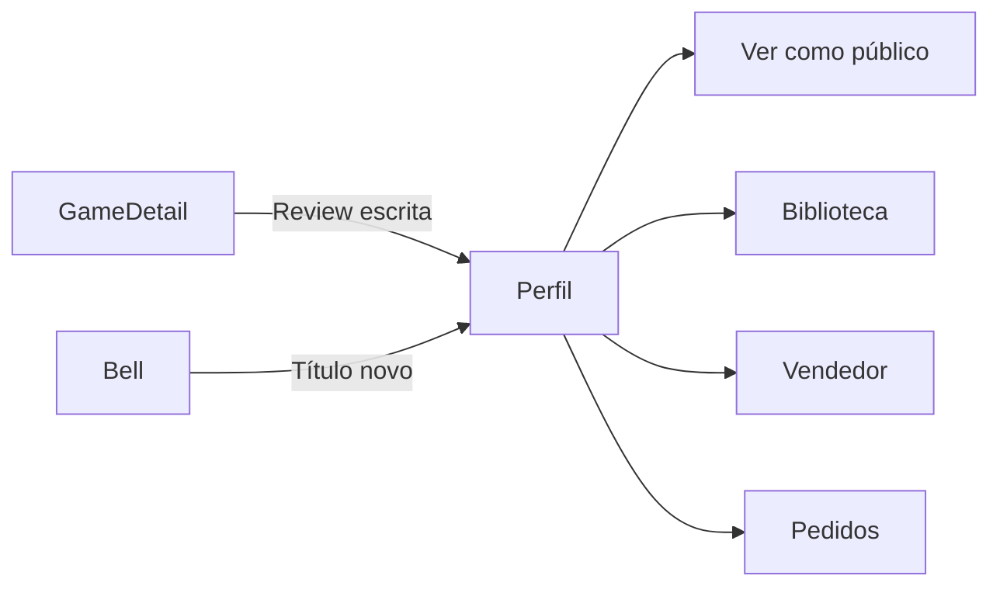

# Perfil — `/perfil`

> **Status:** final
> **Plataforma:** Web
> **Arquivo-fonte:** `src/pages/Perfil.tsx`
> **Última revisão:** 2026-07-06

---

## 1. Objetivo da página

Ser o **centro de controle da identidade gamer** do usuário: dados públicos, cosméticos equipados, títulos, badges, reviews escritas, amigos bloqueados, preferências de notificação e privacidade. Não é um "settings" burocrático — é uma vitrine que o próprio dono ajusta.

## 2. Filosofia

No MIDIAS, **perfil = personagem**. Steam mostra jogos jogados, Discord mostra status, PSN mostra troféus. O MIDIAS junta os três e adiciona uma camada de **cosmética progressiva**: molduras de avatar, títulos desbloqueáveis, temas de página. O perfil é o único lugar onde o usuário edita **quem ele é** dentro do ecossistema. Sem essa página, o usuário vira uma linha na tabela `auth.users` — anônimo mesmo estando logado.

Diferença chave vs. `/perfil/:userId` (PublicProfile): esta é a **versão editável**, com abas de configuração; a pública é read-only e respeita `is_private` + `privacy_grants`.

## 3. Usuários-alvo

| Perfil                 | O que enxerga                                                        | O que pode fazer                                       |
| ---------------------- | -------------------------------------------------------------------- | ------------------------------------------------------ |
| Visitante              | Redirect para `/auth`                                                | Nada                                                   |
| Logado — novo          | Aba "Perfil" com display_name pré-preenchido, cosméticos vazios      | Preencher bio, avatar, escolher primeiro título        |
| Logado — recorrente    | Todas as abas com dados populados, badges acumuladas                 | Editar tudo, trocar loadout, gerenciar bloqueados      |
| Vendedor               | Aba extra "Vendedor" (link para `/vendedor`), cosméticos exclusivos  | Editar handle público, ativar/pausar loja              |
| Admin                  | Mesmas abas + badge de role                                          | Nada especial aqui (admin real fica no Desktop)        |

## 4. Estrutura visual

```text
Header global
   ↓
[Hero: avatar + moldura + nome + título ativo + level + XP bar]
   ↓
[Tabs: Perfil | Customização | Reviews | Amigos Favoritos | Highlights | Bloqueados | Notificações | Privacidade]
   ↓
[Conteúdo da tab ativa]
   ↓
Footer
```

**Por que essa ordem?** Hero primeiro porque é o **espelho** — o usuário precisa ver *como ele aparece para os outros* antes de decidir o que mudar. Tabs abaixo porque são ações; se viessem antes, o usuário editaria no escuro.

## 5. Componentes

### 5.1 Hero de identidade

- **O que é:** faixa superior com `AvatarWithFrame`, display_name, `LevelTitleBadge`, barra de XP até o próximo nível.
- **Dependências:** `useAuth().profile`, `useCosmetics()`, `xp_levels`.
- **Comportamento mobile:** avatar centralizado, tabs viram scroll horizontal.

### 5.2 Tab "Perfil" (dados básicos)

- **O que é:** form com display_name, bio, avatar_url (upload para bucket `avatars`), banner_url.
- **Validação:** display_name 3-30 chars, único (verificar via query antes de salvar).

### 5.3 Tab "Customização" (`CustomizacaoTab`)

- **O que é:** grid de cosméticos possuídos (molduras, títulos, temas de página), com preview ao vivo.
- **Regra crítica:** só permite equipar cosméticos onde `can_equip_title(user, title)` retorna `true`. A trigger `enforce_active_title_lock` bloqueia no DB — o front só precisa dar feedback amigável.

### 5.4 Tab "Reviews" (`MyReviewsTab`)

- Lista todas as `avaliacoes` do usuário com link para o jogo e opção de editar/excluir.

### 5.5 Tabs sociais (Amigos Favoritos, Highlights, Bloqueados)

- `FriendFavoritesTab`: quem o usuário destacou como "melhores amigos" (aparece no perfil público).
- `HighlightsEditor`: até N destaques fixados (jogo favorito, momento marcante, review destaque).
- `BlockedUsersTab`: lê `blocked_users`, permite unblock. Bloqueio esconde mensagens, comentários e denuncia auto.

### 5.6 Tab "Notificações" (`NotificationPrefsTab`)

- Toggles por tipo (`notification_preferences`): mentions, nova mensagem, pedido, review comment, torneio, queda de preço.
- Canais: push, email, in-app.

### 5.7 Tab "Privacidade" (`PrivacyTab`)

- `is_private` (perfil trancado), lista de exceções (`privacy_exceptions`), grants por escopo (biblioteca, reviews, timeline).

## 6. Fluxos de entrada

- Menu do header (avatar → "Meu perfil").
- Pós-signup (redirect automático para completar bio).
- Notificação "Você desbloqueou um título" → CTA "Equipar agora" leva para tab Customização.
- Link "Editar perfil" no `PublicProfile` quando o próprio dono acessa.

## 7. Fluxos de saída

1. `/biblioteca` (ver jogos)
2. `/perfil/:userId` (ver como aparece publicamente — CTA "Ver perfil público" no hero)
3. `/vendedor` (se aplicável)
4. `/pedidos` (histórico)
5. Logout

## 8. Navegação entre páginas



## 9. Regras de negócio

- Display_name **imutável** por 30 dias após última troca (evita perseguição/impersonação). Hoje: **não implementado**, deveria ser.
- Avatar/banner: max 5MB, formatos `image/*`.
- `banned_until > now()` → mostra banner vermelho no hero e desabilita edição de tudo exceto "Contato com suporte".
- Título ativo revalidado no DB via trigger — se o usuário perder a conquista base, o título é forçado a NULL na próxima escrita.

## 10. Estados da interface

| Estado             | Trigger                              | O que o usuário vê                    |
| ------------------ | ------------------------------------ | ------------------------------------- |
| Loading            | `useAuth().loading`                  | Spinner central                       |
| Perfil incompleto  | bio vazia + sem avatar               | Banner "Complete seu perfil (30%)"    |
| Banido             | `banned_until > now()`               | Banner vermelho, edição bloqueada     |
| Erro upload avatar | falha no bucket `avatars`            | Toast + mantém avatar anterior        |

## 11. Permissões

Só o dono da conta. Nem admin edita perfil alheio pelo front (deve usar Desktop com `admin_logs`).

## 12. Origem dos dados

| Bloco             | Origem                                             |
| ----------------- | -------------------------------------------------- |
| Hero              | `profiles` + `user_titles` + `xp_levels`           |
| Customização      | `user_cosmetic_loadout` + `user_titles`            |
| Reviews           | `avaliacoes` (RLS: `user_id = auth.uid()`)         |
| Bloqueados        | `blocked_users`                                    |
| Notif prefs       | `notification_preferences` (upsert on toggle)      |
| Privacidade       | `profiles.is_private` + `privacy_grants`           |

## 13. Banco relacionado

`profiles`, `user_roles`, `user_titles`, `user_badges`, `user_cosmetic_loadout`, `user_xp_log`, `xp_levels`, `notification_preferences`, `privacy_grants`, `blocked_users`, `close_friends`, `profile_highlights`, `favoritos` (contagem no hero).

## 14. APIs / hooks

- `useAuth()` — user + profile básico.
- `useCosmetics()` — loadout + inventário.
- Queries diretas por tab (React Query com `queryKey: ['perfil', tabId, userId]`).
- Edge Function futura: `avatar-resize` (gerar thumbnail 128x128 no upload).

## 15. Painel admin relacionado

**Desktop → Clientes → [usuário] → Drawer de detalhes:**

- Ver perfil completo read-only.
- Forçar reset de avatar/bio (marcar como conteúdo impróprio).
- Banir (`banned_until`, motivo, duração pré-definida: 7d/30d/permanente).
- Revogar título específico (com log em `admin_logs`).
- Ver histórico de mudanças de display_name (não existe hoje — **falta tabela `profile_name_history`**).
- Impersonar? **NÃO fazer.** Auditoria e legal são pesadelo. Alternativa: "modo suporte" = ver o que o usuário vê, sem escrever.

## 16. Casos extremos

- Usuário deleta avatar → cai no placeholder default; não quebrar layout.
- Título ativo foi revogado por admin entre load da página e save → trigger devolve erro; front captura e mostra "Título indisponível, escolha outro".
- Sessão expira no meio de edição → salvar em rascunho local (`localStorage`) antes de redirect para `/auth`.
- Upload de avatar interrompido → limpar objeto órfão do bucket via job noturno (não existe).
- Usuário tenta bloquear a si mesmo → bloquear no front + constraint `CHECK (blocker_id <> blocked_id)`.

## 17. Justificativa de UX/UI

Tabs verticais em desktop, horizontais scroll em mobile: 8 abas não cabem em bottom-nav. Hero grande e visual porque **perfil é vaidade** — se parecer um formulário do INSS, ninguém preenche. Referência direta: Discord "User Profile" + Steam Showcase.

## 18. Escalabilidade

- 100 usuários: irrelevante.
- 10k: aba Reviews pode passar de 100 items → paginar (hoje traz tudo).
- 1M: `notification_preferences` com 20 colunas booleanas fica caro no upsert. Migrar para tabela `notification_channel_prefs (user_id, event, channel, enabled)` normalizada.

## 19. Melhorias futuras

- **P0:** Rate-limit troca de display_name (30d cooldown).
- **P0:** Auto-save de rascunho (bio, especialmente).
- **P1:** Aba "Conexões" para plataformas externas (`connected_platforms` já existe no DB — não tem UI).
- **P1:** "Preview do perfil público" em modal, sem sair da tela.
- **P2:** Wrapped anual ("Seu 2026 em jogos").
- **P2:** Exportar dados (LGPD art. 18) — botão que baixa JSON com tudo.

## 20. Crítica da implementação atual

### 20.1 O que está bom

- **Separação em tabs**: cada `Tab` é um arquivo próprio (`BlockedUsersTab`, `NotificationPrefsTab`, etc.). **Por que funciona:** code splitting natural, cada aba carrega só quando aberta. **Deve ficar.** **Para excelente:** lazy-load com `React.lazy` dentro do tab switcher — hoje todas importam junto.
- **`AvatarWithFrame`**: componente único que aplica moldura cosmética em qualquer lugar. **Por que funciona:** consistência absoluta — perfil, comentários, forum, chat mostram o mesmo avatar. **Deve ficar.** **Para excelente:** aceitar `size` como prop tipada (`sm | md | lg | xl`) em vez de className solta.
- **Trigger `enforce_active_title_lock`**: valida no DB, não confia no front. **Por que funciona:** defesa em profundidade — mesmo um curl malicioso é bloqueado. **Deve ficar.**

### 20.2 O que está ruim

- **Sem cooldown em display_name.**
  - Por que está ruim: usuário pode virar "admin_oficial" hoje, "moderador" amanhã, e enganar novatos.
  - Substituir por: coluna `display_name_changed_at` + validação `now() - changed_at > interval '30 days'` em trigger.
  - **P0.**
- **`fetchProfile` só carrega 3 campos** (`display_name, avatar_url, banned_until`).
  - Por que está ruim: `Perfil.tsx` refaz N queries para pegar bio, banner, xp, título ativo. Waterfall de requests.
  - Substituir por: expandir `AuthContext.profile` para o perfil completo, ou criar RPC `get_full_profile(user_id)` retornando tudo em um round-trip.
  - **P0.**
- **Sem histórico de mudanças.**
  - Ruim: se um usuário reclama "meu título sumiu", ninguém sabe se foi ele, admin, ou trigger.
  - Alternativa: tabela `profile_audit_log (user_id, field, old_value, new_value, changed_by, changed_at)`.
  - **P1.**
- **Upload de avatar não gera thumbnail.**
  - Ruim: o header pede um 40x40 mas baixa a original 2MB do bucket. Waste massivo de banda.
  - Alternativa: edge function `avatar-resize` que gera 128/256/512 no upload.
  - **P1.**

### 20.3 Dívida técnica

- `connected_platforms` no DB sem UI = feature morta que ocupa espaço mental.
- `profile_highlights` tem CRUD mas nenhum lugar público mostra ela ainda em versão completa.
- `notification_preferences` com 20 colunas → migração inevitável.

### 20.4 Ângulos não cobertos

- **A11y:** tabs precisam de `role="tablist"`, setas do teclado navegando entre elas. Hoje é `<button onClick>` puro.
- **LCP:** hero com moldura + avatar + XP bar dispara 3 requests antes da primeira pintura.
- **i18n:** todos os labels hardcoded em PT-BR. Extrair para dicionário quando escalar.
- **Dark/Light parity:** algumas molduras cosméticas foram desenhadas só para dark — no light viram borrão claro sobre fundo claro.
