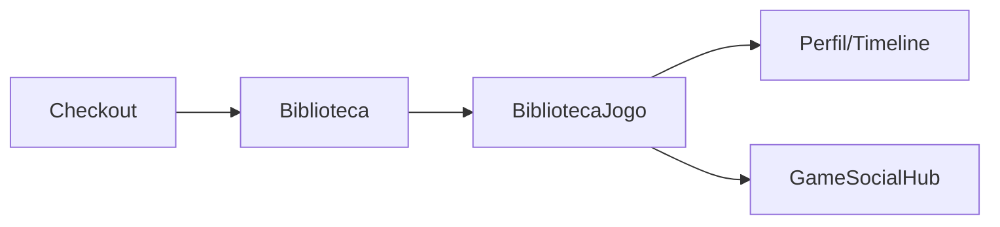

# Biblioteca — `/biblioteca`

> **Status:** final
> **Plataforma:** Web
> **Arquivo-fonte:** `src/pages/Biblioteca.tsx` (+ `BibliotecaJogo.tsx` para detalhe)
> **Última revisão:** 2026-07-06

---

## 1. Objetivo da página

Mostrar **tudo que o usuário possui ou quer possuir**, dividido por status (jogando, zerado, platinado, quero jogar, abandonado), com filtro por plataforma, categoria, e ordenação por horas jogadas ou data de aquisição. É o "Steam Library" do MIDIAS.

## 2. Filosofia

A biblioteca não é só uma lista de compras — é o **arquivo pessoal do gamer**. Cada card tem status editável, horas jogadas, badges de conclusão (`badge_completed`, `badge_platinum`, `badge_verified_source`) e capa customizável (`library_custom_covers`). O objetivo é fazer o usuário **querer voltar aqui** para atualizar seus status, não só para reinstalar jogos.

Duas fontes alimentam: compras confirmadas (trigger `on_order_confirmed` insere em `biblioteca_usuario`) e adições manuais ("quero jogar" via botão no `GameDetail`).

## 3. Usuários-alvo

| Perfil               | O que enxerga                                        | O que pode fazer                              |
| -------------------- | ---------------------------------------------------- | --------------------------------------------- |
| Visitante            | Redirect `/auth`                                     | Nada                                          |
| Logado — vazio       | Empty state: "Sua biblioteca está esperando"         | CTA para Catálogo                             |
| Logado — 1-20 jogos  | Grid completo sem paginação                          | Filtrar, ordenar, editar status               |
| Logado — 100+ jogos  | Grid virtualizado com scroll infinito                | + Busca interna                               |
| Colecionador (500+)  | Idem + aba "Estatísticas" (horas totais, gênero)    | Exportar CSV                                  |

## 4. Estrutura visual

```text
Header
   ↓
[Título "Minha Biblioteca" + contador (X jogos, Y horas)]
   ↓
[Filtros: Status | Plataforma | Categoria | Busca]
   ↓
[Ordenação: Recentes | Mais jogadas | A-Z | Rating]
   ↓
[Grid de cards: capa (custom ou padrão) + badges + status pill + horas]
   ↓
Footer
```

## 5. Componentes

### 5.1 `LibraryStatusBadge`

- Pill colorida por status: verde (zerado), roxo (platinado), amarelo (jogando), cinza (quero jogar), vermelho apagado (abandonado).
- Clicável → dropdown para trocar status → trigger `sync_biblioteca_badges_and_timeline` atualiza badges e emite evento em `game_timeline_events`.

### 5.2 `CustomCoverEditor`

- Modal que permite subir uma imagem própria como capa do jogo (bucket `library-covers` — **verificar se existe**).
- Salva em `library_custom_covers`, `Biblioteca` prioriza custom sobre `produtos.image_url`.

### 5.3 Filtros

- Multi-seleção por status (chips).
- Dropdown por plataforma (Steam, PS5, Xbox, Switch, etc. — vem de `produtos.platform[]`).
- Busca client-side (debounced) sobre título.

## 6. Fluxos de entrada

- Header → "Biblioteca".
- Pós-compra em `/checkout/sucesso` → CTA "Ver na biblioteca".
- Notificação "Você ganhou platina!" → deep link para `/biblioteca/:productId`.

## 7. Fluxos de saída

1. `/biblioteca/:productId` (BibliotecaJogo — hub social + timeline do jogo)
2. `/jogo/:id` (voltar à página comercial)
3. `/perfil/timeline` (linha do tempo agregada)

## 8. Navegação



## 9. Regras de negócio

- Um produto = uma linha por usuário (unique constraint `user_id + product_id`).
- Status `platinado` implica `zerado` (trigger seta ambos).
- `badge_verified_source` = `'user_declared' | 'steam_api' | 'psn_api' | 'admin_verified'`. Hoje só `user_declared` existe na prática.
- Horas jogadas: hoje **manual**. Integração futura com Steam API preencheria automático.

## 10. Estados da interface

| Estado          | Trigger                          | O que o usuário vê                                       |
| --------------- | -------------------------------- | -------------------------------------------------------- |
| Loading         | React Query pending              | Skeleton grid 8 cards                                    |
| Vazio total     | 0 items                          | Ilustração + "Compre seu primeiro jogo" → `/catalogo`    |
| Vazio filtrado  | items > 0 mas filtro zera        | "Nenhum jogo com esses filtros" + botão "Limpar"         |
| Erro            | fetch falhou                     | "Não foi possível carregar" + Retry                      |
| Muitos items    | > 50                             | Virtualização recomendada (não implementada)             |

## 11. Permissões

Somente o dono. Perfil público expõe biblioteca filtrada por `can_view_scope(owner, viewer, 'library')`.

## 12. Origem dos dados

- `biblioteca_usuario` com join em `produtos` (title, image_url, platform, category).
- `library_custom_covers` para override de capa.
- `user_playtime` (agregado por produto) para horas jogadas.

## 13. Banco relacionado

`biblioteca_usuario`, `produtos`, `library_custom_covers`, `user_playtime`, `game_timeline_events`, `user_achievements`.

## 14. APIs / hooks

`useBiblioteca()`:
- Query: select `*, badge_*, produto:product_id(title, image_url, platform, category)`.
- Mutation `updateStatus(id, status)` → PATCH → invalida cache.

## 15. Painel admin relacionado

**Desktop → BibliotecaSocialAdmin:**
- Listar bibliotecas suspeitas (usuário com 500+ jogos em 24h = bot/fraude).
- Revogar entrada de biblioteca (ex: chave de jogo revogada por publisher).
- Ver auditoria de mudanças de status.
- Marcar `badge_verified_source` como `admin_verified` manualmente.

## 16. Casos extremos

- Produto deletado do catálogo → biblioteca fica com registro órfão (produto = null). **Solução:** ON DELETE SET NULL ou soft-delete de produtos.
- Reembolso → precisa remover da biblioteca? Hoje não há trigger para isso. Bug latente.
- Usuário abre 2 abas e muda status divergente → last-write-wins (sem optimistic locking).
- Custom cover com imagem NSFW → sem moderação; deveria passar por review antes de aparecer no perfil público.

## 17. Justificativa de UX/UI

Grid denso (5-6 colunas desktop, 2 mobile) porque coleção grande precisa de densidade. Steam faz igual. Status como pill colorida em vez de ícone porque **texto vence ícone em glanceability** para 5 categorias.

## 18. Escalabilidade

- 100 jogos: OK.
- 10k: precisa virtualização (react-window).
- Contador de horas totais no header exige agregado — hoje soma no front. Migrar para view `mv_user_library_stats`.

## 19. Melhorias futuras

- **P0:** Virtualização do grid.
- **P0:** Trigger para remover da biblioteca em reembolso.
- **P1:** Integração Steam/PSN para importar biblioteca e horas.
- **P1:** Aba "Estatísticas" (heatmap de gêneros, tempo total, top 10 mais jogados).
- **P2:** Compartilhar biblioteca como link público read-only ("meus 2026").
- **P2:** Recomendações "porque você tem X, talvez goste de Y".

## 20. Crítica da implementação atual

### 20.1 O que está bom

- **Trigger `sync_biblioteca_badges_and_timeline`**: em uma única escrita, sincroniza badges E emite evento na timeline. **Por que funciona:** consistência garantida no DB, front nunca esquece de "logar". **Deve ficar.** **Para excelente:** adicionar dispatch de notificação push quando `badge_platinum` vira `true`.
- **`useBiblioteca` já traz o join** com produtos. **Por que funciona:** 1 request em vez de N. **Deve ficar.**
- **`badge_verified_source`** como enum: pensa desde já em fontes futuras (Steam API). **Deve ficar.**

### 20.2 O que está ruim

- **Sem paginação nem virtualização.**
  - Evidência: usuário com 500 jogos = 500 cards no DOM = travamento no mobile.
  - Alternativa: cursor pagination via `.range(0, 49)` + IntersectionObserver para scroll infinito, ou react-window.
  - **P0.**
- **Filtros e busca 100% client-side.**
  - Ruim: baixa TODO o array e filtra no browser. Para 1000 items, 300kb+ de payload.
  - Alternativa: mover filtros para query params + `.ilike('title', ...)` no Postgres.
  - **P1.**
- **Reembolso não remove da biblioteca.**
  - Ruim: usuário pediu reembolso mas continua "possuindo" o jogo → mostra troféus falsos no perfil público.
  - Alternativa: trigger `on_order_refunded` que remove ou marca `revoked_at`.
  - **P0.**
- **Sem preview de custom cover antes de salvar.**
  - Ruim: usuário sobe imagem torta e só descobre depois.
  - Alternativa: canvas de crop com aspect ratio fixo (3:4).
  - **P2.**

### 20.3 Dívida técnica

- `user_playtime` existe mas nenhum UI escreve nela (só a integração Steam futura escreveria). Enquanto isso, contador de horas mente ou é zero.
- Custom covers não têm moderação automática.

### 20.4 Ângulos não cobertos

- **A11y:** grid sem `role="grid"` + `aria-rowcount`. Leitor de tela lê "500 buttons".
- **Offline (PWA):** biblioteca é o candidato #1 para cache offline (`/biblioteca` deveria funcionar sem rede). Não implementado.
- **SEO:** rota protegida — irrelevante.
- **Perf:** capa custom vinda de bucket público sem CDN cache-control. Cada visita re-baixa.
