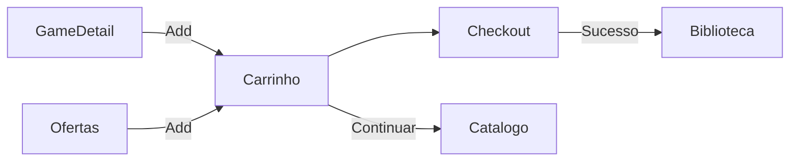

# Carrinho — `/carrinho`

> **Status:** final
> **Plataforma:** Web
> **Arquivo-fonte:** `src/pages/Carrinho.tsx` + `src/lib/cartStore.tsx` + `cartContext.ts`
> **Última revisão:** 2026-07-06

---

## 1. Objetivo da página

Ser o **último degrau antes da conversão**: revisar itens, ajustar quantidade, aplicar cupom, ver subtotal/desconto/total, e ir para checkout. Precisa ser rápido, confiável, e nunca surpreender o usuário no valor final.

## 2. Filosofia

Carrinho é o momento de **maior atrito** do funil. Cada segundo extra, cada modal de "tem certeza?", cada campo obrigatório reduz conversão em % mensuráveis. O carrinho do MIDIAS deve ser **calmo, transparente e reversível**: mostra tudo, deixa remover sem confirmação, calcula em tempo real, e nunca esconde o preço final até a última tela.

Bundles precisam ser tratados como **unidade atômica** (ver `07-bundles.md`) — mas hoje não são. **Bug conceitual documentado.**

## 3. Usuários-alvo

| Perfil                 | O que enxerga                                        | O que pode fazer                                      |
| ---------------------- | ---------------------------------------------------- | ----------------------------------------------------- |
| Visitante              | Carrinho com items em localStorage                   | Adicionar/remover; ao ir para checkout → `/auth`      |
| Logado                 | Idem + email pré-preenchido no checkout              | Aplicar cupom, ir direto ao checkout                  |
| Logado — cupom inválido| Toast "Cupom expirado"                              | Remover cupom, tentar outro                           |
| Estoque zerou          | Alerta amarelo no item                              | Remover item ou seguir sem ele                        |

## 4. Estrutura visual

```text
Header
   ↓
[Título "Carrinho" + contador]
   ↓
[Grid 2 colunas em desktop]
  ├─ [Coluna 1: lista de items com imagem, título, plataforma, preço, quantity stepper, botão remover]
  └─ [Coluna 2 sticky: resumo (subtotal, desconto cupom, total), input cupom, CTA "Finalizar Compra"]
   ↓
[Empty state se vazio: ilustração + "Explorar Catálogo"]
   ↓
[Cross-sell: "Que tal esses também?" — não implementado]
   ↓
Footer
```

## 5. Componentes

### 5.1 CartItem row

- Imagem 80x80, título linkado ao `/jogo/:id`, plataforma, preço unit, quantity stepper (1-99, mas jogos digitais deveriam ser 1), preço total do item, "×" para remover.

### 5.2 Resumo

- Subtotal (soma preços × quantidade).
- Desconto do cupom (linha separada, vermelha, negativa).
- Total (destaque grande, com "à vista no Pix: -5%" abaixo).
- CTA "Finalizar Compra" (verde grande) → `/checkout`.

### 5.3 Input de cupom

- Field + botão "Aplicar". Chama `useCupom(code)` que valida via query `cupons` (ativo, dentro do período, uses < max_uses, se `is_first_purchase_only` verifica pedidos do usuário).

## 6. Fluxos de entrada

- Ícone carrinho no header (com badge de contagem).
- CTA "Adicionar ao carrinho" em `GameCard`, `GameDetail`, `Ofertas`, `BundleDetail`.
- Notificação "Preço caiu no seu wishlist" → CTA "Comprar" adiciona e navega.

## 7. Fluxos de saída

1. `/checkout` (conversão)
2. `/catalogo` (continuar comprando)
3. `/jogo/:id` (voltar a um item para reler)

## 8. Navegação



## 9. Regras de negócio

- Jogos digitais: quantidade fixa em 1 (regra não aplicada hoje; UI permite N).
- Cupom: 1 por pedido, aplicado sobre o subtotal.
- Pix: -5% adicional (mostrado só no checkout, poderia aparecer aqui como preview).
- Bundle: hoje é adicionado item por item; deveria ser 1 linha com sub-items expansíveis.
- Estoque: revalidar no momento do checkout (não do carrinho — carrinho é otimista).

## 10. Estados da interface

| Estado             | Trigger                        | O que o usuário vê                              |
| ------------------ | ------------------------------ | ----------------------------------------------- |
| Vazio              | items.length === 0             | Ilustração + CTA catálogo                       |
| Cupom aplicado     | cupom válido                   | Linha "-R$ X (Cupom SAVE10)" com "remover"      |
| Cupom inválido     | erro validação                 | Toast + input mantido para correção             |
| Estoque insuf.     | quantity > stock               | Alerta amarelo no item + botão "Ajustar para X" |
| Preço mudou        | polling detecta diff           | Toast "Preço de X atualizado" + destaque item   |

## 11. Permissões

Público (carrinho funciona deslogado). Checkout exige login.

## 12. Origem dos dados

- Items: `CartContext` (React Context + localStorage sync).
- Cupom: `cupons` (`useCupom`).
- Preços em tempo real: **não implementado** (usa o preço no momento do add).

## 13. Banco relacionado

Nenhuma tabela `carrinho_persistente` — carrinho vive só no localStorage. Cupons: `cupons`, `cupon_usos`.

## 14. APIs / hooks

- `useCart()` — items, add, remove, update, total, count.
- `useCupom(code)` — valida e retorna % ou valor de desconto.

## 15. Painel admin relacionado

**Desktop → Cupons:**
- Criar cupom (code, tipo `percent | fixed`, valor, valid_from, valid_until, max_uses, is_first_purchase_only, min_order_value).
- Listar cupons com uses_count / max_uses (barra de progresso).
- Desativar cupom (soft — mantém histórico de usos).
- Gerar código automático (SAVE10 → gera SAVE10-XXXX únicos).
- **Falta hoje:** cupom por segmento (só para users com > X pedidos, ou primeiros 100 signups).

## 16. Casos extremos

- Usuário adiciona 50 items → localStorage estoura (~5MB). Limitar a 30.
- Item removido do catálogo → CartContext deveria detectar e remover silenciosamente + toast.
- Preço original mudou (subiu) entre add e checkout → checkout deve mostrar diff e pedir confirmação.
- Cupom aplicado + item removido faz total virar zero → validar min_order_value.
- 2 abas abertas, adicionar em uma não reflete na outra → BroadcastChannel para sync.

## 17. Justificativa de UX/UI

Coluna resumo sticky à direita em desktop, embutida abaixo em mobile (padrão Amazon/Steam). CTA grande verde porque **conversão > estética**. Sem modal de confirmação no remover — se o usuário errou, undo aparece por 5s.

## 18. Escalabilidade

- Carrinho não escala em items (100 items no localStorage já é problema).
- Não escala em usuários porque não usa DB. Vantagem: zero custo backend. Desvantagem: perde carrinho ao trocar de device.

## 19. Melhorias futuras

- **P0:** Persistir carrinho no DB para usuários logados (`user_cart_items`).
- **P0:** Tratar bundle como unidade atômica.
- **P1:** Sync entre abas (BroadcastChannel).
- **P1:** Undo remove (toast com "Desfazer" por 5s).
- **P1:** Cross-sell "quem comprou X levou Y".
- **P2:** Wishlist quick-move ("Deixar para depois").

## 20. Crítica da implementação atual

### 20.1 O que está bom

- **Carrinho funciona deslogado.** **Por que:** não bloqueia descoberta; login vira problema só no checkout. Padrão de e-commerce moderno. **Deve ficar.**
- **`useCupom` desacoplado.** **Por que:** reutilizável no checkout, admin, ofertas. **Deve ficar.**
- **Total calculado em tempo real com useMemo.** **Por que:** UI sempre coerente. **Deve ficar.**

### 20.2 O que está ruim

- **Bundle quebrado.**
  - Evidência: adiciona-se um bundle e ele vira 3 items independentes; remover 1 quebra o desconto silenciosamente.
  - Alternativa: `CartItem` com discriminated union `{ type: 'game', game } | { type: 'bundle', bundle, items }`. Preço atômico. Remove tudo junto.
  - **P0.**
- **Carrinho perde ao trocar de device.**
  - Ruim: usuário adiciona no mobile no ônibus, chega em casa no desktop, carrinho vazio.
  - Alternativa: `user_cart_items` sincronizado quando logado; localStorage vira fallback anônimo.
  - **P0.**
- **Preço congelado no add.**
  - Ruim: promoção termina, usuário só descobre no checkout.
  - Alternativa: revalidar preços na entrada do carrinho (fetch por IDs) + destacar diffs.
  - **P1.**
- **Quantity stepper permite 99.**
  - Ruim: jogo digital ≠ item físico; quem compra 99 cópias?
  - Alternativa: `if (produto.tipo === 'digital') maxQty = 1`.
  - **P1.**

### 20.3 Dívida técnica

- `CartContext` em `cartStore.tsx` mistura provider + context + hook. Já tem `useCart` e `cartContext` separados — arquitetura confusa, refatorar para 1 padrão.
- Sem testes unitários no `cartStore`.

### 20.4 Ângulos não cobertos

- **A11y:** quantity stepper sem `aria-live` — leitor não anuncia mudança de total.
- **Perf:** cada re-render recalcula total; useMemo com deps corretas resolve.
- **Analytics:** eventos `add_to_cart`, `remove_from_cart`, `apply_coupon`, `begin_checkout` não são emitidos.
- **PWA offline:** carrinho deveria funcionar 100% offline (localStorage já ajuda).
