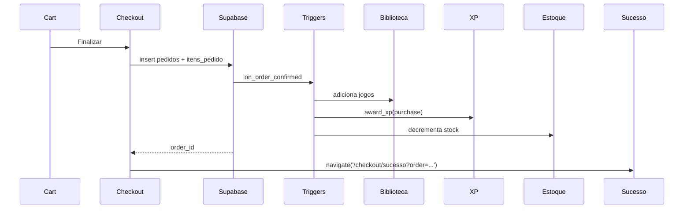

# Checkout — `/checkout`

> **Status:** final
> **Plataforma:** Web (protegida)
> **Arquivo-fonte:** `src/pages/Checkout.tsx` + `src/pages/CheckoutSucesso.tsx`
> **Última revisão:** 2026-07-06

---

## 1. Objetivo da página

Concluir a compra: escolher método (Pix / Cartão), aplicar cupom (se não veio do carrinho), confirmar dados, criar `pedido` no DB e disparar a cadeia de triggers (biblioteca, XP, notificação, redução de estoque).

**Contexto TCC:** pagamento é 100% simulado. Nenhum gateway real conectado. Pix mostra QR fake; cartão aceita qualquer número que passe no Luhn.

## 2. Filosofia

Checkout precisa parecer **profissional mesmo sendo simulado**. O aluno-avaliador precisa acreditar que é possível ligar no gateway real (Pagar.me, Stripe) trocando uma edge function. UX = Stripe Checkout minimalista, não Mercado Livre confuso.

Regra de ouro: **o botão "Confirmar Pagamento" só existe uma vez.** Depois de clicado, disable até a resposta chegar. Duplicidade de pedido é o pior bug possível.

## 3. Usuários-alvo

| Perfil                | O que enxerga                                          | O que pode fazer                               |
| --------------------- | ------------------------------------------------------ | ---------------------------------------------- |
| Deslogado             | Redirect `/auth?redirect=/checkout`                    | Login/signup e volta                           |
| Logado — 1ª compra    | Form completo + banner "5% off no Pix"                 | Escolher método, finalizar                     |
| Logado — recorrente   | Método último usado pré-selecionado                    | 1-click checkout (não implementado)            |

## 4. Estrutura visual

```text
Header (minimal — sem menu, evita distração)
   ↓
[Stepper: Carrinho ✓ | Pagamento (atual) | Sucesso]
   ↓
[Grid 2 colunas]
  ├─ [Coluna 1: Método de pagamento (Pix | Cartão) + form condicional]
  └─ [Coluna 2 sticky: Resumo (items compactos, subtotal, desconto, total)]
   ↓
[Botão "Confirmar Pagamento" full-width]
   ↓
[Selo "Compra Segura" + política de reembolso]
   ↓
Footer minimal
```

**Por que sem header cheio?** Reduzir escape do funil. Padrão Shopify/Stripe.

## 5. Componentes

### 5.1 Seletor de método

Tabs "Pix" | "Cartão". Ao trocar, form embaixo muda:
- **Pix:** QR fake + código copiável + timer 15min + "aguardando pagamento" (mock).
- **Cartão:** número, validade, CVV, nome, parcelas (1x-12x, sem juros até 6x — simulado).

### 5.2 Resumo compacto

Reutiliza o mesmo componente do carrinho, sem stepper de qty.

### 5.3 Botão "Confirmar Pagamento"

- Estado idle: verde grande.
- Loading: spinner + "Processando..." + disabled.
- Erro: shake + toast + volta a idle.

## 6. Fluxos de entrada

- `/carrinho` → CTA "Finalizar Compra".
- Deep link de email "Complete sua compra" (recuperação de carrinho — não implementado).

## 7. Fluxos de saída

1. `/checkout/sucesso` (95% dos casos)
2. `/carrinho` (voltar para editar)
3. `/auth` (se sessão expirou no meio)

## 8. Navegação



## 9. Regras de negócio

- Pix: 5% off automático sobre o total.
- Cartão: parcelamento sem juros até 6x, com juros 2%/mês de 7x-12x (simulado).
- Estoque revalidado no momento do submit — se algum item ficou sem, ABORTA e volta ao carrinho com aviso.
- Cupom já validado no carrinho, mas revalida (uses_count pode ter estourado no meio).
- Pedido nasce `pending` → 2s depois vira `confirmed` (simulação de gateway callback).

## 10. Estados da interface

| Estado           | Trigger                                | UI                                                 |
| ---------------- | -------------------------------------- | -------------------------------------------------- |
| Loading inicial  | fetch de dados do usuário              | Skeleton                                           |
| Processando      | submit clicado                         | Botão disabled + spinner + overlay bloqueando UI   |
| Sucesso          | pedido confirmed                       | Redirect `/checkout/sucesso`                       |
| Erro estoque     | algum item stock=0                     | Modal "Item X ficou sem estoque" + volta carrinho  |
| Erro cupom       | uses_count estourou                    | Remove cupom + recalcula + pede confirmação        |
| Sessão expirada  | 401 no insert                          | Modal + botão "Logar novamente" (mantém rascunho)  |

## 11. Permissões

Logado obrigatório. RLS em `pedidos`: `user_id = auth.uid()`. Admin não cria pedido pelo front (Desktop tem `PedidosOnline` só para leitura/gestão).

## 12. Origem dos dados

- Items: `CartContext`.
- Dados do usuário: `useAuth().profile` + `profiles` (endereço, se houver).
- Preços revalidados: query `produtos` por IDs.

## 13. Banco relacionado

`pedidos`, `itens_pedido`, `cupons`, `cupon_usos`, `movimentacoes_estoque` (via trigger), `biblioteca_usuario` (via trigger), `user_xp_log` (via trigger).

## 14. APIs / hooks

- `useSubmitGuard()` — previne double-click.
- Insert direto em `pedidos` (com service-role? não — user pode inserir seus próprios via RLS).
- Trigger `on_order_confirmed` faz o pesado.

## 15. Painel admin relacionado

**Desktop → PedidosOnline:**
- Lista pedidos com filtro por status.
- Ver detalhes (`OrderDetailModal`).
- Trocar status manualmente (confirmed → processing → shipped → delivered).
- Cancelar pedido (dispara `on_order_cancelled` que devolve estoque).
- Reembolso (**falta trigger** para remover da biblioteca).
- Exportar CSV.

## 16. Casos extremos

- **Duplo submit:** `useSubmitGuard` bloqueia; se falhar, unique constraint em `pedidos(idempotency_key)` seria a defesa final — **não existe hoje**.
- **Gateway (simulado) demora >30s:** timeout no front, pedido pode ter sido criado; UI precisa oferecer "Verificar status do pedido".
- **Estoque para 0 durante submit:** trigger `on_order_confirmed` já roda com `SELECT ... FOR UPDATE`? Verificar — se não, race condition.
- **Cupom com min_order_value quebrado por remoção de item no carrinho:** revalidar.
- **Preço mudou entre carrinho e checkout:** hoje aceita o preço antigo (bug). Deveria mostrar diff.

## 17. Justificativa de UX/UI

Layout Stripe-like: 2 colunas, minimal, sem escape. Selos de segurança são teatro necessário — mesmo simulado, usuário procura por eles. Timer no Pix (15min) cria urgência sem ser agressivo.

## 18. Escalabilidade

Baixo throughput por natureza (checkout é 1 op por usuário por sessão). Gargalo real: triggers em cadeia no `on_order_confirmed` podem travar em picos (Black Friday). Solução: mover parte para edge function assíncrona.

## 19. Melhorias futuras

- **P0:** Idempotency key para prevenir pedido duplicado por retry de rede.
- **P0:** Trigger de reembolso.
- **P1:** Salvar rascunho de checkout se sessão expirar.
- **P1:** 1-click checkout para recorrentes.
- **P1:** Recuperação de carrinho abandonado (email 24h depois).
- **P2:** Integração real (Pagar.me/Stripe) via edge function `create-payment`.
- **P2:** Assinatura recorrente (Pass Premium mensal).

## 20. Crítica da implementação atual

### 20.1 O que está bom

- **Stepper visual (Carrinho → Pagamento → Sucesso).** **Por que:** reduz ansiedade, usuário sabe onde está. **Deve ficar.**
- **`useSubmitGuard`.** **Por que:** primeira linha de defesa contra double-submit. **Deve ficar.** **Para excelente:** adicionar idempotency key server-side.
- **`on_order_confirmed` faz TUDO em cascata** (biblioteca, XP, estoque). **Por que:** consistência transacional. **Deve ficar.**

### 20.2 O que está ruim

- **Sem idempotency key.**
  - Ruim: retry de rede pode gerar 2 pedidos idênticos. É o bug clássico de e-commerce.
  - Alternativa: front gera UUID no mount do checkout, envia no insert; constraint `UNIQUE(user_id, idempotency_key)`.
  - **P0.**
- **Sem revalidação de preço.**
  - Ruim: comprou por R$ 50 mas produto agora é R$ 80 (ou vice-versa). Usuário reclama, suporte tem que resolver caso a caso.
  - Alternativa: SELECT preços antes do insert; se diff > 1%, modal "Preços mudaram" com opção de aceitar novo total.
  - **P0.**
- **Pix simulado sem tempo real.**
  - Ruim: usuário fica olhando QR, não sabe quando muda. Precisa recarregar.
  - Alternativa (mesmo simulado): setTimeout(2s) que aciona status change; realtime channel escuta `pedidos` do usuário.
  - **P1.**
- **Sem tela intermediária "Verificando estoque" para pedidos grandes.**
  - Ruim: se trigger demora 3s, usuário acha que travou.
  - Alternativa: overlay com etapas ("Validando estoque..." → "Registrando pedido..." → "Adicionando à biblioteca...").
  - **P2.**

### 20.3 Dívida técnica

- Simulação misturada com código de produção — quando integrar gateway real, será refactor grande. Isolar toda a lógica em `src/lib/payments/` desde já.
- Sem testes E2E cobrindo o fluxo completo.

### 20.4 Ângulos não cobertos

- **A11y:** form de cartão sem `autocomplete="cc-number"`, `cc-exp`, `cc-csc`. Gerenciadores de senha não ajudam.
- **PCI:** mesmo simulado, ensinar boas práticas — nunca logar CVV, mesmo no console.
- **Analytics:** funil `begin_checkout → payment_selected → purchase` não é rastreado.
- **i18n moeda:** hardcoded R$. Se expandir para outros países, formatar via Intl.NumberFormat.
