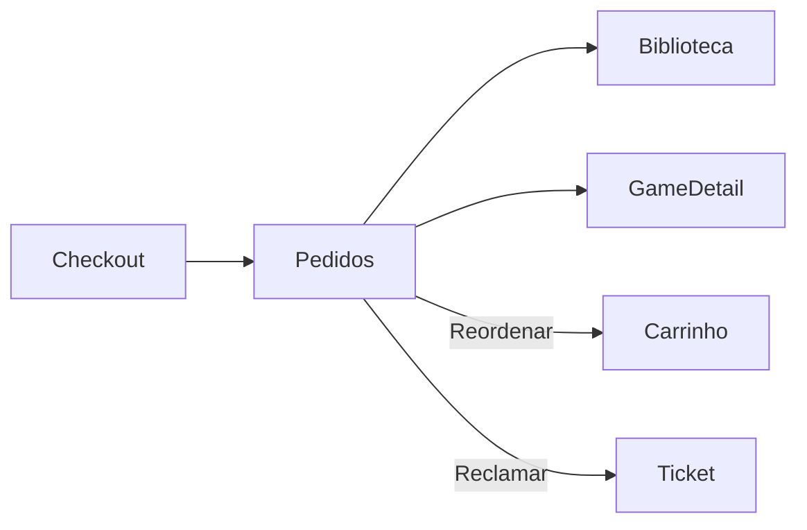

# Pedidos — `/pedidos`

> **Status:** final
> **Plataforma:** Web (protegida)
> **Arquivo-fonte:** `src/pages/Pedidos.tsx`
> **Última revisão:** 2026-07-06

---

## 1. Objetivo da página

Mostrar o **histórico de compras** do usuário, com status de cada pedido, itens contidos, valores, cupons aplicados, e ações contextuais (reembolso, reclamar, baixar nota fiscal fake, reordenar).

## 2. Filosofia

Pedidos são **confiança materializada**. O usuário quer prova de que a plataforma registra suas compras corretamente. Uma tela de pedidos ruim = zero recompra. O MIDIAS trata pedidos como **timeline de eventos** (não só uma linha estática): pending → confirmed → processing → shipped → delivered, com timestamps e possíveis mensagens do suporte.

Diferença estratégica: como o produto é digital, "shipped" na prática é "entregue na biblioteca" — mas mantemos os estados por consistência com trocas C2C (mobile).

## 3. Usuários-alvo

| Perfil               | O que enxerga                              | O que pode fazer                              |
| -------------------- | ------------------------------------------ | --------------------------------------------- |
| Deslogado            | Redirect `/auth`                           | Nada                                          |
| Logado — 0 pedidos   | Empty state                                | CTA catálogo                                  |
| Logado — 1-10        | Lista completa                             | Ver detalhes, reordenar, abrir ticket         |
| Logado — 50+         | Lista paginada + filtros                   | Filtrar por período, status                   |

## 4. Estrutura visual

```text
Header
   ↓
[Título "Meus Pedidos" + contador]
   ↓
[Filtros: Status | Período (30d, 90d, 1a, tudo)]
   ↓
[Lista de cards de pedido]
  ├─ [Card: #pedido | data | status pill | total | items thumb inline | botão "Ver detalhes"]
  └─ [...]
   ↓
[Paginação]
   ↓
Footer
```

## 5. Componentes

### 5.1 Order card

- Header: `#00042` + `12/03/2026 às 14:32` + `LibraryStatusBadge`-style pill.
- Body: strip horizontal de thumbs (até 5 items) + "+3 mais".
- Footer: `R$ 349,80` + botão "Detalhes".

### 5.2 `OrderDetailModal`

- Timeline vertical: `pending` (12:00) → `confirmed` (12:02) → `delivered` (12:02).
- Items completos com preço unit + qty + subtotal.
- Cupom aplicado (se houver): "Cupom SAVE10 (-R$ 20,00)".
- Total.
- Ações: "Reordenar" (recria carrinho), "Baixar Nota (PDF fake)", "Abrir chamado".

## 6. Fluxos de entrada

- Menu do header → "Meus Pedidos".
- Email transacional "Seu pedido foi confirmado" → deep link.
- `CheckoutSucesso` → "Ver todos os pedidos".

## 7. Fluxos de saída

1. `/jogo/:id` (clicar em item)
2. `/biblioteca` (ver o que foi adicionado)
3. `/contato` ou modal ticket (reclamar)
4. `/carrinho` (via "Reordenar")

## 8. Navegação



## 9. Regras de negócio

- Reembolso pode ser solicitado até 7 dias após `delivered`, se `hours_played < 2` na biblioteca (regra Steam).
- Reordenar copia items para carrinho, revalidando preços atuais.
- Nota fiscal simulada (PDF gerado client-side).
- Cancelamento só permitido enquanto status = `pending`.

## 10. Estados da interface

| Estado           | Trigger                       | UI                                            |
| ---------------- | ----------------------------- | --------------------------------------------- |
| Vazio            | 0 pedidos                     | "Você ainda não fez pedidos" + CTA            |
| Cancelado        | status='cancelled'            | Card cinza + pill vermelha                    |
| Reembolsado      | status='refunded'             | Pill amarela + "Valor devolvido"              |
| Aguardando Pix   | status='pending' + method=pix | Botão "Pagar agora" reabre QR                 |

## 11. Permissões

Usuário vê só os próprios pedidos (RLS `user_id = auth.uid()`). Admin (Desktop) vê todos em `PedidosOnline`.

## 12. Origem dos dados

`pedidos` + `itens_pedido` + join produtos + `cupon_usos` (se houver).

## 13. Banco relacionado

`pedidos`, `itens_pedido`, `cupon_usos`, `cupons`, `movimentacoes_estoque`, `tickets` (se abrir chamado sobre pedido).

## 14. APIs / hooks

- `usePedidos()` — query com order desc, com relacionamentos.
- Mutation `cancelOrder(id)` → update status → dispara `on_order_cancelled`.

## 15. Painel admin relacionado

**Desktop → PedidosOnline** (já detalhado em 12-checkout §15):
- Filtros avançados (por vendedor, produto, cupom, faixa de valor).
- Bulk actions (marcar N pedidos como shipped).
- Timeline com eventos (quem mudou status, quando, por quê).
- Anexar mensagem interna do suporte ao pedido.
- Emissão de nota fiscal real (integração futura).

## 16. Casos extremos

- Pedido com produto deletado do catálogo → mostrar "Produto removido" mas manter na lista com preço histórico.
- Pedido antigo com formato de dados mudado (schema evolution) → tolerar campos null.
- Usuário exclui conta → pedidos deveriam persistir para contabilidade? Sim, mas anonimizados (`user_id = NULL`, guardar `email_hash`).
- Reembolso parcial (só 1 item de 3) → não implementado; hoje é all-or-nothing.

## 17. Justificativa de UX/UI

Card por pedido, não tabela — mobile-first. Timeline visual no detalhe = padrão Correios/iFood, todo brasileiro entende. Reordenar como CTA principal porque **recompra é o hack de retenção mais barato**.

## 18. Escalabilidade

- 10 pedidos: OK.
- 1000 pedidos: paginação obrigatória (hoje traz tudo).
- Filtros no client → precisa mover para query.

## 19. Melhorias futuras

- **P0:** Paginação server-side.
- **P0:** Trigger `on_order_refunded` que remove da biblioteca.
- **P1:** Reembolso parcial (por item).
- **P1:** Email quando status muda (hoje só notifica in-app).
- **P2:** Nota fiscal real (integração NFSe).
- **P2:** Exportar histórico completo (LGPD).

## 20. Crítica da implementação atual

### 20.1 O que está bom

- **`usePedidos` já traz join com items.** **Por que:** N+1 evitado. **Deve ficar.**
- **Reordenar existe (ou está planejado).** **Por que:** hack de retenção clássico. **Deve ficar.** **Para excelente:** avisar quais items subiram/desceram de preço na hora de reordenar.
- **`on_order_cancelled` devolve estoque.** **Por que:** consistência DB. **Deve ficar.**

### 20.2 O que está ruim

- **Sem paginação.**
  - Ruim: usuário com 200 pedidos = 200 rows na primeira request.
  - Alternativa: `.range(0, 19)` + "Carregar mais".
  - **P0.**
- **Sem trigger de reembolso removendo da biblioteca.**
  - Já mencionado em 10-biblioteca; aqui é o outro lado do bug.
  - **P0.**
- **Cancelamento só via admin.**
  - Ruim: usuário quer cancelar pedido `pending` (esperando Pix) e não consegue sem abrir ticket.
  - Alternativa: botão "Cancelar" se status='pending' e < 30min.
  - **P1.**
- **Sem email transacional.**
  - Ruim: usuário fecha o navegador, não sabe quando o pedido confirma.
  - Alternativa: edge function + trigger AFTER UPDATE em `pedidos` envia email via Resend/SendGrid.
  - **P1.**

### 20.3 Dívida técnica

- Status como string livre no DB — deveria ser enum (`order_status`).
- Sem tabela `order_status_history` para auditoria de mudanças.

### 20.4 Ângulos não cobertos

- **A11y:** pills de status só por cor — daltônicos perdem. Adicionar ícone (✓, ⏱, ✕).
- **Impressão:** tela de detalhes deveria ter CSS de print decente para quem quer imprimir nota.
- **SEO:** rota protegida — irrelevante.
- **Analytics:** clique em "Reordenar" é ouro em ouro para métricas de retenção — hoje não é rastreado.
