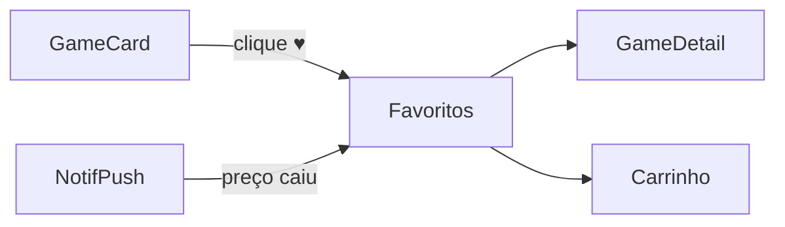

# Favoritos — `/favoritos`

> **Status:** final
> **Plataforma:** Web (protegida)
> **Arquivo-fonte:** `src/pages/Favoritos.tsx`
> **Última revisão:** 2026-07-06

---

## 1. Objetivo da página

Reunir todos os jogos que o usuário marcou com ♥ ("Wishlist"), com filtros, notificações de queda de preço e conversão fácil ("Adicionar ao carrinho").

## 2. Filosofia

Favoritos é a **antessala do carrinho**. O usuário não está pronto para comprar hoje, mas quer ser notificado quando o preço cair, quando entrar em oferta, quando lançar DLC. É a arma silenciosa de retenção: cada ♥ é um lembrete futuro para o MIDIAS puxar o usuário de volta.

O trigger `notify_wishlist_price_drop` já entrega a promessa central: preço caiu, você recebe notificação. Sem isso, favoritos vira lista morta (o pecado do Steam Wishlist).

## 3. Usuários-alvo

| Perfil                | O que enxerga                                     | O que pode fazer                                |
| --------------------- | ------------------------------------------------- | ----------------------------------------------- |
| Deslogado             | Redirect `/auth`                                  | Nada                                            |
| Logado — 0 favs       | Empty state                                       | CTA catálogo                                    |
| Logado — 1-20         | Grid com card + preço + destaque queda            | Remover, adicionar carrinho, ir ao jogo         |
| Logado — 50+          | Grid + filtros por plataforma/preço/desconto      | Ordenar por maior desconto atual                |

## 4. Estrutura visual

```text
Header
   ↓
[Título "Meus Favoritos" + contador]
   ↓
[Filtros: Plataforma | Categoria | "Em oferta agora"]
   ↓
[Ordenação: Adicionados recente | Maior desconto | Menor preço]
   ↓
[Grid de GameCards com badges especiais: "Preço caiu!" / "Voltou ao estoque"]
   ↓
Footer
```

## 5. Componentes

### 5.1 `GameCard` (variante wishlist)

- Igual ao card padrão + overlay "R$ 89 → R$ 49" quando preço caiu desde o favoritar.
- Botão ♥ preenchido (clique remove).
- Botão "Adicionar ao carrinho" direto.

### 5.2 Filtros / ordenação

- Chips de plataforma.
- Toggle "Apenas em oferta agora" (filtra `discount > 0`).
- Ordenar por maior desconto **atual** (não histórico).

## 6. Fluxos de entrada

- Header → "Favoritos".
- Ícone ♥ em qualquer `GameCard` (toggle) → toast "Adicionado aos favoritos" com CTA "Ver".
- Notificação push "Queda de preço" → deep link.

## 7. Fluxos de saída

1. `/jogo/:id`
2. `/carrinho` (após add)
3. `/ofertas` (se filtrar "em oferta" e quiser ver mais)

## 8. Navegação



## 9. Regras de negócio

- Favoritar exige login (não persiste anônimo).
- Sem limite de favoritos.
- Notificação de queda de preço só se `NEW.price < prev_price` (trigger já implementa).
- Se produto for deletado, entrada some silenciosamente (CASCADE via FK).

## 10. Estados da interface

| Estado          | Trigger                    | UI                                              |
| --------------- | -------------------------- | ----------------------------------------------- |
| Vazio           | 0 favoritos                | Ilustração + "Explore o catálogo e favorite"    |
| Vazio filtrado  | filtro zera resultado      | "Nenhum favorito nesse filtro" + limpar         |
| Loading         | pending                    | Skeleton grid                                   |

## 11. Permissões

Só o dono. RLS `user_id = auth.uid()`.

## 12. Origem dos dados

- `favoritos` (join com `produtos`).
- Preço atual em `produtos.price`.
- Preço no momento do favoritar: **não armazenado** hoje — não dá para mostrar "caiu R$ X desde que você favoritou" sem essa coluna.

## 13. Banco relacionado

`favoritos`, `produtos`, `price_history` (para diff), `notifications` (via trigger).

## 14. APIs / hooks

`useFavoritos()`:
- `favoritos: string[]` (só IDs).
- `isFavorito(id)`.
- `toggleFavorito(id)`.

**Falha:** hook só retorna IDs; a página `Favoritos.tsx` precisa fazer segunda query para pegar dados dos produtos. Já é uma waterfall.

## 15. Painel admin relacionado

**Desktop → Analytics:**
- Ranking de jogos mais favoritados (Wishlist Chart).
- Correlação favorito → compra (taxa de conversão de wishlist).
- Alerta: "Jogo X foi favoritado 500x e nunca entrou em promoção" → sugerir campanha.

Falta hoje: nenhuma dessas telas está em `src/desktop/pages/`.

## 16. Casos extremos

- Produto sai de linha (out of stock indefinido) → mostrar "Indisponível" mas manter no favorito.
- Preço subiu → não notifica (correto), mas UI poderia mostrar "↑ subiu R$ 10".
- Usuário favorita, esquece, 6 meses depois preço cai — notif chega no vazio? Sim, correto — é o ponto.
- 1000 favoritos → query lenta sem paginação.

## 17. Justificativa de UX/UI

Grid igual ao catálogo por familiaridade — mas com overlay "Preço caiu" (verde brilhante) para atrair olho. Não usar tabela: ninguém curte tabela de wishlist. Referência: Steam Wishlist com sort por "Discount".

## 18. Escalabilidade

- 100 favoritos: OK.
- 10k por usuário: absurdo mas paginar mesmo assim.
- Trigger `notify_wishlist_price_drop` roda em TODA queda de preço, para TODOS os favoritos: em 1M usuários, cada queda de preço = potencialmente N notificações. Batch send necessário.

## 19. Melhorias futuras

- **P0:** Coluna `favoritos.price_at_add` para diff pessoal.
- **P0:** Paginação server-side.
- **P1:** Alerta de meta de preço ("Notificar quando cair abaixo de R$ 50").
- **P1:** Compartilhar wishlist como link público ("presente de aniversário").
- **P2:** Auto-compra quando cair de preço (autorizado, cartão salvo).

## 20. Crítica da implementação atual

### 20.1 O que está bom

- **Trigger `notify_wishlist_price_drop` já implementado.** **Por que:** entrega a promessa de valor central sem código no front. **Deve ficar.** **Para excelente:** batch por usuário (1 notificação "3 jogos do seu wishlist caíram" em vez de 3 separadas).
- **`useFavoritos` é simples e reutilizável.** **Por que:** qualquer componente com `GameCard` pode chamar `toggleFavorito`. **Deve ficar.**
- **Toggle otimista** (invalida a query no sucesso). **Deve ficar.**

### 20.2 O que está ruim

- **Só armazena IDs no hook, força waterfall.**
  - Evidência: `favoritos` retorna `string[]`, `Favoritos.tsx` faz segunda query para produtos.
  - Alternativa: hook aceitar parâmetro `withProducts: true` e trazer join. Ou criar `useFavoritosComProdutos()`.
  - **P1.**
- **Sem preço histórico do momento do favoritar.**
  - Ruim: "R$ 89 → R$ 49" (badge) exigiria coluna `price_at_add` que não existe.
  - Alternativa: adicionar coluna, populada no INSERT.
  - **P0** (feature central da promessa).
- **Sem meta de preço.**
  - Ruim: usuário só quer ser notificado se cair abaixo de X, hoje recebe qualquer queda.
  - Alternativa: coluna `price_target numeric NULL`; trigger só notifica se `NEW.price <= price_target`.
  - **P1.**
- **Sem gestão de "produto indisponível".**
  - Ruim: favorito de item deletado quebra o card.
  - Alternativa: JOIN LEFT + fallback UI "Produto removido, deseja retirar do wishlist?".
  - **P2.**

### 20.3 Dívida técnica

- Trigger de price_drop dispara N notificações — sem coalescing. Em BF, spam.
- Sem métricas de conversão wishlist → compra.

### 20.4 Ângulos não cobertos

- **A11y:** botão ♥ sem `aria-pressed`. Leitor de tela não sabe se está favoritado.
- **PWA:** favoritos poderiam sincronizar offline (write queue).
- **SEO:** rota protegida — irrelevante.
- **Perf:** grid grande sem virtualização.
- **Cross-device:** favoritos são DB — funcionam. Vantagem sobre carrinho.
