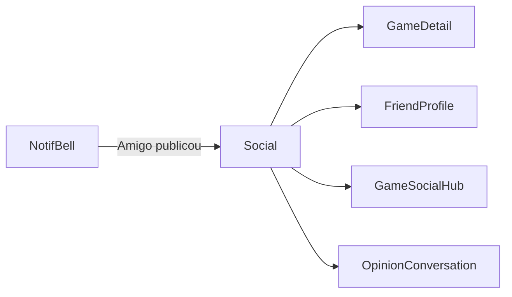

# Social — `/social`

> **Status:** final
> **Plataforma:** Web (protegida)
> **Arquivo-fonte:** `src/pages/SocialLibrary.tsx` (+ subcomponentes em `src/components/social/`)
> **Última revisão:** 2026-07-06

---

## 1. Objetivo da página

Ser o **feed social do gamer**: o que os amigos estão jogando agora, reviews completas publicadas, screenshots, opiniões, highlights fixados, e conquistas recentes. É o Discord + Steam Activity + Letterboxd unificados.

## 2. Filosofia

Social sem propósito vira ruído. O MIDIAS mira em **social contextual ao jogo**: você não vê "amigo X postou meme aleatório", você vê "amigo X platinou Elden Ring", "amigo Y publicou review completa de Baldur's Gate", "amigo Z está jogando Balatro há 40h". Cada item do feed tem **âncora em um produto**, ligando descoberta social → decisão de compra.

Diferença de Twitter/Facebook: aqui não existe feed geral público. Só de mutuals aceitos (via `conversas` com `status='accepted'`) — sem stalking possível.

## 3. Usuários-alvo

| Perfil                    | O que enxerga                                              | O que pode fazer                                |
| ------------------------- | ---------------------------------------------------------- | ----------------------------------------------- |
| Deslogado                 | Redirect `/auth`                                           | Nada                                            |
| Logado — 0 amigos         | Empty state "Adicione amigos para ver o feed"              | Buscar amigos, ver mutuals sugeridos            |
| Logado — 1-20 amigos      | Feed cronológico                                           | Curtir, comentar, favoritar item, ir ao jogo    |
| Logado — 50+ amigos       | Feed com filtros por tipo (reviews, status change, clips)  | Filtrar, mutar amigo/jogo específico            |

## 4. Estrutura visual

```text
Header
   ↓
[Tabs: Feed | Reviews Completas | Highlights | Amigos Ativos]
   ↓
[Filtros: Tipo (status, review, clip, opinion) | Jogo específico]
   ↓
[Feed vertical]
  ├─ [FriendIdentityPanel: avatar amigo + "Platinou Elden Ring"]
  ├─ [Card do evento: preview + interações]
  ├─ [ReviewCompletaCard]
  ├─ [HighlightsStrip horizontal (stories-like)]
  ├─ [ScreenshotsPanel grid]
  ├─ [OpinionsPanel]
  └─ [...]
   ↓
Footer
```

## 5. Componentes

### 5.1 `FriendIdentityPanel`

Cabeçalho de cada item: avatar do amigo (com moldura), nome, título ativo, timestamp relativo ("há 3h"), tipo do evento.

### 5.2 `HighlightsStrip`

Barra horizontal de stories dos amigos (jogos destacados no perfil), estilo Instagram. Clicar abre lightbox.

### 5.3 `ReviewCompletaCard`

Preview de review completa (título, jogo, hero image, primeiras 3 linhas) + CTA "Ler completa" → `/jogo/:id/review-completa`.

### 5.4 `ScreenshotsPanel`

Grid masonry de screenshots de amigos, com like/save.

### 5.5 `OpinionsPanel`

"Opiniões relâmpago" (texto curto sobre um jogo, tipo tweet). Diferente de review — sem nota, sem estrutura.

### 5.6 `MuteGameButton` / mute amigo

Sem drama de "unfollow", só silencia por tempo definido.

## 6. Fluxos de entrada

- Header → "Social".
- Notificação "Amigo X publicou review" → deep link.
- `/perfil/timeline` → "Ver feed dos amigos".

## 7. Fluxos de saída

1. `/jogo/:id` (contextual — todo evento leva a um jogo)
2. `/amigo/:userId` (perfil do amigo)
3. `/jogo/:id/social` (hub social do jogo específico)
4. `/conversas-opinioes` (responder opinião do amigo)

## 8. Navegação



## 9. Regras de negócio

- Só mostra eventos de mutual friends (`are_mutual_friends(a, b) = true`).
- Respeita `visibility` de cada evento (`public | friends | close_friends | private`).
- `close_friends` só se `is_close_friend(owner, viewer) = true`.
- Mudar status para "abandonado" NÃO aparece no feed (evita constrangimento).
- Bloqueio filtra totalmente (nem eventos, nem menções).

## 10. Estados da interface

| Estado             | Trigger                       | UI                                              |
| ------------------ | ----------------------------- | ----------------------------------------------- |
| Vazio (0 amigos)   | mutuals.length === 0          | Ilustração + "Encontre gamers" → busca          |
| Vazio (com amigos) | amigos não postaram nada      | "Amigos quietos hoje" + sugestão de conteúdo    |
| Loading            | fetch pendente                | Skeleton com layout preservado                  |
| Erro               | fetch falhou                  | Toast + retry                                   |
| Item mutado        | mute ativo                    | Item colapsado com "Silenciado — reexibir"      |

## 11. Permissões

- Ver: qualquer logado, mas filtrado por mutuals + visibility.
- Curtir/comentar: qualquer logado que pode ver.
- Bloquear/mutar: qualquer logado.

## 12. Origem dos dados

- `game_timeline_events` (status changes, playtime milestones).
- `reviews_completas` (com filter por visibility).
- `game_screenshots`, `game_clips`, `game_opinions`.
- `profile_highlights`.
- `friend_activity_states` (jogando agora — se atualizado por client).

## 13. Banco relacionado

`conversas` (mutuals), `blocked_users`, `close_friends`, `user_game_mutes`, `game_timeline_events`, `reviews_completas`, `review_completa_visibility`, `game_opinions`, `game_screenshots`, `game_clips`, `profile_highlights`, `friend_activity_states`, `social_content_states`, `social_favorites`.

## 14. APIs / hooks

- `useFriendActivity()` — feed principal.
- `useMutualFriends()` — quem me segue e sigo.
- Queries diretas por painel (React Query com keys por tipo).

## 15. Painel admin relacionado

**Desktop → BibliotecaSocialAdmin + ForumAdmin:**
- Moderar reviews completas denunciadas.
- Remover screenshots impróprias.
- Banir usuário abusivo (dispara `blocked_users` global? Não — vira `banned_until` no profile).
- Ver métricas: eventos/dia, taxa de interação, top amigos mais ativos.

## 16. Casos extremos

- Amigo altera visibility de review para `private` DEPOIS de aparecer no feed → item some no próximo refresh; usuário confuso.
- 1000 eventos em 24h (amigo que joga muito) → dominar o feed. Precisa cap por usuário/dia (max 5 items no feed).
- Amigo bloqueou o viewer → viewer não deveria ver os eventos dele; verificar bloqueio bidirecional na query.
- Evento sobre produto deletado → esconder ou mostrar "sobre um jogo removido".

## 17. Justificativa de UX/UI

Feed vertical infinito é o padrão universal (Twitter/Instagram/LinkedIn). Tabs separando "Feed geral" de "Reviews Completas" porque a densidade de review é muito diferente (texto longo x update rápido). HighlightsStrip no topo puxa engajamento imediato — mesmo padrão que Instagram Stories.

## 18. Escalabilidade

- 20 amigos, 5 eventos/dia = 100 items/dia. Trivial.
- 500 amigos, 10 eventos/dia = 5000 items/dia. Precisa **fan-out on write** (tabela `user_feed` populada por trigger) em vez de query cruzando N tabelas na leitura.
- Sem cache: cada refresh reprocessa tudo.

## 19. Melhorias futuras

- **P0:** Cap de items por amigo/dia no feed (evitar dominação).
- **P0:** Fan-out on write para escalar acima de 100 amigos.
- **P1:** Recomendação "Amigos que talvez você conheça" (mutuals de mutuals).
- **P1:** Realtime channel para novos items aparecerem sem refresh.
- **P2:** Feed algorítmico opcional (top interações, não cronológico).
- **P2:** Compartilhar item do feed em conversa privada (DM).

## 20. Crítica da implementação atual

### 20.1 O que está bom

- **Ancoragem em jogo em TODO evento.** **Por que:** cada scroll do usuário pode virar clique num produto. Discovery + monetização casadas. **Deve ficar.** **Para excelente:** botão "Adicionar ao wishlist" direto no card do feed.
- **Respeito estrito a `visibility` + `close_friends`.** **Por que:** confiança do usuário. Steam falha nisso constantemente. **Deve ficar.**
- **`MuteGameButton`** (não unfollow drástico). **Por que:** amigos jogam coisas que o viewer não curte; mutar > desamizar. **Deve ficar.**

### 20.2 O que está ruim

- **Feed cruza N tabelas na leitura.**
  - Evidência: para montar 20 items, faz query em `game_timeline_events`, `reviews_completas`, `game_screenshots`, `game_clips`, `game_opinions`, unindo por user_id ∈ mutuals. Custo O(N amigos × M tipos).
  - Alternativa: tabela `user_feed_items (owner_id, source_type, source_id, created_at, visibility)` populada por triggers em cada tabela de origem. Uma query `SELECT ... WHERE owner_id = ANY(mutuals) ORDER BY created_at DESC LIMIT 20`.
  - **P0.**
- **Sem cap por amigo/dia.**
  - Ruim: um amigo speedrunner posta 30 clips por dia → feed vira monoautoral.
  - Alternativa: query com `ROW_NUMBER() OVER (PARTITION BY user_id ORDER BY created_at DESC)` + `WHERE rn <= 5`.
  - **P0.**
- **Sem realtime.**
  - Ruim: precisa recarregar para ver amigo publicando agora. Perde a magia do "live".
  - Alternativa: Supabase realtime subscribe em `user_feed_items`.
  - **P1.**
- **HighlightsStrip pode explodir se amigo tem 20 highlights.**
  - Ruim: strip infinito quebra layout.
  - Alternativa: max 5 por amigo, ordenado por `pinned_at DESC`.
  - **P2.**

### 20.3 Dívida técnica

- `friend_activity_states` só é populada se o client explicitamente escrever "estou jogando". Não existe integração com plataforma real (Steam presence), então "jogando agora" quase sempre é vazio.
- Sem paginação server-side no feed — usa `.limit(50)` fixo.

### 20.4 Ângulos não cobertos

- **A11y:** feed com scroll infinito sem `aria-live="polite"` para anunciar novos items.
- **Perf:** imagens de highlight sem lazy loading — carrega tudo no mount.
- **Notif overload:** amigo publica review → notificação. 20 amigos publicando = 20 notifs. Precisa agrupar ("3 amigos publicaram reviews hoje").
- **Privacidade transversal:** se amigo A é mutual de B e C, mas B bloqueou C, o item de B ainda pode aparecer para C via feed compartilhado? Auditoria de bloqueio em cascata necessária.
- **i18n:** timestamps relativos ("há 3h") hardcoded PT-BR — extrair.
